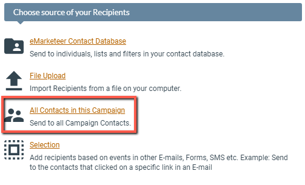

# Campaign Contacts

The Campaign Contacts is a tab in each campaign that lists contacts that belong to the specific campaign.

A contact is added to the Campaign Contacts list when it:

-   is addressed and sent an email that belongs to the campaign (contacts excluded prior to sending are not added).
-   is addressed and sent an sms that belongs to the campaign (contacts excluded prior to sending are not added).
-   submits a form belonging to the campaign.
-   visits a webpage belonging to the campaign (anonymous visits are not added).
-   is imported to the campaign using the “Import Contacts” feature in the Campaigns left hand menu.

### Campaign contacts interface

Campaign contacts interface.

Clicking on individual contacts lets you view the history of interactions within the campaign. To easily find a specific contact you are looking for you can use Quick Search in the top right corner of the tab.

##### Removing contacts from a campaign

You can also use this tab to remove unwanted contacts from the campaign, and by extension each component report within the campaign (great for removing tests). Start by selecting the contacts you wish to remove from the campaign using the boxes on the left hand side of each contact, then click the “Remove selected from campaign” option above the list.

### All contacts in this campaign (Recipient Source)

The Campaign Contacts can be addressed using the “All contacts in this campaign” option while sending email or sms. Please refer to the definition at the top of the article to learn what constitutes a campaign contact.

The “All contacts in this campaign” option.
