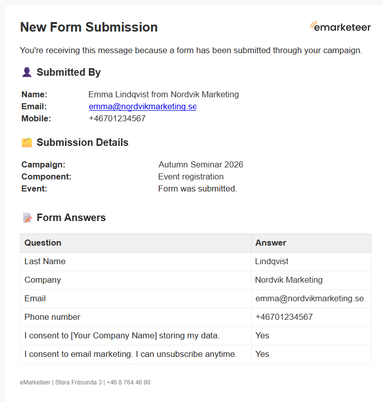

# Send notification automation

The Send notification automation is a [campaign automation](campaign-automations.md) that sends a notification about the contact who triggered it, by email, SMS or both. Use it to alert a colleague, for example when a contact submits a form.

## Settings

* **Name** — a name for the automation, shown in the campaign's **Automation rules** list.
* **...to these e-mail addresses** — the email addresses to notify.
* **...and these mobile phone numbers (incl. country code)** — the mobile numbers to notify by SMS, including the country code, for example +46701234567.
* **Do only once per contact** — selected by default, so the automation runs at most once for each contact.

## What the notification contains

The notification reports that the trigger happened and who triggered it. An email notification includes:

* The contact's details, such as name, email address and mobile number.
* The campaign, the component and the event, for example that a link in an email was clicked or that a form was submitted.
* For a form submission, the answers the contact submitted.

## Trigger

Choose the component and event that run the automation under **When this happens**. See [Choose the trigger](campaign-automations.md#choose-the-trigger).

**Related Journey step:** [Notify stakeholder](../../documentation/journeys/journey-step-notify-stakeholder.md), which is similar but sends email only.

This automation is not the same as the notifications eMarketeer sends you about your account and your tasks. For those, see [Notification system](../../documentation/notification-system.md).
