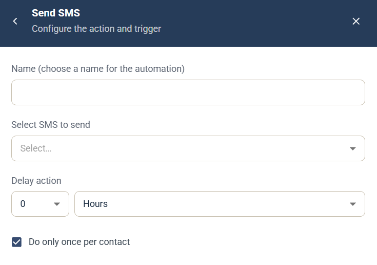

# Send SMS automation

The Send SMS automation is a [campaign automation](campaign-automations.md) that sends a text message (SMS) to the contact who triggered it. To do the same in a Journey, see the [Send SMS / Text message](../../documentation/journeys/journey-step-send-sms.md) step.

## Settings

* **Name** — a name for the automation, shown in the campaign's **Automation rules** list.
* **Select SMS to send** — choose the SMS to send.
* **Delay action** — how long to wait after the trigger before the message is sent. Enter a number and choose a unit, such as hours.
* **Do only once per contact** — selected by default, so the automation runs at most once for each contact.

The SMS must already exist. You can't create an SMS from the automation.

## Trigger

Choose the component and event that run the automation under **When this happens**. See [Choose the trigger](campaign-automations.md#choose-the-trigger).
