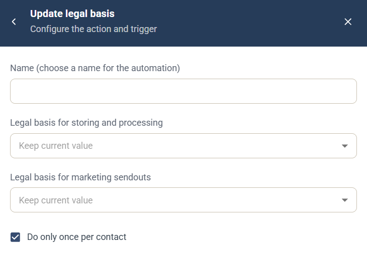

# Update legal basis automation

The Update legal basis automation is a [campaign automation](campaign-automations.md) that sets the legal basis for the contact who triggered it.

## Settings

* **Name** — a name for the automation, shown in the campaign's **Automation rules** list.
* **Legal basis for storing and processing** — the legal basis for storing and processing the contact's data.
* **Legal basis for marketing sendouts** — the legal basis for sending marketing to the contact.
* **Do only once per contact** — selected by default, so the automation runs at most once for each contact.

Both settings default to **Keep current value**, which leaves that legal basis unchanged.

## Trigger

Choose the component and event that run the automation under **When this happens**. See [Choose the trigger](campaign-automations.md#choose-the-trigger).

**Related Journey step:** [Legal Basis](../../documentation/journeys/journey-step-legal-basis.md)
