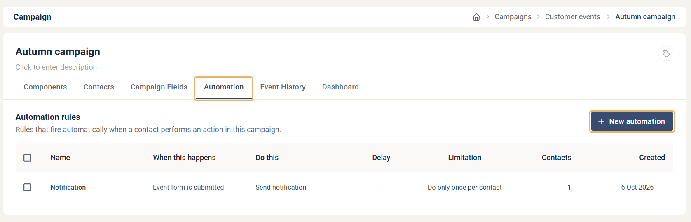

# Campaign automations

Campaign automations are rules inside a campaign. Each rule runs one action, such as sending an email or adding the contact to a list, when a contact does something with one of the campaign's components.

Use them for simple, immediate follow-ups to a send or a form, for example a confirmation email when a form is submitted, or a notification to a colleague when a link is clicked. They are quick to set up, they live with the campaign, and they are copied along when you copy the campaign.

## Find a campaign's automations

Open the campaign and click the **Automation** tab. The **Automation rules** list shows each automation with its trigger (**When this happens**), its action (**Do this**), any delay, whether it runs only once per contact (**Limitation**), and how many contacts it has run for.

## Create an automation

1. Open the campaign and click the **Automation** tab.
2. Click **New automation**.
3. Choose the action that should happen.
4. Fill in the settings for the action. Each automation's settings are described in its own article below.
5. Under **When this happens**, choose the trigger. See [Choose the trigger](#choose-the-trigger).

## Choose the trigger

Every automation has a **When this happens** section at the bottom. It sets which event in the campaign runs the automation.

1. **Select Component** — choose one of the campaign's components. Only components in the same campaign can trigger its automations.
2. **Select Event** — choose what the contact must do with that component.

The events depend on the type of component:

* **Email** — **Is opened**, **Is sent**, **Any link is clicked** or **A specific link is clicked**.
* **Form** — **Is submitted**.
* **Form (Legacy)** — **Is submitted** or **Specific answer**, which triggers when a specific option in a multiple-choice question is answered.


Email opens are an unreliable trigger. Some email clients block images, and an open is only registered when images load. Use a click as the trigger when you can. See [When is an email registered as opened?](../reports/email-open.md).


## Settings all automations share

* **Name** — a name for the automation, shown in the **Automation rules** list.
* **Do only once per contact** — selected by default. The automation then runs at most once for each contact, even if the contact triggers the event again.
* **Delay action** — available for the **Send email** and **Send SMS** automations. Waits the set time after the trigger before the message is sent.

## Copy or transfer a campaign

When you copy a campaign, its automations are copied with it, so the copy works the same way. When you [transfer a campaign to a different account](transfer-a-campaign-to-a-different-account.md), the automations are not transferred.

## Available automations

* **[Send email automation](campaign-automation-send-email.md)** — send an email message to the contact.
* **[Send SMS automation](campaign-automation-send-sms.md)** — send an SMS message to the contact.
* **[Add to list automation](campaign-automation-add-to-list.md)** — add the contact to a contact list.
* **[Remove from list automation](campaign-automation-remove-from-list.md)** — remove the contact from a contact list.
* **[Add to campaign automation](campaign-automation-add-to-campaign.md)** — add the contact to another campaign.
* **[Remove from Campaign automation](campaign-automation-remove-from-campaign.md)** — remove the contact from a campaign.
* **[Update contact card automation](campaign-automation-update-contact-card.md)** — update fields on the contact record.
* **[Update legal basis automation](campaign-automation-update-legal-basis.md)** — set the legal basis for storing and marketing.
* **[Update subscription automation](campaign-automation-update-subscription.md)** — subscribe or unsubscribe the contact.
* **[Withdraw consent automation](campaign-automation-withdraw-consent.md)** — withdraw the contact's consent for marketing sendouts.
* **[Send notification automation](campaign-automation-send-notification.md)** — send a notification by email or SMS.

If you have connected SuperOffice, see also [SuperOffice automations](../integrations/superoffice-automations-pro.md).

## Campaign automations and Journeys

Campaign automations and [Journeys](../journeys/journeys.md) can perform many of the same actions. Choose the one that fits the task:

* Use a **campaign automation** when one action should happen right after an event in this campaign, such as a form submission or a link click.
* Use a **Journey** when you need several steps, waits, If / Else branches or conditions, or a trigger outside the campaign. See [Journey Steps](../../documentation/journeys/journey-steps.md).

Many automations have a Journey step that does the same thing:

| Campaign automation | Closest Journey step |
|---|---|
| Send email | [Send Email](../../documentation/journeys/journey-step-send-email.md) |
| Send SMS | [Send SMS / Text message](../../documentation/journeys/journey-step-send-sms.md) |
| Add to list | [Contact List](../../documentation/journeys/journey-step-contact-list.md) |
| Remove from list | [Contact List](../../documentation/journeys/journey-step-contact-list.md) |
| Add to campaign | — |
| Remove from Campaign | — |
| Update contact card | [Update Contact Card](../../documentation/journeys/journey-step-update-contact-card.md) |
| Update legal basis | [Legal Basis](../../documentation/journeys/journey-step-legal-basis.md) |
| Update subscription | [Update Subscription](../../documentation/journeys/journey-step-update-subscription.md) |
| Withdraw consent | — |
| Send notification | [Notify stakeholder](../../documentation/journeys/journey-step-notify-stakeholder.md) |
