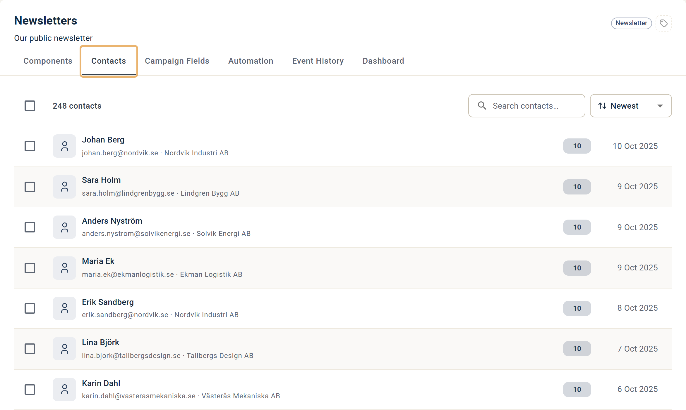
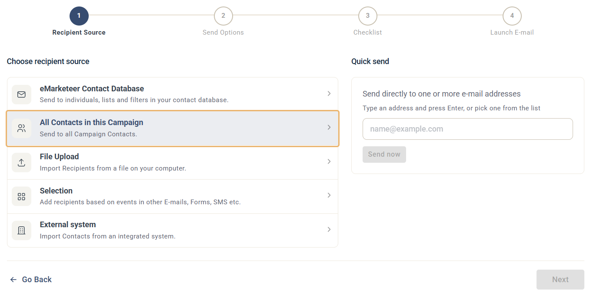

# Campaign Contacts

Campaign Contacts is a tab in each campaign that lists the contacts belonging to that campaign.

Use it to see who has interacted with the campaign, review individual contact history, and remove unwanted contacts.

A contact is added to the Campaign Contacts list when it:

* Is addressed and sent an email that belongs to the campaign. Contacts excluded before sending are not added.
* Is addressed and sent an SMS that belongs to the campaign. Contacts excluded before sending are not added.
* Submits a form belonging to the campaign.
* Visits a Landing Page belonging to the campaign. Anonymous visits are not added.

## Campaign Contacts interface

Campaign Contacts interface

Click an individual contact to view the history of their interactions within the campaign. To find a specific contact, use the Search contacts field in the top right corner of the tab.

### Removing contacts from a campaign

You can use this tab to remove unwanted contacts from the campaign, and by extension from each component report within the campaign. This is useful for removing test contacts.

1. Select the contacts to remove using the checkboxes on the left of each row.
2. Click Remove from Campaign above the list.

## All contacts in this campaign (Recipient Source)

You can address Campaign Contacts using the "All contacts in this campaign" option when sending an email or SMS. See the definition at the top of this article for what counts as a campaign contact.

The "All contacts in this campaign" option
