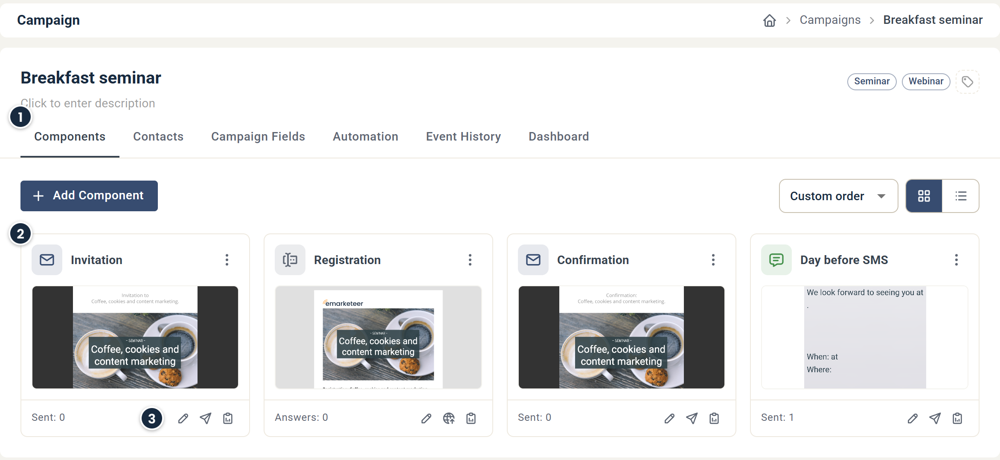

# Campaign Interface explained

This article describes the campaign interface, with a focus on the Components view.

At the top of the campaign page are the campaign name, description and tags, followed by tabs for the different views of the campaign. Add new components with **Add Component** in the Components view.

Components make up the content of your campaign. There are four component types: [Emails](../getting-started/basics-creating-email.md), [Forms](../getting-started/basics-creating-form-new.md), [SMS](../getting-started/basics-creating-sms.md), and [Landing pages](../developer-advanced/creating-first-webpage.md), plus one sub-component, Mobile apps.

## 1. Campaign views

Below the campaign name and description sit several tabs. Each tab is a separate view of the campaign:

* **Components** — The default view. Organize and view the campaign's components.
* **Contacts** — Lists contacts added to the campaign, either imported directly or added automatically through interaction. The number of contacts is shown above the list. [Read more](campaign-contacts.md).
* **Campaign Fields** — Define fields unique to this campaign that can be merged into component content as variables. Editing a field value replaces the variable in every component that uses it. [Read more about campaign fields](how-to-use-campaign-fields-in-emarketeer.md).
* **Automation** — Add automated actions to the campaign. Automations trigger from a contact interacting with a component, so the campaign must contain at least one component. [Read more about campaign automations](campaign-automations.md).
* **Event History** — Shows events for sent emails or SMS. Review when a component was sent, and review or abort upcoming scheduled sends.
* **Dashboard** — Build campaign-specific reports using reporting widgets. See [campaign reports](../reports/how-to-use-emarketeer-campaign-reports.md).

## 2. View-specific area

The area below the tabs shows the interface for the active view. The screenshot above shows the Components view.

Click **Add Component** to add an email, form, SMS, landing page or mobile app to the campaign.

## 3. Components view

In the Components view, components appear as either cards or a list. Switch between them using the Grid view and List view icons in the top right corner. This guide uses the default grid view.

Use the sort menu next to the view icons to order the components by Custom order, Newest, Name A–Z, or Most results. With Custom order selected, you can rearrange the cards by drag and drop. Double-click a card's thumbnail to open the component editor.

At the bottom of each card is the component's result count (for example Sent or Answers) and icons for the main sections of the component:

* **Edit** (pencil) — Opens the component editor where you change the content of the component.
* **Send** (paper plane) — Opens the Send options page. Send or schedule a component. Available for email and SMS only.
* **Publish** (globe) — Opens the Publish options page. Shows the direct URL of the component and other publishing options. Available for forms and landing pages only.
* **Reports** (clipboard) — Opens the component report. Each component type has its own report with different metrics.

The icon in the top left corner of the card shows the component type. The three-dot icon in the top right corner opens the More actions menu.

### More actions menu

This menu repeats Edit, Send or Publish, and Reports, and adds Shared Reports. For forms it also has Open/Close Form. It also provides options for managing the component:

* **Change name** — Renames the component. The name is visible only to eMarketeer users, not to contacts.
* **Copy** — Creates a copy in the campaign named "Copy of \[component name]". The copy has a clean report but is otherwise identical to the original.
* **Move** — Moves the component to another campaign. A component can't exist outside a campaign, so you move it to another campaign, never to a folder. Internal links to components in the source campaign may break in the new one.
* **Create Template** — Creates a copy of the component as a template, available under My Templates when you add a new component. My Templates lists all saved templates on your account.
* **Delete** — Deletes the component from the campaign. Deleting a component removes its report and connected statistics. Contact interactions with the component are removed from the contact's Engagement timeline.
