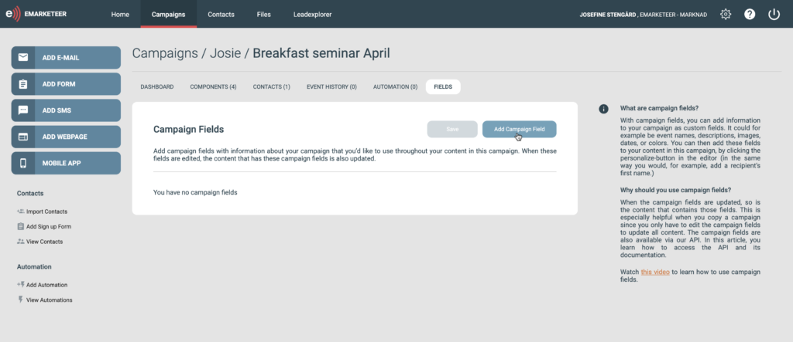
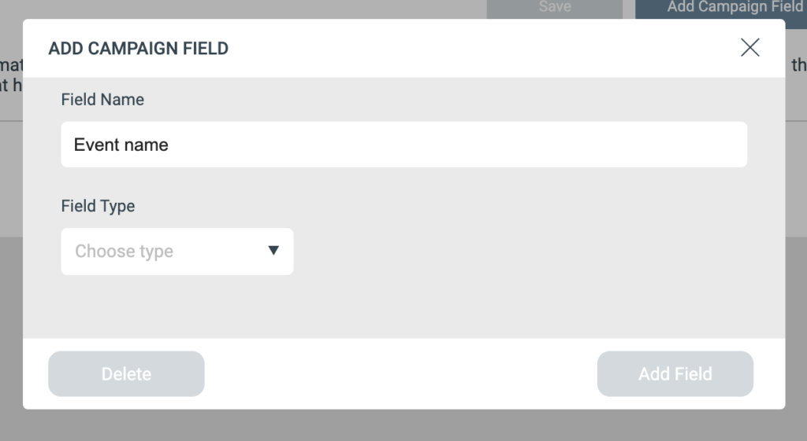
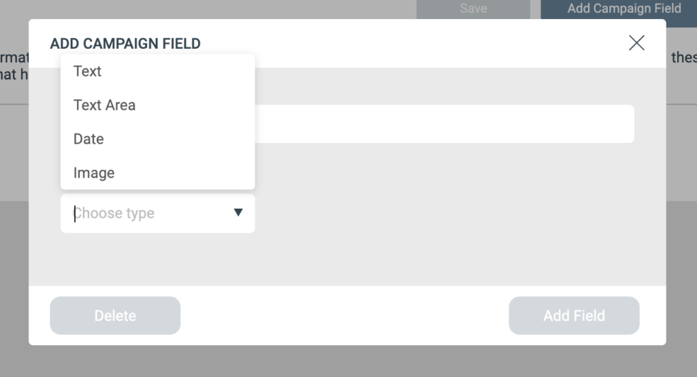
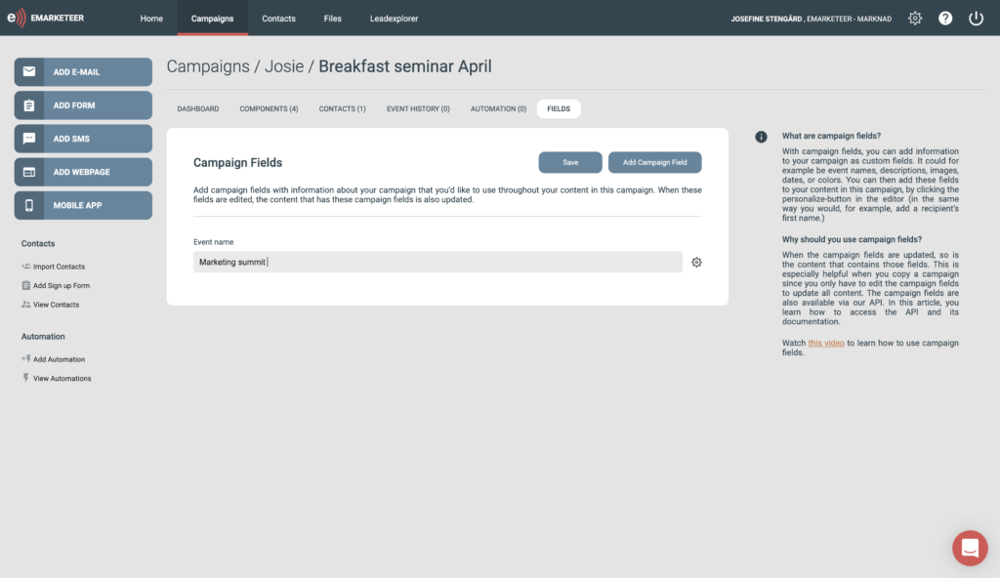
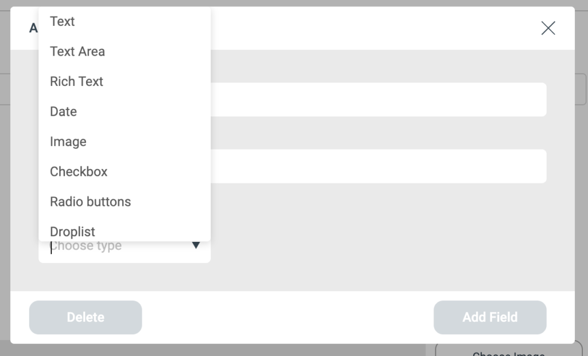
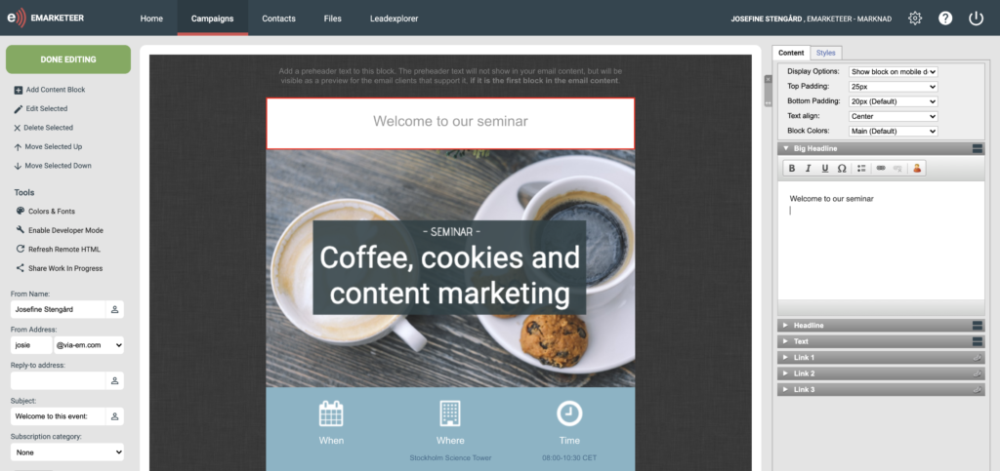
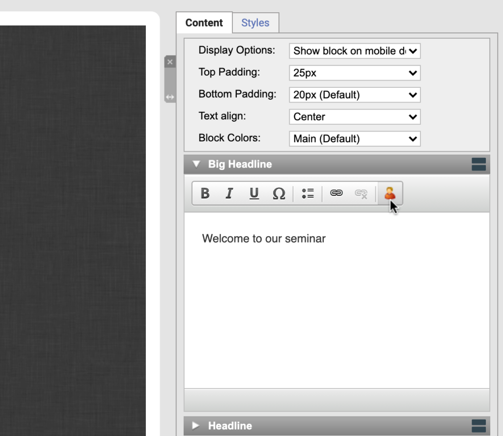
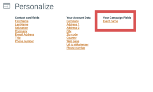
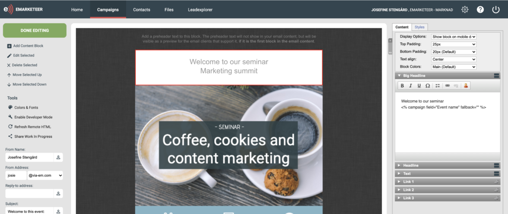
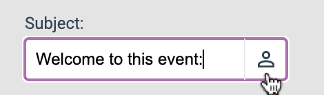

# How to use campaign fields in eMarketeer

Campaign fields let you store custom information once and reuse it across every piece of campaign content.

In this article, you learn why campaign fields are useful, how to set them up, how to insert them into your content, and a few extra tips.

## What are campaign fields?

A campaign field holds custom information that you want to reuse throughout a campaign — titles, event names, descriptions, images, dates, and so on. It is up to you which fields to add.

## Why use campaign fields?

Instead of typing the same information into every content piece, you store it once as a campaign field and reference it. When the information changes, you update the field and every component that uses it updates automatically. This is especially helpful when you copy a campaign — you only edit the fields to bring the whole campaign up to date.

## How to set up campaign fields

1. In your campaign, go to the "fields" tab and click "add campaign field."

2. In the pop-up, name the field. Make the name clearly describe what the field contains — for example, "event name." Use the description to note how and when you use the field as a reference for future edits.

3. Choose the field type. The available types are:

- **Text:** suitable for headlines or names.
- **Text area:** like text but with more room — suitable for descriptions or summaries. Supports HTML.
- **Date:** with optional time.
- **Image:** add an image from your eMarketeer image library or paste an image link. Make sure the link starts with https.
- **Rich text:** for text you want to format with bold, italics, hyperlinks, and so on.
- **Checkbox:** show or hide a piece of content based on whether the box is checked. For example, two events share a campaign, but only one needs to include parking information — a checkbox controls whether the parking text is included.
- **Radio buttons:** choose one of several options. For events at different locations, you can add radio buttons for each location and the chosen value flows into your content.
- **Droplist:** pick one or more options from a list. For example, a list of speakers — pick the ones for this event and they appear in your content.

4. After you pick a type, a value field appears. Enter the value.

Repeat for any campaign fields you need. Click save. Use the cog wheel to edit or delete a field.

## How to add a campaign field to your content

Adding a campaign field works the same way as inserting a contact's first name.

1. In your content editor — an email in this example — click the text block where you want to add the field.

2. Click the personalize icon.

3. In the pop-up, you see the fields on your contact card together with the campaign fields you set up. This is why clear names matter.

4. Choose the campaign field and click save. The field is added to your content.

## How to add a campaign field as an image or to a form

There is currently no personalize button for image blocks or the form editor. To use a campaign field there, go to any text block, copy the campaign field link, and paste it into your form or as the image URL in your image block.

## Use campaign fields in your sender information

You can also use a campaign field in the subject line. Click the personalize icon next to the subject and choose the campaign field.

