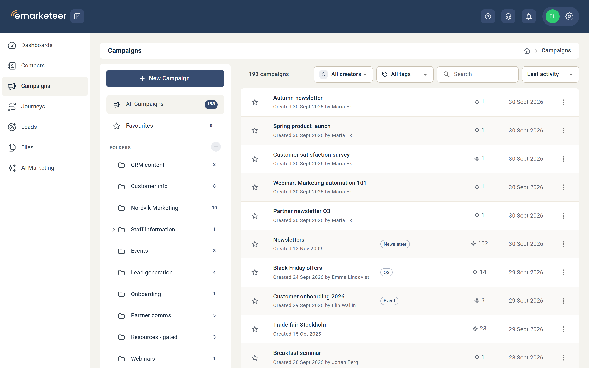

# Organizing campaigns

A campaign works like a project that groups related components together — for example, every email, form, and landing page tied to one event or newsletter. As your account fills with campaigns, a little structure keeps them easy to find. See [How to create a new campaign](../getting-started/create-new-campaign.md) to make your first one.

## The Campaigns list view

The Campaigns list gives you an overview of every campaign without opening any of them. The Contents column lists how many of each component type a campaign holds, so you can see what's inside at a glance. You can also see who created each campaign and when. Campaigns are sorted with the most recently created first.

## Organize campaigns into folders

Group campaigns into folders by type — for example Newsletters, Events, Surveys, Website forms, Internal, or Promotional. Sorting by purpose makes any single campaign quicker to find later.

### Create a folder

To create a folder, click the plus icon next to **Folders** in the left-hand panel of the Campaigns listing. A folder can hold other folders or campaigns. A campaign can't hold folders.

### Move campaigns and folders

You can move one campaign at a time. Click the three-dot icon on the campaign's row and choose **Move to folder**.

## Per-campaign options

Each campaign has additional options behind the three-dot icon on the far right of its row:

* **Favourite** — Click the star to the left of a campaign's name to add it as a favourite, quickly accessible from the Favourites section in the left-side menu.
* **Rename** — To rename a campaign, open it and change its name there.
* **Copy campaign** — Makes a copy of the campaign in the same folder. As the most recently created campaign, the copy is sorted first.
* **Transfer campaign** — Creates a copy of the campaign in another eMarketeer account. See [Transfer a campaign to a different account](transfer-a-campaign-to-a-different-account.md).
* **Delete campaign** — Deletes the campaign.
