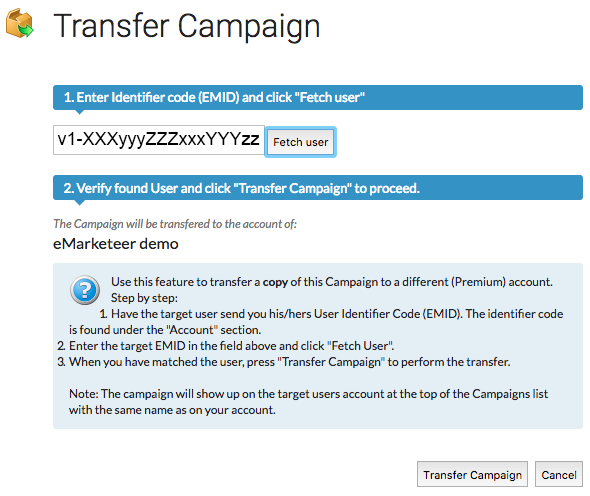

# Transfer a campaign to a different account

You can transfer a copy of a campaign from one eMarketeer account to another. This helps when your organisation runs several separate accounts and wants to share work between them.

Only the campaign components are transferred. Contacts and automations stay in the original account, and the original campaign remains in place — the destination receives a copy.

### Before you start

You need two things:

1. A campaign you want to transfer.
2. The TenantID of the destination account.

### Get the destination TenantID

The TenantID is a unique identifier for an eMarketeer account. Ask a user on the destination account to log in and click their avatar in the top right. Their TenantID appears at the top of the menu, under their email and company name.

Have them copy the code and send it to you.

### Transfer the campaign

Open "Campaigns" and find the campaign you want to transfer in the list. Click the three-dot icon on the far right of that row, then click "Transfer campaign".

A dialog opens and asks for the TenantID of the destination account. Paste the TenantID you received and click "Fetch User".

Verify the destination account looks correct, then click "Transfer Campaign" to complete the transfer.

### After the transfer

The receiving account now has a copy of the campaign as the first entry in its campaign list.
