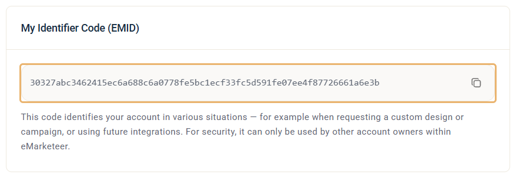

# Transfer a campaign to a different account

You can transfer a copy of a campaign from one eMarketeer account to another. This helps when your organisation runs several separate accounts and wants to share work between them.

Only the campaign components are transferred. Contacts and automations stay in the original account, and the original campaign remains in place — the destination receives a copy.

### Before you start

You need two things:

1. A campaign you want to transfer.
2. The EMID of a user in the destination account.

### Get the EMID of the destination account

The EMID (My Identifier Code) is a code that is unique to a user in a specific eMarketeer account. Ask a user in the destination account to log in, click the gear icon in the top right corner and go to **My Profile** > **Security**. The code is under **My Identifier Code (EMID)**.

Have them click the copy icon next to the code and send the code to you.

### Transfer the campaign

Open "Campaigns" and find the campaign you want to transfer in the list. Click the three-dot icon on the far right of that row, then click "Transfer campaign".

A dialog opens and asks for the EMID of the destination account. Paste the EMID you received and click **Transfer campaign**.

### After the transfer

The receiving account now has a copy of the campaign as the first entry in its campaign list.
