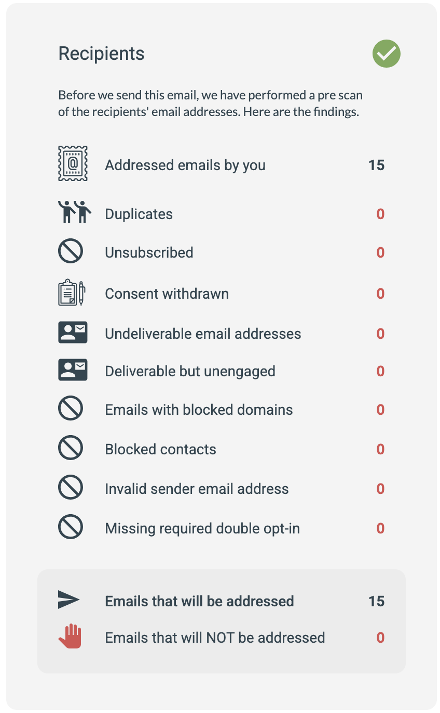

# Understanding the Email Checklist

The Email Checklist shows how many contacts will be addressed by a sendout, and how many will not, broken down by reason.

You see this page when sending an email. Review it to confirm your sendout reaches the right audience and to understand any exclusions.

Example of the Checklist

## Checklist categories

Addressed email by you
This is the total number of contacts included in the recipient lists used for this sendout.

Duplicates
The number of duplicate email addresses found. Usually only relevant when you use more than one recipient list.

Unsubscribed
The number of intended recipients unsubscribed from the subscription list used to categorize this email. Only relevant when you use such a list.

Consent Withdrawn
The number of contacts who have revoked their consent to receive sendouts from you. The specific consent setting is the contact's Marketing Consent.
[This article](https://support.emarketeer.com/knowledgebase/how-does-consent-work/) explains consent in more detail.

Undeliverable Email Addresses
The number of contacts whose email addresses have previously reported they cannot receive email.
[This guide](https://support.emarketeer.com/knowledgebase/undeliverable-contacts-email-checklist/) shows how to find undeliverable contacts in your contact database.

Deliverable but Unengaged
The number of contacts that can receive email but have not read your messages or had any registered activity for a long period. You choose whether to send to these contacts in Step 2 of the email sendout, via the Exclude Inactive Recipients setting.
[This article](https://support.emarketeer.com/documentation/exclude-inactive-recipients/) explains Exclude Inactive Recipients.

Emails with Blocked Domains
If your account blocks specific domains for sendouts, any contacts on those domains in your recipient lists are counted here.

Blocked Contacts
If a setting on your sendout dynamically blocks some contacts, they are counted here. Examples include "Exclude contacts that have already been sent this email" or actively blocking a recipient source, such as when sending reminder emails as described in [this guide](https://support.emarketeer.com/knowledgebase/configuring-reminder-email/).

Invalid Sender Email Address
Recipients fall under this category when the sender email address for this email component is invalid. This can be because of an invalid email domain or an incorrectly formatted address. Fix it on the email's editing page by updating the sender email in the left-side menu.

Missing Required Double Opt-In
The number of contacts in the recipient list that have not completed the double opt-in process, in cases where double opt-in is required before a contact can receive email from your account.

Emails that will be addressed
The number of contacts that will be addressed by this sendout after exclusions.

Email that will not be addressed
The total number of contacts that will not be addressed by this sendout.
