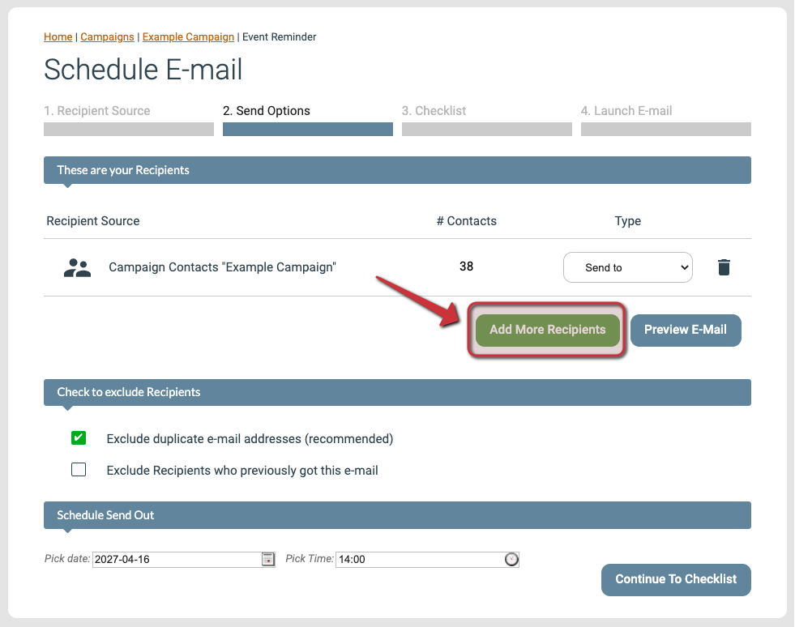
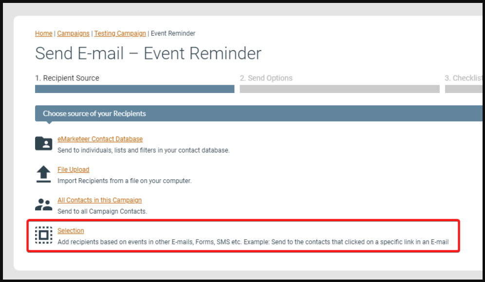
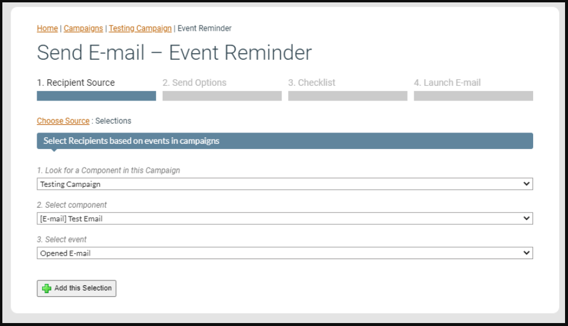
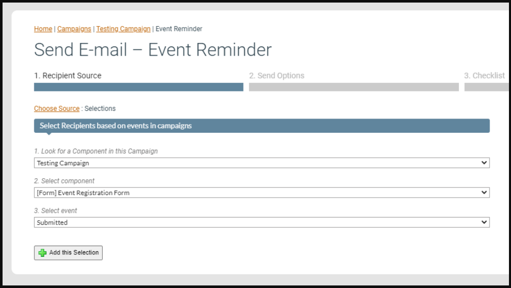
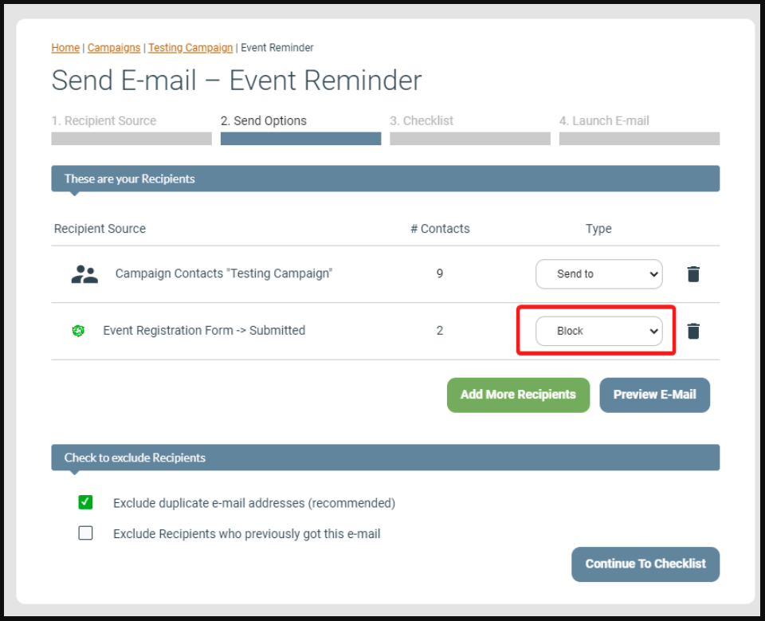

# How to set up and send a reminder email

Set up a follow-up campaign that automatically skips contacts who already engaged with the original send.

eMarketeer's reminder pattern uses a dynamic Selection of contacts based on engagement with a previous component, such as an email or form. The Selection updates over time, so you can build the reminder before the original campaign goes out and trust it to target only the contacts who still need a nudge.

This guide covers two common scenarios: reminding contacts to read an email they haven't opened, and reminding contacts to register through a form they haven't submitted.

---

## How to create a reminder email

### 1. Create an email component to use as the reminder

If you have not built the reminder email yet, see the guide on [creating an email](https://support.emarketeer.com/knowledgebase/basics-send-email/).

### 2. Start the send process and add the original recipients

Choose the same group of contacts you used for the original campaign as your first Recipient Source. If you want to send the reminder later, pick "Scheduled Email" as the sendout type in the first step.

### 3. On Step 2, Send Options, click [Add More Recipients]

Use this button to add the Selection of contacts you want to block from the reminder.

The [Add More Recipients] button on the Send Options page

### 4. Choose "Selection" for the second Recipient Source

Selection is one of the options on the first Recipient Source page

### 5. Pick the Selection that matches your reminder

The Selection you pick depends on what the reminder is about. The two examples below cover an email open and a form submission, but other event types are available.

- To remind contacts to read a previous email, build a Selection of contacts who have opened that email. Those contacts are the ones you will block.

Selecting contacts that have opened the previous email as a recipient source to block in the next step

- To remind contacts to register through a form, build a Selection of contacts who have submitted that form. Those contacts are the ones you will block.

Selecting form registrants as a recipient source to block in the next step

### 6. Set the Selection's Type to "Block"

The Recipients list now shows both your original group and the new Selection. Change the Type dropdown for the Selection from "Send to" to "Block".

Blocking the sendout by setting the Recipient Source to Block

A contact in a blocked recipient list is excluded from the send, even if another recipient list would have included them.

For a scheduled email, the Selection re-evaluates over time. Even if it contains zero contacts when you set up the send, it will block the right people at the moment the email goes out.

### 7. Continue to the Checklist and send or schedule

Finish the sendout flow to send the reminder now or schedule it for later.

---

If you still have questions, contact support via the channels listed on the [contact page](https://app.emarketeer.com/corporate/gui/help/contact.php) when logged in to your account.
