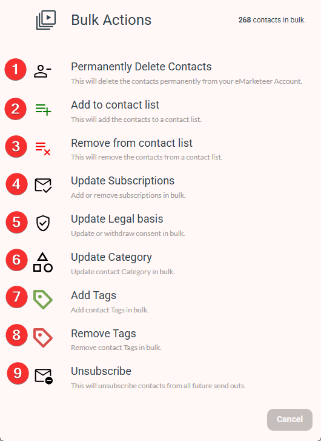

# Bulk Actions: A Tool for Managing Lists of Contacts

Bulk Actions lets you update or manage groups of contacts in a single operation.

The Bulk Actions button is available alongside Selections, Lists, and contact pages, typically next to the Export button. Use it when you need to apply the same change to many contacts at once.

Image showing the location of the Bulk Actions button on the Contacts Page of a Contact List

## Bulk action options

The Bulk Actions tool offers nine main functions:

1. **Permanently Delete Contacts** — Permanently deletes the contacts from your account along with any interactions they have been part of. Deleted contacts cannot be restored. This includes their interactions, activity, and engagement history.

2. **Add to Contact List** — Adds the contacts to a contact list specified in the next step. You can create a new contact list if one does not already exist.

3. **Remove from Contact List** — Removes the contacts from a contact list specified in the next step.

4. **Update Subscriptions** — Changes the opt-in/opt-out status of subscription lists for the contacts. You can update any or all subscription lists in one go.

5. **Update Legal Basis** — Updates the Legal Basis of all the contacts. You can update both "Store and Process" and "Marketing Sendouts" at the same time, and to different options if needed.

6. **Update Category** — Updates the Contact Category of all the contacts.

7. **Add Tags** — Adds the selected tags to all the contacts.

8. **Remove Tags** — Removes the selected tags from all the contacts.

9. **Unsubscribe** — Unsubscribes the contacts from all future email and SMS sendouts by setting their Legal Basis for Marketing Sendouts to "Withdrawn."
