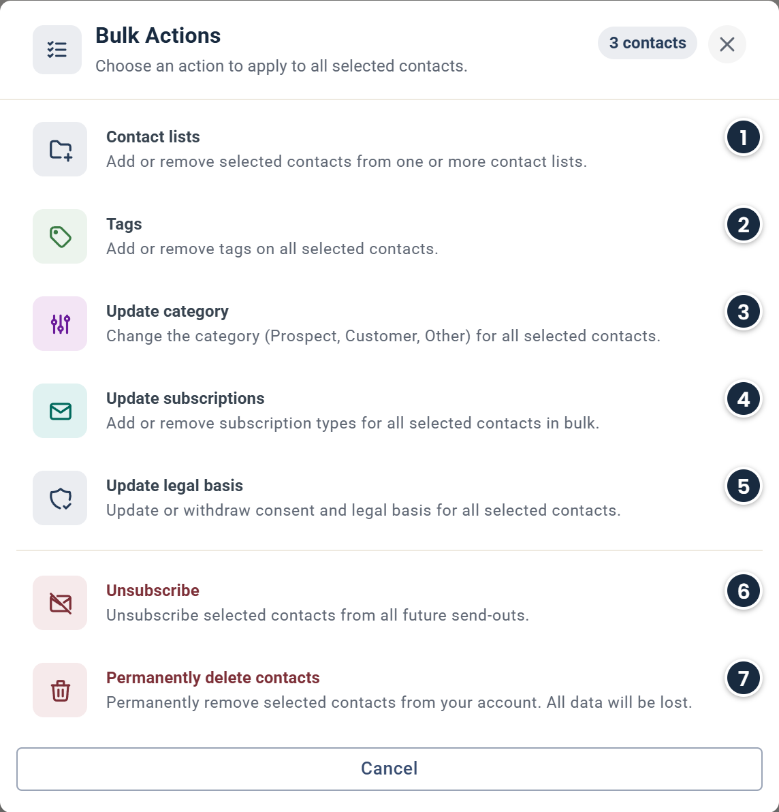

# How to manage contacts in bulk

Bulk Actions lets you update or manage groups of contacts in a single operation.

To open it, go to **Contacts** and select the contacts you want to change with the checkboxes in the list. To select every contact in the current view, use the checkbox at the top of the list. The **Bulk actions** button then appears at the top of the list, next to **Export**. Use it when you need to apply the same change to many contacts at once.

## Bulk action options

The Bulk Actions tool offers seven functions:

1. **Contact lists** — Adds the contacts to, or removes them from, a contact list. Choose **Add to list** or **Remove from list**, then select a list. You can create a new contact list if one does not already exist.
2. **Tags** — Adds tags to, or removes them from, all the contacts. Choose **Apply tag** or **Remove tag**, then select or create a tag.
3. **Update category** — Updates the Contact Category (Prospect, Customer, Other) of all the contacts.
4. **Update subscriptions** — Changes the opt-in/opt-out status of subscription lists for the contacts. You can update any or all subscription lists in one go.
5. **Update legal basis** — Updates the Legal Basis of all the contacts. You can update both "Store and Process" and "Marketing Sendouts" at the same time, and to different options if needed.
6. **Unsubscribe** — Unsubscribes the contacts from all future email and SMS sendouts by setting their Legal Basis for Marketing Sendouts to "Withdrawn."
7. **Permanently delete contacts** — Permanently deletes the contacts from your account along with any interactions they have been part of. Deleted contacts cannot be restored. This includes their interactions, activity, and engagement history.
