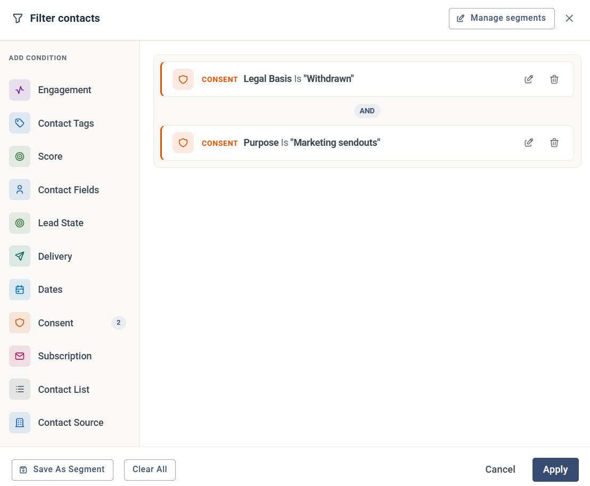
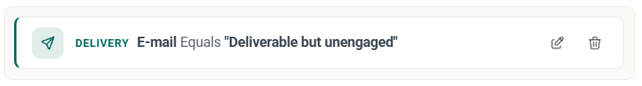

# How to clean up your contacts

This guide shows how to find contacts that are no longer relevant for your account, so you can remove them.

Cleaning up regularly keeps your contact count within your plan. It also helps you follow [GDPR](../gdpr-consent/emarketeer-gdpr-overview.md), which says you shouldn't keep personal data for longer than you need it. And a tidy contact database is easier to work with.

## Find contacts with the filter builder

All the examples below use the filter builder. Click **Contacts** in the left sidebar, then click **Filter** above the contact list. To learn how the filter builder works, see [How to build and use Contact Filters](how-to-build-contact-filters.md).

Click **Save As Segment** to save a filter you want to run again, so the clean-up becomes a routine.

## Undeliverable contacts

Undeliverable contacts are contacts whose email delivery has failed. To find them, add a **Delivery** condition with **E-mail** **Equals** **Undeliverable**.

They are safe to remove, because eMarketeer already excludes them from sendouts. See [Email bounce handling](../email-deliverability/bounce-handling.md).

eMarketeer remembers that an address is undeliverable. If you delete the contact and add it again, it's still flagged as undeliverable.


A few undeliverable contacts can be false positives. Rather than keeping all of them, make a routine of checking the bounces after each sendout for anything unexpected.


## Contacts who withdrew consent

These contacts have opted out of marketing emails. To find them, add two **Consent** conditions: **Legal Basis** is **Withdrawn**, and **Purpose** is **Marketing sendouts**.

They are excluded from sendouts automatically and are safe to remove. eMarketeer keeps their consent history, so if you import them again, it still knows they withdrew consent and won't send them marketing emails.

## Contacts you haven't used in a year

Every contact has a **Last Email Sent** date, which is set each time an email is sent to the contact. Use it to find contacts you haven't emailed in a full year:

1. Add a **Dates** condition: **Last Email Sent**, **Days Passed (or more)**, **365**.
2. Add an **Engagement** condition: **Any form**, **Not Submitted**, at least 1 time, last 365 days. This keeps contacts who have submitted a form during the year.

The result is contacts that exist in eMarketeer but that you haven't emailed, and that haven't submitted any forms, for a year. If you have good [lead scoring](../lead-board-scoring/how-lead-scoring-works-in-emarketeer.md) rules, you can use a **Score** condition in the same way.

## Deliverable but unengaged contacts

These contacts can receive your emails, but they don't open them or click any links. To find them, add a **Delivery** condition with **E-mail** **Equals** **Deliverable but unengaged**.

They may be worth removing, but consider giving them a chance first with a re-engagement [Journey](../journeys/journeys.md). To read more about unengaged contacts, see [Exclude inactive recipients](../../documentation/email-sms/exclude-inactive-recipients.md).

## Remove the contacts

When the filter shows the contacts you want to remove, select them and choose **Bulk actions** › **Permanently delete contacts**. See [How to manage contacts in bulk](bulk-actions-tool.md).


Deleted contacts can't be restored from within eMarketeer. If you might need their data later, click **Export** to save a copy before you delete them.

