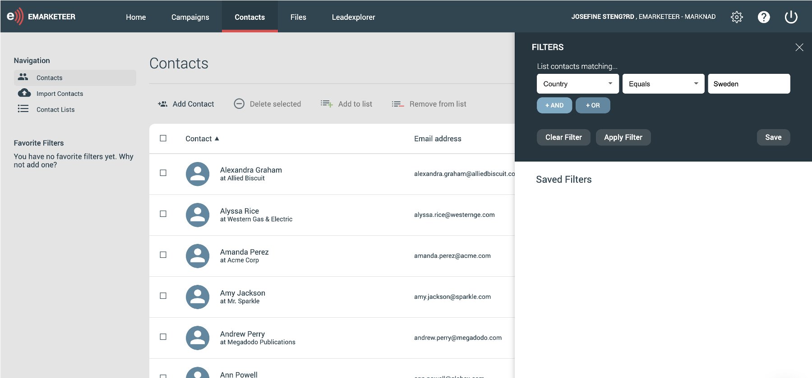

# How to build and use Contact Filters

Filters let you segment contacts by any criteria you set up, from broad groups to highly specific selections.

This article walks through the filter builder, shows a few example filters, and covers the actions you can take on a selection of contacts.

## Get to know the filter builder

In eMarketeer, click the "contacts" tab. This is where you work with and get to know your contacts. To segment or build a selection, click the "filter" tab on the right-hand side, just above the contact list. A web panel opens — this is where you build filters and find the ones you have saved.

The first drop-down lists every category you can filter on:

* Contact fields (any information on the contact card)
* Marketing engagement
* Delivery
* Dates
* Consent
* Subscription categories
* Contact lists

## Build a filter

To build a filter, pick the category and then a suitable operator — for example, "equals" or "doesn't equal." The operators available depend on the category.

For a simple example, segment contacts by country:

1. In the first drop-down, choose Contact fields -> country.

2. In the operator drop-down, choose "equals."

3. In the third field, type the country.

4. Click "apply." You now see all contacts that match the filter.

## Make a filter more specific by adding criteria

To narrow a filter, add more criteria. After the first one, click "and" or "or" to add another.

* AND: the contact must match both criteria.

* OR: the contact must match one of the criteria.

You can add as many criteria as you like and mix AND and OR in the same filter.

## Filter on engagement

The engagement category is worth highlighting. You can filter contacts by how they engaged with your marketing — for example, whether they filled out a specific form, clicked a link in an email, or visited a page on your website. This is useful for grouping contacts who have shown enough interest to be passed to sales, or for sending follow-up content based on activity.

## Save filters

Save a filter to come back to it quickly. Saved filters are not personal — every user on your account can see them. You find saved filters in the same panel as the filter builder. You can also mark a filter as a favorite to pin it to the left-hand menu.

## What you can do with your selection of contacts

### Bulk actions

Several bulk actions let you update every contact in the filter at once. You can update legal basis, change subscriptions, add the contacts to a campaign or an email list, and more.

### Set the filter as a recipient

To send to the contacts in a filter:

1. Go to the send-out options for your email, where you add recipients.
2. Choose "eMarketeer contact data base."
3. Click "contact filter."
4. In the drop-down, choose the filter you want to send to. The filter must be saved to appear here.

Every contact that matches the filter at send time receives the email.
