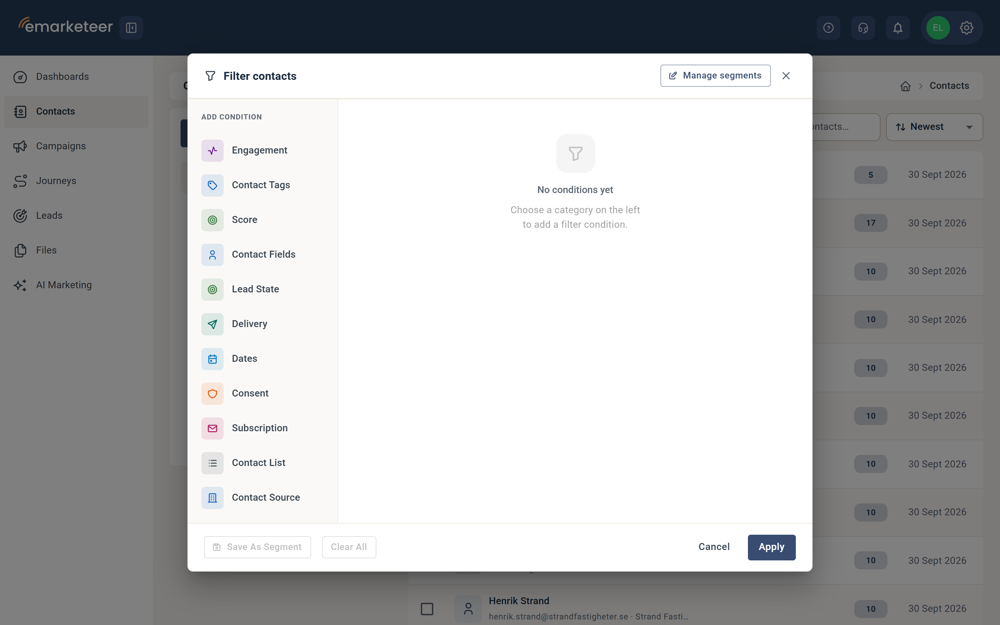
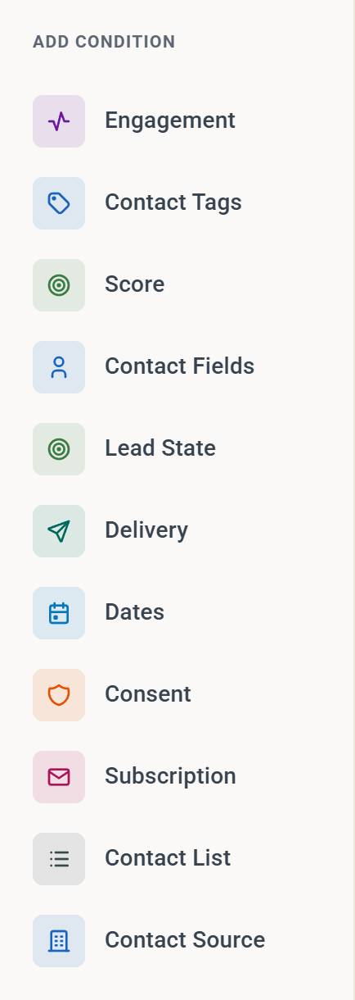
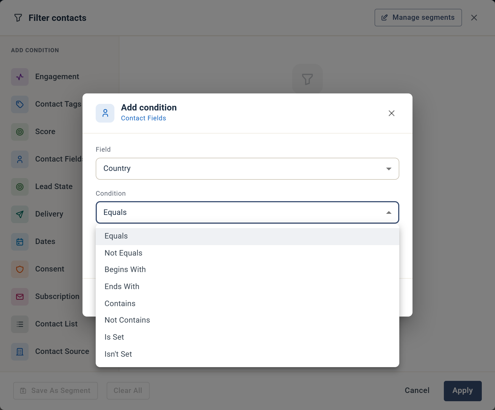
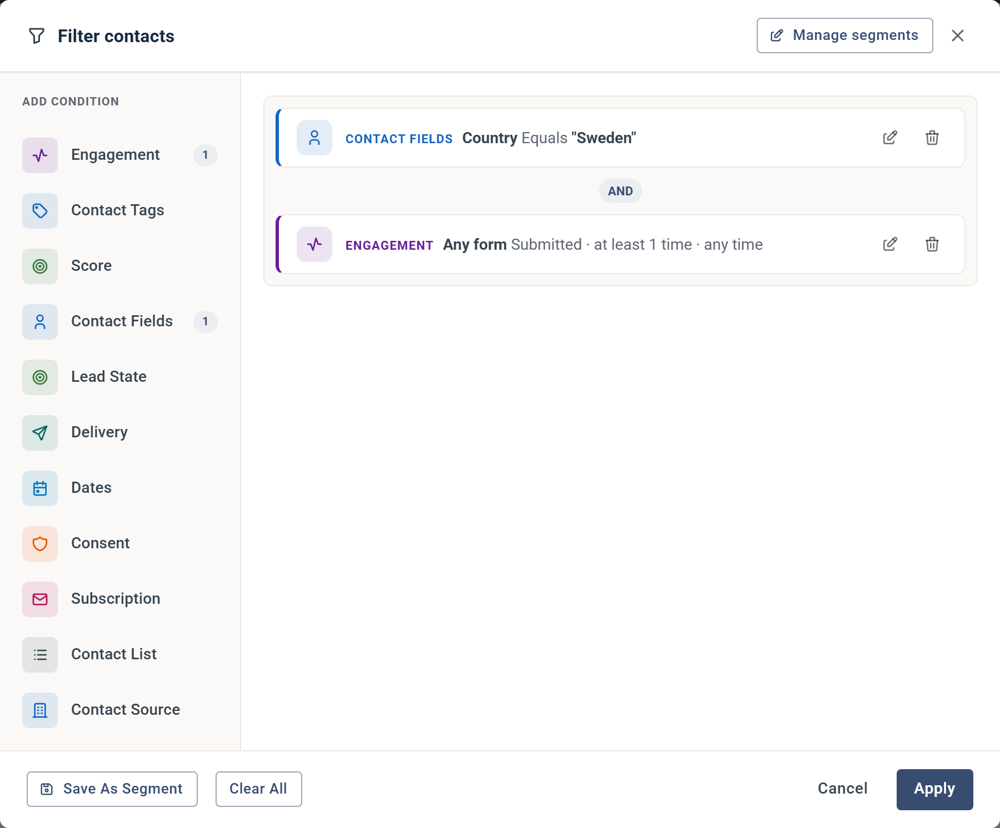
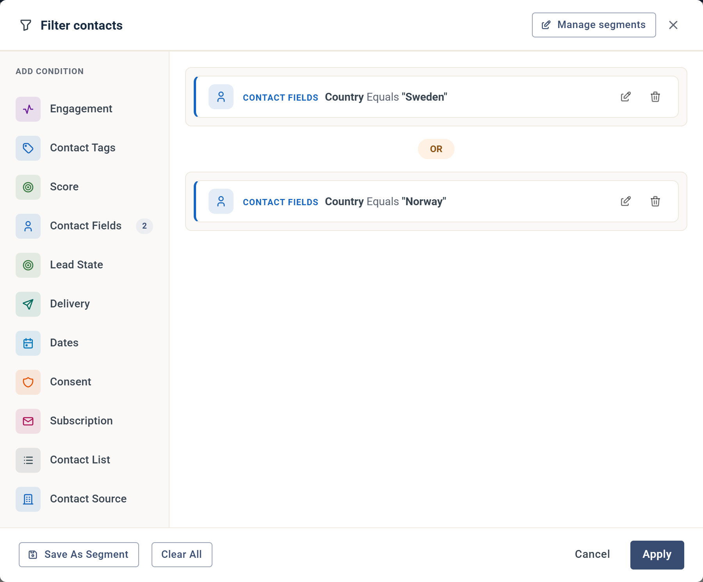

# How to build and use Contact Filters

Filters let you segment contacts by any criteria you set up, from broad groups to highly specific selections.

This article walks through the filter builder, shows a few example filters, and covers the actions you can take on a selection of contacts.


Journeys, Lead Streams, and lead scoring rules use mostly the same dialog to build their conditions — typically with a slightly smaller set of options. Understanding it here gives you a solid foundation for working effectively with eMarketeer's automated sequences ([Journeys](../journeys/journeys.md)) and lead qualification tools ([Lead Streams](../lead-board-scoring/lead-streams.md), [Lead scoring](../lead-board-scoring/how-lead-scoring-works-in-emarketeer.md)).


## Get to know the filter builder

In eMarketeer, click **Contacts** in the left sidebar. This is where you work with and get to know your contacts. To segment or build a selection, click **Filter** just above the contact list. The **Filter contacts** dialog opens — this is where you build filters. Use **Manage segments** at the top of the dialog to find the segments you have saved.

The **Add condition** column on the left lists every category you can filter on:

* Engagement
* Contact Tags
* Score
* Contact Fields (any information on the contact card)
* Lead State
* Delivery
* Dates
* Consent
* Subscription
* Contact List
* Contact Source

## Build a filter

To build a filter, click a category and then choose a suitable condition — for example, "Equals" or "Not Equals." The conditions available depend on the category.

For a simple example, segment contacts by country:

1. Click **Contact Fields**, then choose **Country** in the **Field** drop-down.

2. In the **Condition** drop-down, choose "Equals."

3. In the **Value** field, type the country and click **Add condition**.

4. Click **Apply**. You now see all contacts that match the filter.

## Make a filter more specific by adding criteria

To narrow a filter, add more criteria. Click a category again to add another condition. New conditions are joined with AND. Click the **AND** label between two conditions to switch it to **OR**.

* AND: the contact must match both criteria.

* OR: the contact must match one of the criteria.

You can add as many criteria as you like and mix AND and OR in the same filter.

## Filter on engagement

The engagement category is worth highlighting. You can filter contacts by how they engaged with your marketing — for example, whether they filled out a specific form, clicked a link in an email, or visited a page on your website. This is useful for grouping contacts who have shown enough interest to be passed to sales, or for sending follow-up content based on activity.

## Save segments

Save a filter as a segment to come back to it quickly. Click **Save As Segment** in the Filter contacts dialog. Segments are not personal — every user on your account can see them. You find saved segments under **Manage segments** in the same dialog and under **Segments** in the Contacts menu. You can also mark a segment as a favourite with the star in **Manage segments** to pin it to the left-hand menu.

## What you can do with your selection of contacts

### Bulk actions

Several bulk actions let you update every contact in the filter at once. Select the contacts with the checkboxes in the list, then click **Bulk actions**. You can update legal basis, change subscriptions, add the contacts to a contact list, add tags, and more.

### Set a segment as a recipient

To send to the contacts in a segment:

1. Go to the send-out options for your email, where you add recipients.
2. Choose "eMarketeer contact data base."
3. Click "contact filter."
4. In the drop-down, choose the segment you want to send to. The filter must be saved as a segment to appear here.

Every contact that matches the segment at send time receives the email.
