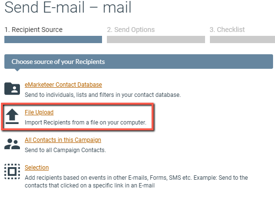
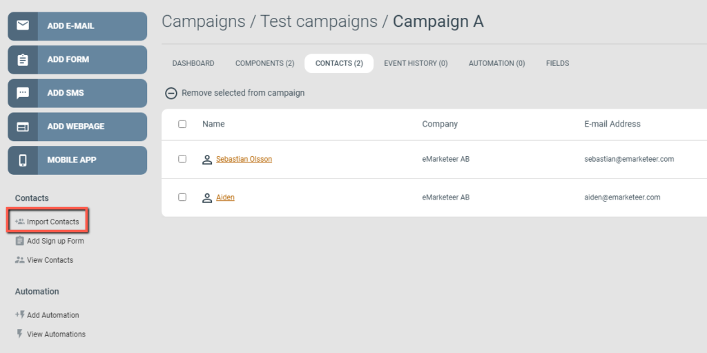
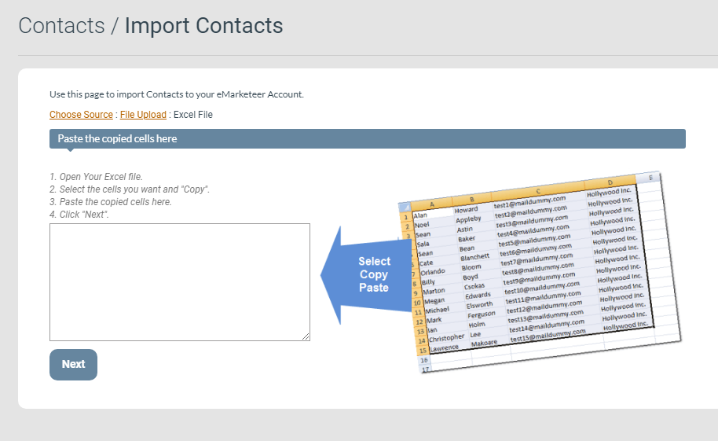
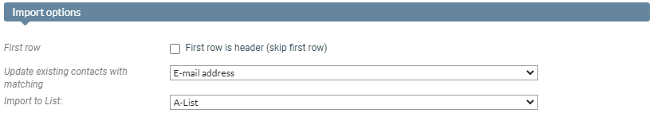
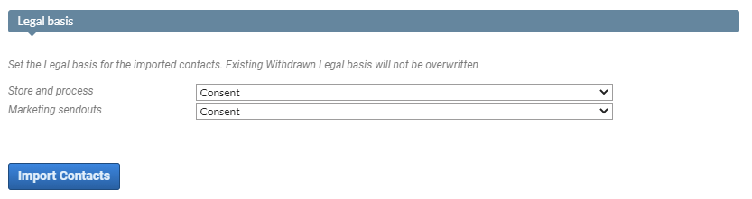
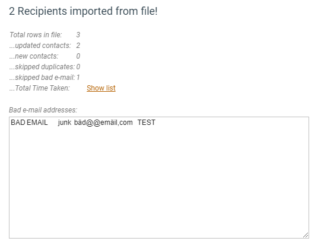

# Import contacts from Excel

This guide describes how to import contacts to your eMarketeer contact database from Excel documents.

## Preparations

1. Structure your Excel file so each column lists data of a single type and each contact sits on a new row.
2. All contacts need valid email addresses or they will not be imported. This applies even when you import contacts for SMS sendouts.
3. eMarketeer uses first name and last name as two separate fields. Full name is not supported, so split the columns in Excel.
4. If you intend to update legal basis ([consent information](https://support.emarketeer.com/knowledgebase/how-does-consent-work/)) as part of the import, make sure every contact in the file shares the same legal basis.

[

](https://support.emarketeer.com/wp-content/uploads/2021/05/2021-05-28_09-36-53.png)

Example of an Excel file with 3 contacts

## Where to import?

At this point you have an Excel file ready to go. Where you perform the import depends on what you want to do with the contacts. Most often you want to make a specific email sendout. The question is whether you want to send to them immediately or store them for later.

### Import as a recipient source

When sending emails you can choose one or more sources for your recipients. The File upload option lets you import contacts from an Excel file (or text file) and use them as recipients in that send. It is an efficient way to use contacts from a file without creating a contact list first.

[

](https://support.emarketeer.com/wp-content/uploads/2021/05/2021-05-28_10-01-08.png)

File upload option when sending an email.

### Import to a campaign

If you want to prepare your campaign ahead of sending, you can import the contacts straight to the [campaign contacts list](https://support.emarketeer.com/knowledgebase/campaign-contacts/). You can then use the "All Contacts in this Campaign" option to address that selection.

Note that the campaign contacts list updates dynamically as new contacts interact with the campaign, so there may be additional contacts beyond those from the Excel file when you address this source. This option suits empty campaigns you want to prep with contacts ahead of time, or campaigns where you want to add to an existing contact list. It does not suit campaigns with multiple purposes or recipient types.

[

](https://support.emarketeer.com/wp-content/uploads/2021/05/2021-05-28_10-16-19.png)

Import contacts option in a campaign.

### Import to a contact list

If you intend to use the contacts more than once, add them to a contact list. You can then address the same contacts across multiple sendouts without re-importing. Contact lists are commonly used for newsletter subscription lists, lists of internal contacts, or a test group for draft emails.

If you need to create a new contact list as a destination for your import, [this guide](https://support.emarketeer.com/knowledgebase/new-contact-list/) shows you how.

[

](https://support.emarketeer.com/wp-content/uploads/2021/05/2021-05-28_10-40-55.png)

Import Contacts option in the Contacts tab.

## Importing and field mapping

Once you have chosen the method of import, the next step is the import itself. Choose File Upload and select Excel File.

The next view contains instructions on how to proceed:

1. Open your Excel file.
2. Select the cells you want to import and copy them.
3. Paste the copied cells in the empty text area.
4. Click Next.

[

](https://support.emarketeer.com/wp-content/uploads/2021/05/2021-05-28_14-36-37.png)

An empty text area

### Field mapping

Next you select the columns to import. The default setting is Do not import unless the value in the first row of a column matches an entry in the drop-down menu, in which case it is pre-selected. To import a column, choose the option that matches its data type. For example, the column that contains email addresses should be set to E-Mail.

[

](https://support.emarketeer.com/wp-content/uploads/2021/05/2021-05-28_14-44-26.png)

Matching the column with the eMarketeer contact fields

### Import options

By default, matching is done on email address. If a matching email address is found, the existing contact is updated with the new information. If no match is found, a new contact is created. You can also match on External ID if one of your data columns has that data type. This updates contacts that share an External ID, which is useful if you want to update their email address. If no match is found, a new contact is created.

If the import runs under Contacts, you can also import contacts to an existing contact list using the Import to List option.

[

](https://support.emarketeer.com/wp-content/uploads/2021/06/2021-06-18_13-18-03.png)

Import options

### Legal basis

Finally, you can update the legal basis for the contacts in your file. This creates or updates the legal basis for every imported contact, so make sure your selection accurately reflects the legal basis for each individual in the file. [Read more about consent here](https://support.emarketeer.com/knowledgebase/how-does-consent-work/).

A withdrawn consent is not changed by a contact import. You cannot revoke a withdrawal through import.

[

](https://support.emarketeer.com/wp-content/uploads/2021/06/2021-06-18_13-58-39.png)

Example of how to set "Consent" as the Legal Basis for each Purpose.

When ready, click Import Contacts to start the import. The time it takes depends on the number of contacts and columns. A small list of a few hundred contacts and a handful of columns typically takes a few seconds, while larger lists take longer. A progress bar runs during the import.

When the import finishes, the results show how many contacts were updated, created, and skipped. If the import did not produce the expected results, this report helps you understand the problem. Contacts with invalid email addresses appear in the "Bad e-mail addresses" text area (visible after clicking Show list). You can copy that text into another Excel document for review.

[

](https://support.emarketeer.com/wp-content/uploads/2021/06/2021-06-18_14-26-33.png)

Results of the import
