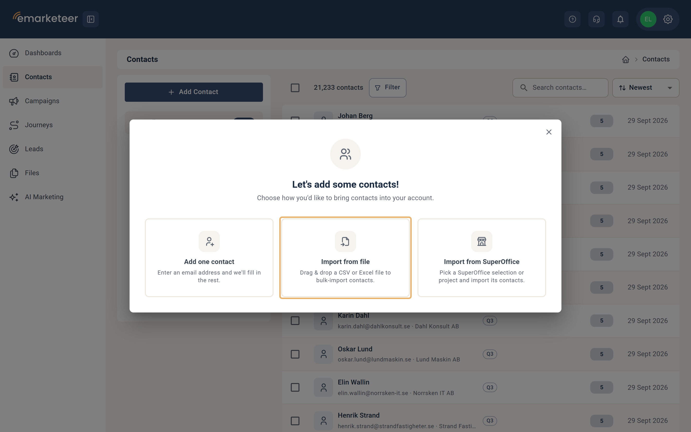
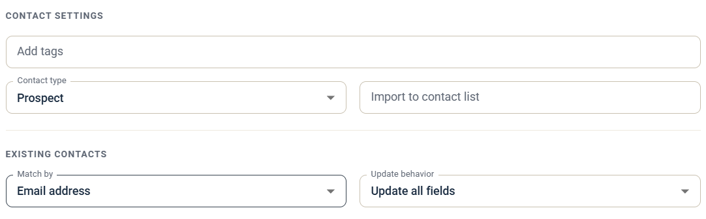
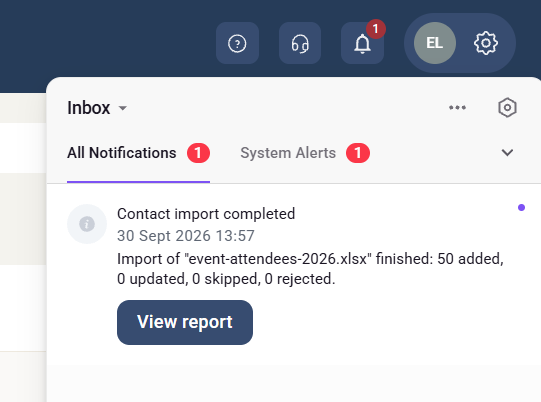
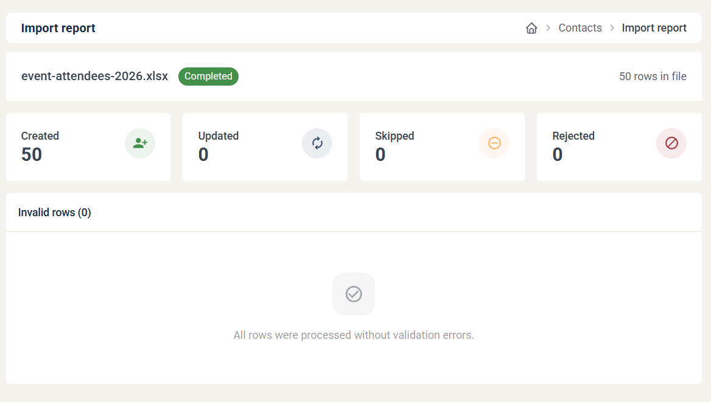

# Import contacts from Excel

This guide describes how to import contacts to your eMarketeer contact database from Excel documents.

## Preparations

1. Structure your Excel file so each column lists data of a single type and each contact sits on a new row.
2. All contacts need valid email addresses or they will not be imported. This applies even when you import contacts for SMS sendouts.
3. eMarketeer uses first name and last name as two separate fields. Full name is not supported, so split the columns in Excel.
4. If you intend to update legal basis ([consent information](../gdpr-consent/how-does-consent-work.md)) as part of the import, make sure every contact in the file shares the same legal basis.

## Where to import?

At this point you have an Excel file ready to go. Where you perform the import depends on what you want to do with the contacts. Most often you want to make a specific email sendout. The question is whether you want to send to them immediately or store them for later.

### Import as a recipient source

When sending emails you can choose one or more sources for your recipients. The File upload option lets you import contacts from an Excel file (or text file) and use them as recipients in that send. It is an efficient way to use contacts from a file without creating a contact list first.

### Import to a contact list

If you intend to use the contacts more than once, add them to a contact list. You can then address the same contacts across multiple sendouts without re-importing. Contact lists are commonly used for newsletter subscription lists, lists of internal contacts, or a test group for draft emails.

If you need to create a new contact list as a destination for your import, [this guide](../getting-started/new-contact-list.md) shows you how.

To start the import, go to **Contacts** in the left sidebar, click **Add Contact** and choose **Import from file**.

## Importing and field mapping

### Map columns

In the **Import from file** window, drag and drop your Excel or CSV file, or browse to it. eMarketeer shows how many rows it found and a preview of the first five rows.

For each column, choose the contact card field it contains in the dropdown above it. Columns whose heading matches a field are mapped automatically. Columns without a field are not imported. For example, set the column with email addresses to **Email**. Then click **Next: Import settings**.

### Contact settings and existing contacts

Under **Contact settings** you can add tags to every imported contact, set their **Contact type**, and add them to a contact list with **Import to contact list**.

Under **Existing contacts**, **Match by** decides how eMarketeer recognises contacts already in your database. By default it matches on email address: a matching contact is updated, and a new contact is created if there is no match. You can also match on External ID if one of your columns has that data type, which is useful if you want to update email addresses. External ID links a contact to its record in a connected CRM. For SuperOffice, it's set when you import from SuperOffice. See [How contacts are matched between eMarketeer and SuperOffice](../../documentation/superoffice/superoffice-contact-matching.md). **Update behavior** controls how existing contacts are updated.

### Legal basis

Finally, you can update the legal basis for the contacts in your file, for **Store and process** and **Marketing sendouts**. Both are set to **Do not update** by default. Updating creates or updates the legal basis for every imported contact, so make sure your selection accurately reflects the legal basis for each individual in the file. [Read more about consent here](../gdpr-consent/how-does-consent-work.md).

A withdrawn consent is not changed by a contact import. You cannot revoke a withdrawal through import.

### Start the import

Click **Import contacts**. The import runs in the background, so you can click **Done** and keep working while it finishes.

### Import results

When the import is complete, you get a notification in the inbox under the bell icon in the top right corner. It shows how many contacts were added, updated, skipped and rejected. Click **View report** to open the import report.

The report shows the number of contacts created, updated, skipped and rejected. If the import did not produce the expected results, the report helps you find out why. Rows that could not be imported, for example because of an invalid email address, are listed under **Invalid rows**.

