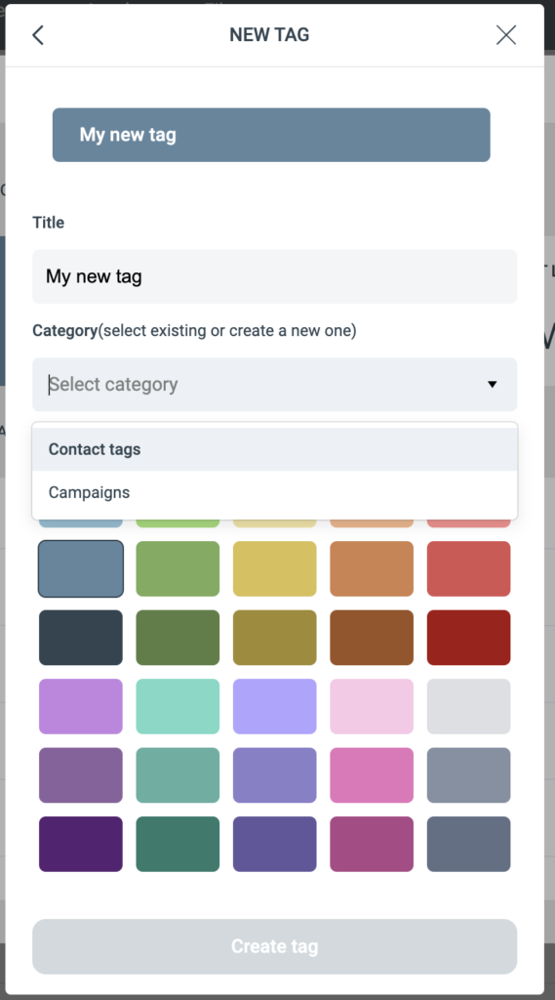

# Tags

Tags are keywords you assign to contacts and campaigns to classify them.

A tag is a piece of information that describes the data or content it is assigned to. Tags are nonhierarchical keywords used for bookmarks, images, videos, files, and so on. A tag does not carry any information or semantics on its own.

Tagging serves several purposes, including:

* Classification.
* Marking ownership.
* Describing content type.
* Online identity.

### How tags are used in eMarketeer

Tags can be used on campaigns and contacts for many purposes.

#### Campaigns

Tags on campaigns let you define what the campaign is about. For example, tag your newsletter campaigns with "Newsletters" and "Sweden" while tagging other campaigns with "Events" and a specific product area.

Tags on campaigns let you separate engagement in the filter by tag — for example, get all contacts who answered any event form, or all contacts who opened any Swedish newsletter.

#### Contacts

Tags on contacts help you segment in a more nuanced way. Set tags manually on a contact, use bulk action to tag a list of contacts, or use journeys to add or remove tags when contacts perform certain actions.

### The tag widget

You find the tag widget in a campaign (top right corner) or on the contact card. To add a tag, click the plus icon next to the tag widget to open it.

#### Tag categories

Each tag belongs to a category. Categories group related tags — for example, "Contact interests", "Contact types", or a category just for campaigns.

#### Create a new tag

If the tag you want doesn't exist, create it by clicking "Create new tag".

Give the tag a title. In the droplist, choose the category it belongs to. If no category fits, type a new category name and it will be created. Pick a color for the tag and click "Create tag".

#### Deleting a tag

To remove a tag completely, open the tag widget and click the edit button next to the tag title. Then click "Delete". This removes the tag from eMarketeer and from all contacts and campaigns that used it.

### Add tags to contacts or campaigns

In the list of tags, check the checkbox in front of the tag you want to assign.

### Remove tags from a contact or campaign

There are two ways to remove a tag:

1. In the campaign or on the contact card, hover over a tag and click the "x" to remove it. 

2. Open the tag widget and uncheck the checkbox in front of the tag.
