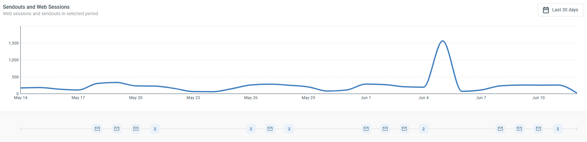

# Operational Report

The Operational Report gives you an at-a-glance overview of what is happening in your account right now. It pulls your most recent sendouts, form submissions, campaigns, journeys, and newly created work onto a single screen, so you can see ongoing activity without opening each report separately.

Use it as your starting point: check what just went out and what is scheduled next, see what people are submitting, watch which campaigns and journeys are active, and follow how website engagement lines up with your email sends. Component and contact names throughout the report are links — click them to open the component report or the contact card.

## What you can use it for

* See ongoing work across the account in one place — sendouts, forms, campaigns, journeys, and recently created components.
* Jump straight to the detail: component and contact names link to the component report or the contact card.
* Correlate website engagement with your email sends to see how traffic responds to what you send.
* Check what is scheduled to go out next, not only what has already sent.
* Keep an eye on which campaigns and journeys are currently active.

## The widgets

Most widgets always show the latest activity in your account. Only the Sendouts and Web Sessions graph at the top responds to the date range selector — the other widgets are unaffected by it.

**Sendouts and Web Sessions** is the timeline at the top. It plots your email sendouts alongside website sessions over the selected period, so it works both as your account's email timeline and as a way to correlate website engagement with what you send. Use the date range selector (top right) to change the period — this is the only widget the date range affects. Below the graph, each email icon and number marks the emails sent on that date; click one to see which emails went out that day and to open an individual component report.

**Recent Sendouts** lists the five most recent email and SMS sendouts with more than 20 recipients, with open rate, clicks, CTR, and CTOR. Toggle it to **Scheduled** to see the upcoming sendouts closest in time instead. Click a component name to open its component report.

**Latest Sendout** highlights your single most recent sendout, with a shortcut to its report.

**Latest form submits** shows the five most recent form submissions, including the form and its campaign and the contact who submitted. Click a contact to open their contact card, or open the submission details.

**Active Campaigns** lists the campaigns with the most current engagement, with clicks, conversions, and MQLs. Click a campaign to open its report.

**Active Journeys** shows the most recently triggered journeys, with the latest contact to move through and counts of how many contacts are in the journey and how many have completed it.

**Recent created work** lists the most recently created components, with who created each one and when, so you can pick up where the team left off.

## Requirements

The Web Sessions part of the top graph needs the Web Tracker installed on your website. Without it, the graph still shows your sendouts, but no website session data. See [Installing the web tracker script on your website](../../documentation/web-tracker/installing-the-web-tracker-script-on-your-website.md).

## What to do next

For a higher-level view of campaigns, conversions, and leads, open the [Marketing Performance](marketing-performance.md) dashboard.
