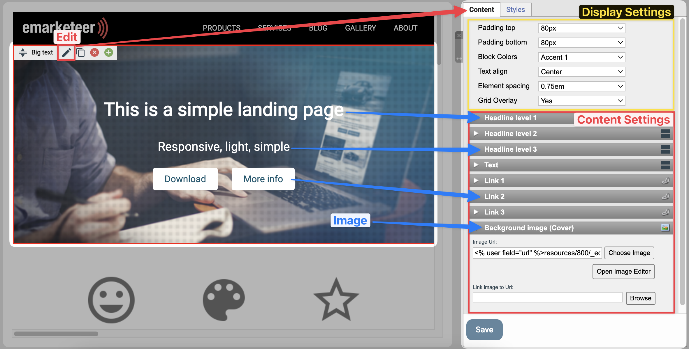
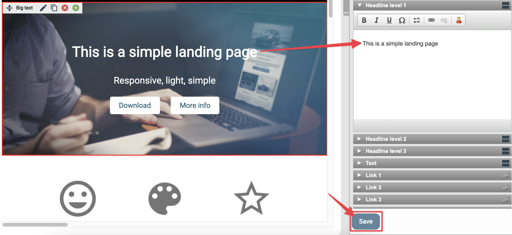
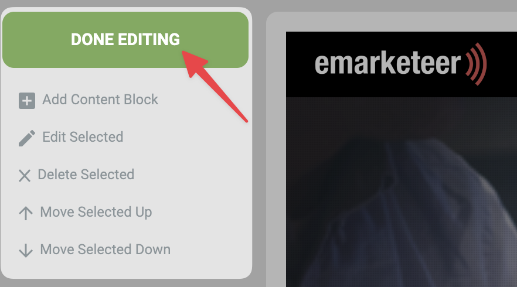

# Creating your first webpage

Build a webpage in eMarketeer to use as an event landing page, news article, or any other standalone page.

This guide walks through creating a webpage component, editing its content blocks, and finishing the page.

***

### 1. Click \[Add Webpage] from the campaign page

If you need to create the campaign first, see [How to create a new campaign](https://support.emarketeer.com/knowledgebase/create-new-campaign/).

The \[Add Webpage] button

### 2. Fill in the settings and choose a template

Webpage settings

#### Settings

* **Name your webpage**: A unique name so you can find it later. Use something that describes the page's role in the campaign. Visitors do not see this name.
* **Page title**: The title visitors see in their browser tab.

#### Template

Pick a template from one of the tabs to use as the starting design. This guide uses _Simple Landing (R)_ from the Landing Pages tab. Templates saved on your account appear under the My Templates tab.

#### Create the webpage component

Click \[Create Web Page] to create the component.

### 3. The webpage editor

After creation, the editor opens with the template's content already in place. The left menu lets you add content blocks, open tools, and adjust the settings from step 2. The rest of the page shows the current content, made up of blocks you can edit one at a time.

The webpage editing view

## 4. Editing a content block

Each content block has several parts. Click the Edit button on the block to open its editor.

Editing a webpage content block

The settings panel opens on the right with two tabs: Content and Styles. Content holds the block's text, images, and links. Styles holds colors and fonts. On the Content tab, the top section controls how the block displays — usually leave those defaults — and the lower section is where you edit the content itself.

### 5. Changing a headline

Click the title bar of the part you want to change, then edit the text in the text box. An empty text box hides that part of the block. In the example below, the text paragraph and two link buttons are empty, so they do not appear on the page. Click \[Save] to keep your changes.

Editing the headline text of a block

### 6. Changing the image of a block

Open the block for editing, go to the Image section on the right, and click \[Choose Image].

.png>)

The \[Choose Image] button

To upload your own image:

1. Click \[Upload File].
2. Click \[Choose files] and pick the image from your computer.
3. Upload the file to your eMarketeer account.
4. Select the uploaded file from the file browser.
5. Click \[Use Selected] to add it to the content block.

.png>)

Steps for uploading and using a new image file

If the image does not match the recommended dimensions, an auto-scale option appears. Click the link in the notice to scale the image automatically.

.png>)

Auto Scale option

### 7. Adding a button with a link

Buttons can link to a webpage, a file, or another eMarketeer component. For an external website, paste the full URL — including `http://` or `https://` — into the URL field and write a caption for the button.

To link to a form:

1. Open the Link 1 content settings and click \[Browse].
2. Click \[Link to eMarketeer Form].
3. Pick the campaign that holds your form, then pick the form itself.
4. Click \[Select], then \[Apply], then \[Save] to attach the link and save the block.

.png>)

Update content block button link

### 8. Adding another content block

Click \[Add Content Block] in the left menu, then click \[Add Block] next to the block type you want. If the button is greyed out, click an existing block in the page first so the editor knows where to insert the new one.

.png>)

Add Content Block to open the menu and then Add the specific block you want

### 9. Repositioning a content block

Click and hold the reposition icon on the left side of the block's context bar, then drag the block to the new position.

.png>)

Reposition block by dragging it into position

### 10. Deleting a content block

If the template includes a block you do not need, click the delete button on that block's context bar.

.png>)

Delete content block button

### 11. Finishing the webpage

Click \[Done Editing] to leave the editor.

The \[Done Editing] button
