# Creating your first landing page


You need a campaign before you can add a landing page. See [How to create a new campaign](../getting-started/create-new-campaign.md) if you haven't created one yet.



The example builds an event landing page, but the process is the same for any landing page. By the end, you will have a landing page ready to publish.




### Add a landing page from the campaign page

From the Components tab of the campaign, click **Add Component**, then choose **Landing Page**.

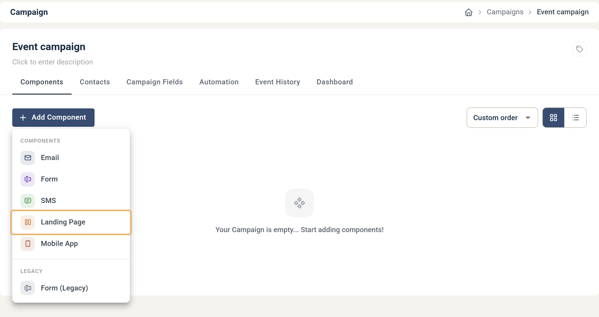




### Fill in settings and choose a template

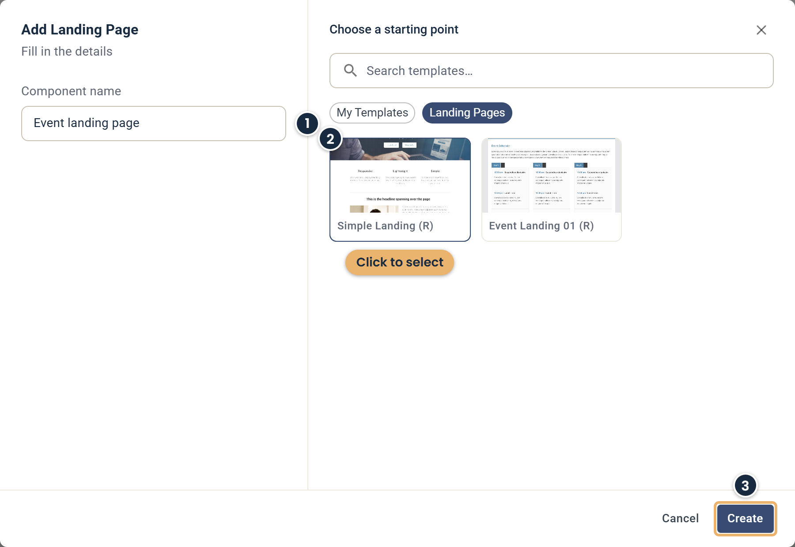

**Settings**

* **Component name:** A unique name so you can find it later. Use something that describes the page's role in the campaign. Visitors do not see this name.

**Template**

Under **Choose a starting point**, pick a template from one of the tabs as a starting point for the design. This guide uses **Simple Landing (R)** from the **Landing Pages** tab. Custom templates saved on your account appear under **My Templates**.

**Create the landing page**

Once the name and template are set, click **Create** to create the component.



### The landing page editor

After you click **Create**, the editor opens with the template's content already in place. The left menu lets you add content blocks, access tools, and set the page title under **Webpage Extras**. The rest of the page shows the current content, made up of blocks you edit individually.

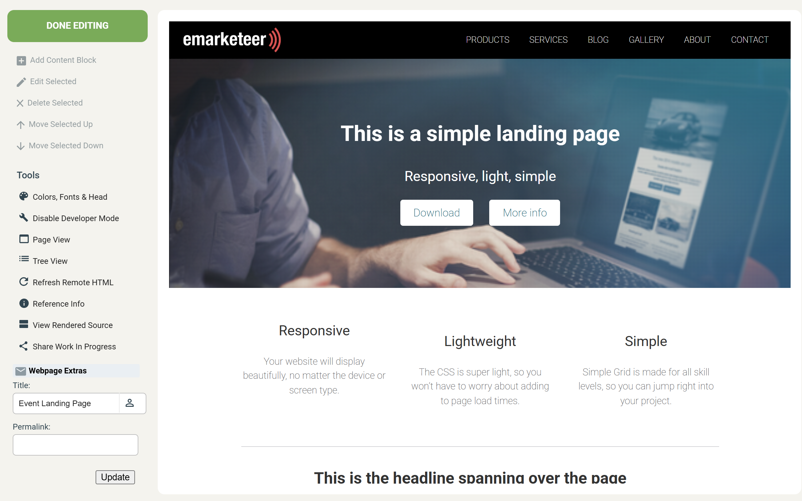




### Edit a content block

Each content block has several parts you can update. Click the block's **Edit** button to open its settings.

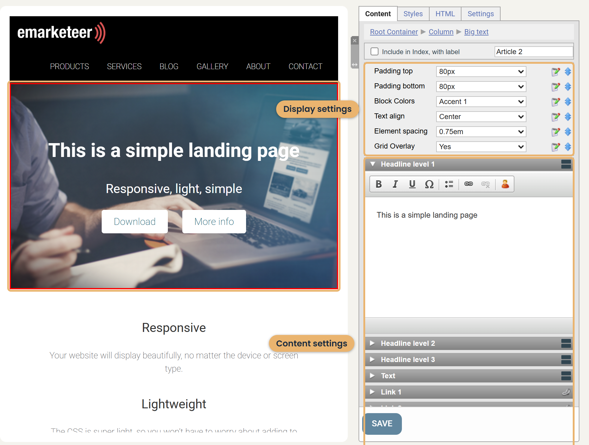

A settings panel opens on the right with the tabs **Content**, **Styles**, **HTML** and **Settings**. Content is where you change the block's text, images, and links. Styles is where you change colors and fonts.

On the Content tab, the top section controls how the block displays — leave those defaults for now. The lower section is where you edit the actual content.



### Change a headline

To change a headline or text paragraph, click its title bar and edit the text in the text box. An empty text box hides that part of the block.

In the example below, the text paragraph and two link buttons are empty, so they do not appear on the page.

Click **Save** after each change.

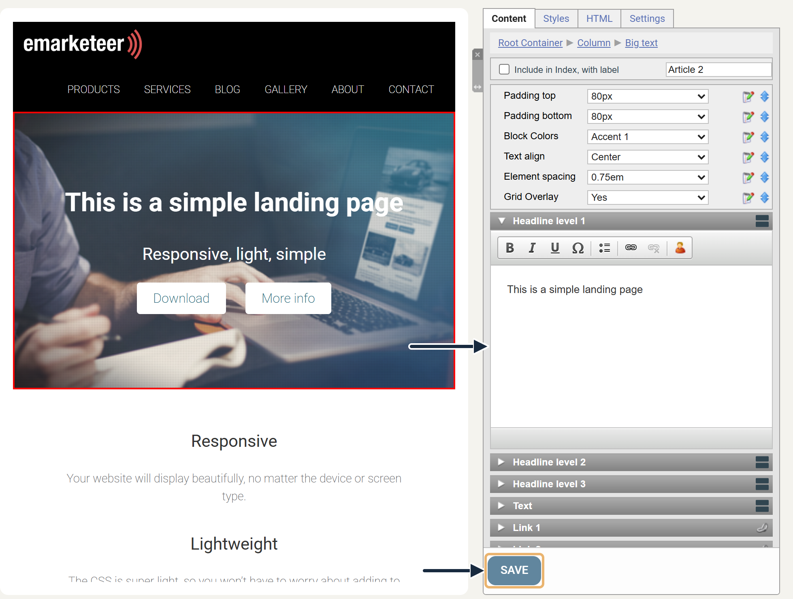




### Change the image in a block

Open the block for editing, go to the Image section in the right panel, and click **Choose Image**.

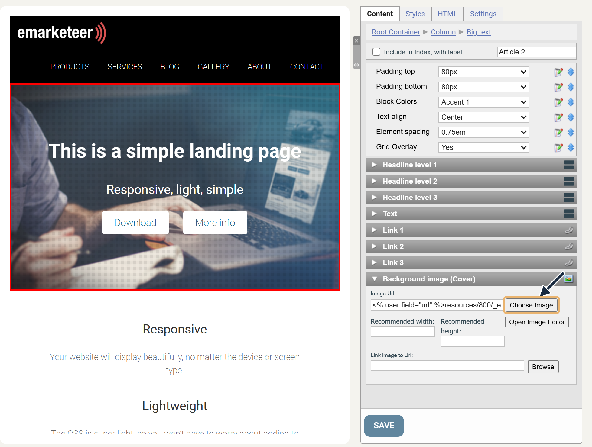

To upload and use your own image:

1. Click **Upload Files**.
2. Click **Choose files** and select the image on your computer.
3. Upload the file to your eMarketeer account.
4. Click the file in the browser window to select it.
5. Click **Use Selected** to add it to the content block.

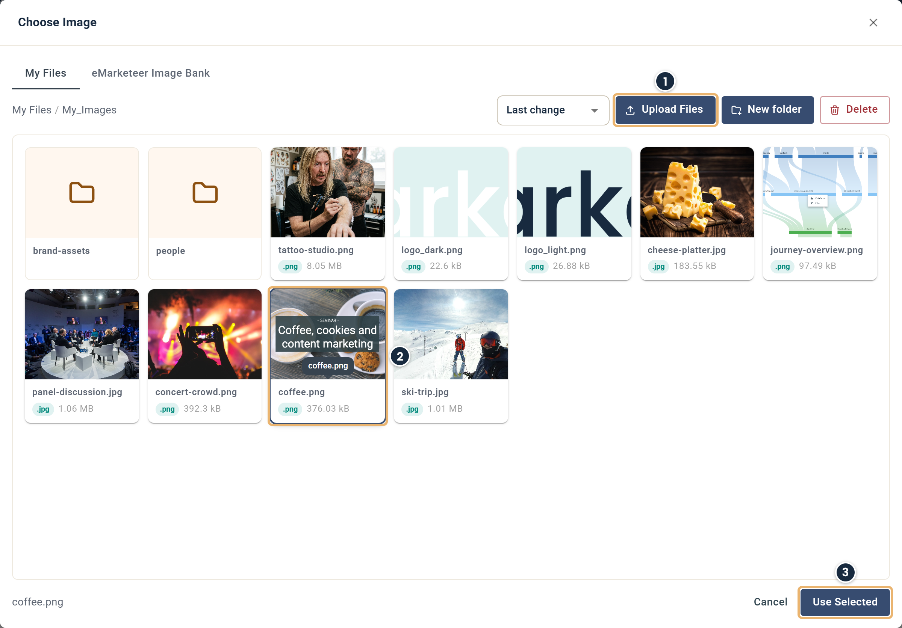

If the image does not match the recommended dimensions for the block, an option to auto-scale it appears. Click the link in the notice to accept.

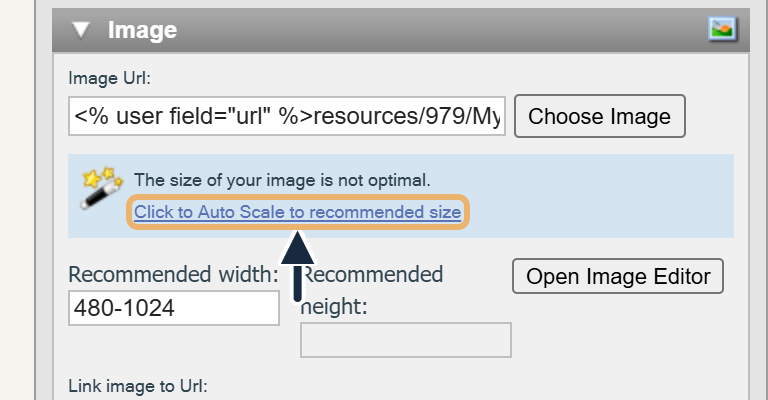




### Add a button with a link

Use buttons to link to a webpage, file, or another eMarketeer component. For a web link, type the URL in the Link settings (include `http://` or `https://`) and write a button caption. To link to a form:

1. Open the Link 1 content settings and click **Browse**.
2. Click **Link to eMarketeer Form**.
3. Pick the campaign that contains your form, then pick the form itself.
4. Click **Select**, then **Apply**, then **Save** to add the link and save the block.

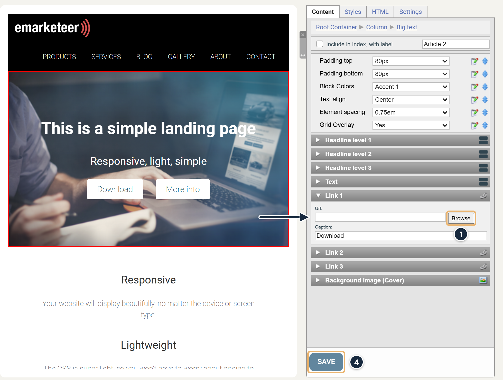




### Add a new content block

Click **Add Content Block** in the left menu, then click **Add Block** next to the block type you want.

If the button is grey, click an existing block first to tell the editor where to insert the new one.

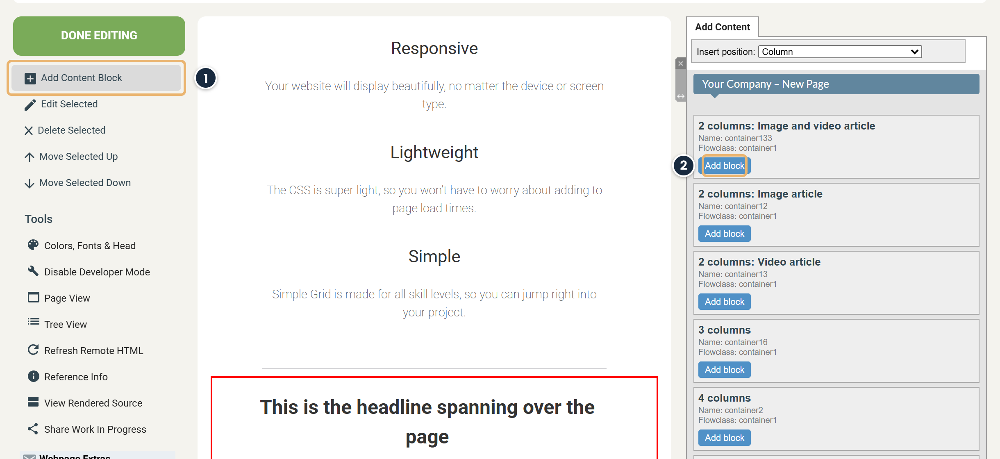




### Reposition a content block

To move a block, click and hold the reposition icon on the left side of the block's context bar, then drag it to the new position.

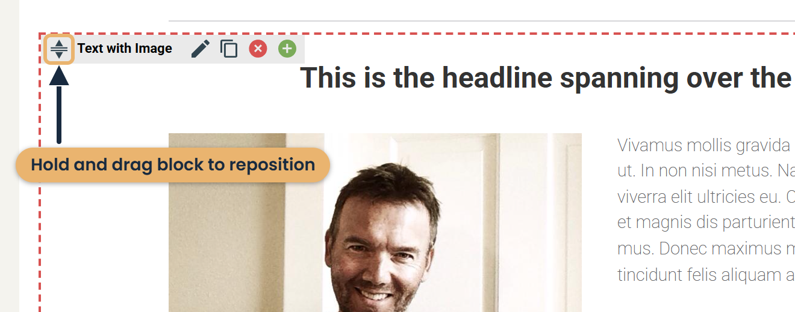




### Delete a content block

To remove a block you don't need, click the delete button on its context bar.

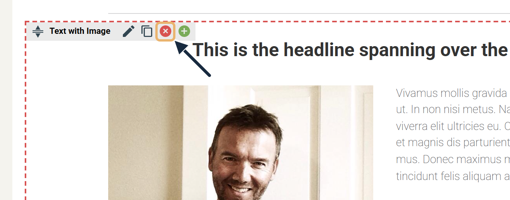




### Finish the landing page

Click **Done Editing** to leave the editor.

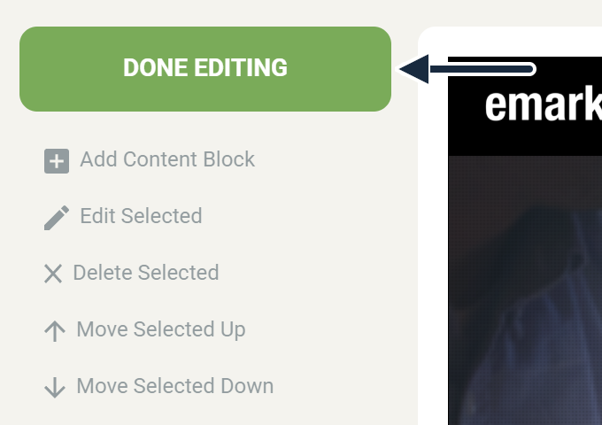



