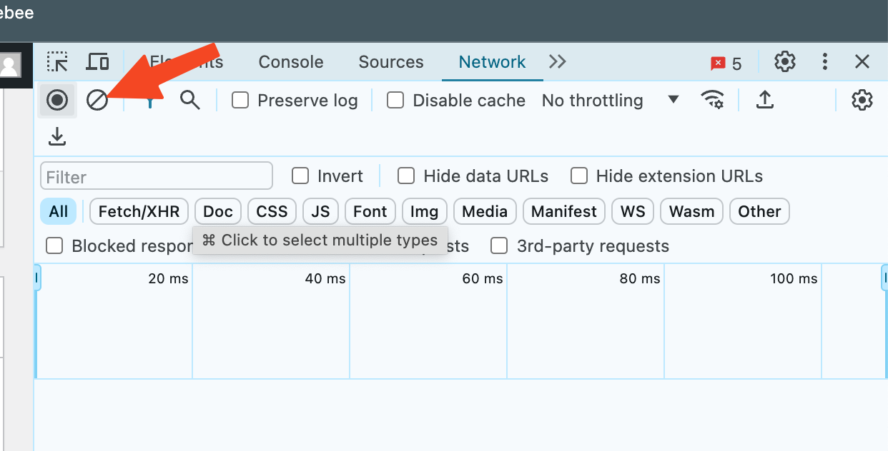
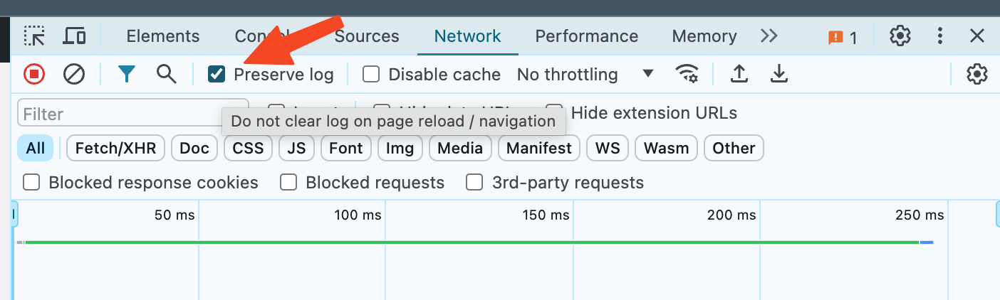

# Generate HAR file for support

A HAR file records every network detail in your browser as you reproduce a problem in eMarketeer, which helps support diagnose the issue.

If support asks for a HAR file, open eMarketeer to the place where the problem happens, start the recording, reproduce the issue, then save and send the file.

#### For Chrome browser

1. Open Chrome and go to the page where the issue happens.
2. Click the ⋮ menu and select More Tools > Developer Tools.
3. In the panel that opens, select the Network tab. Keep the panel open while you reproduce the issue.

4. Clear the logs before you reproduce the problem by clicking the clear button.

5. Look for the round record button in the upper left corner of the tab. Make sure it is red. If it is grey, click it once to start recording.

6. If it isn't, check the Preserve log box.

7. Reproduce the issue while network requests are recorded.
8. Click the download button, Export HAR, and save the file to your computer as HAR with Content.

9. Upload the HAR file to your ticket with eMarketeer Support for further investigation.
