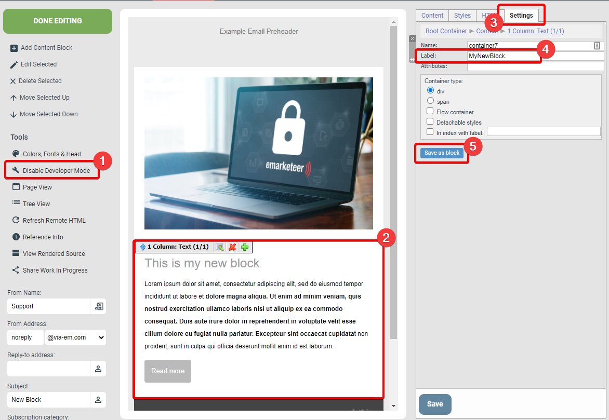
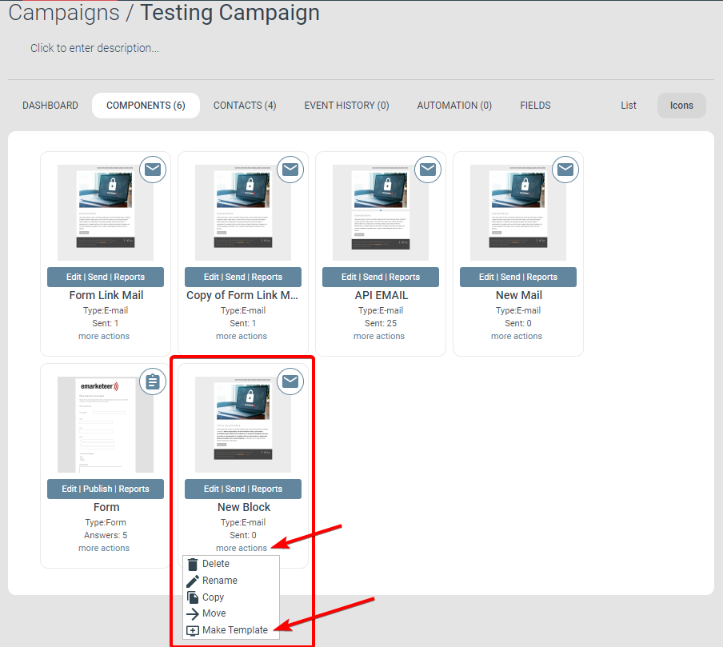

# How to create a custom content block (Developer)

Save an edited content block so it becomes reusable across components and templates.

This article covers advanced use of eMarketeer and is outside the scope of standard support. If you need help with developer features, contact your reseller to be put in touch with a development consultant or technician.

Users with Developer permissions can change the HTML of a content block to alter how it looks and works. Once you have made a substantial edit, you can save the block for reuse. A saved block is then available to every user who edits that component, and if the component becomes a template, the saved block carries through to any new component created from that template.

Contact your account's Account Administrator if you need Developer permission on your user account.

***

## How to save a custom content block

Saving a block

### 1. Enable Developer Mode

With Developer permissions you will see the \[Enable Developer Mode] button in the Tools menu.

### 2. Open the block to save

Double-click the custom block to open its configuration menu.

### 3. Go to Block Settings

Open the Settings tab in the block's configuration menu.

### 4. Give the block a label

The Label is the name shown in the Component Content section when the block is in use. Example: _1 Column: Text (1/1)_.

### 5. Click Save as Block

\[Save as Block] opens the dialog where you can save the custom block to the component.

Save as block window

### 1. Set a container name

The container name identifies the custom block in the system and is visible in Developer Mode.

### 2. Set a unique label for the block

This label is the name every user sees when working with the custom block.

### 3. Create the custom block

Clicking \[Create] saves the custom block and adds it to the "Add Content Block" menu so any user can drop it in.

The block as shown in the Add Content list

***

## Custom blocks in templates

To make the block available in new components built from a template, either edit an existing template to add the block, or create a new template from a component that already contains it, as shown below.

Creating a template from a component with a custom block

Any new component created from that template inherits the custom block. If you later update the block in the template, the change also propagates to components already built from it.
