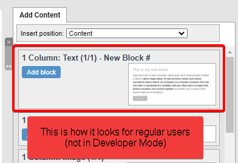
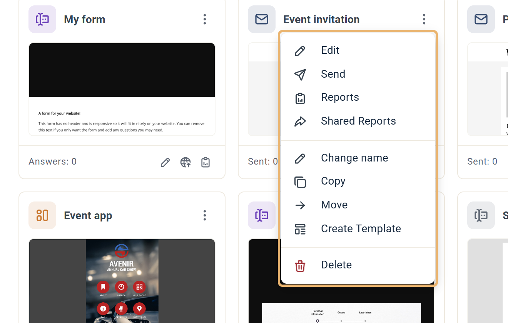

# How to create a custom content block


This feature requires Developer permission. Contact your Account Administrator if you need it enabled on your user account.


Save an edited content block so it becomes reusable across components and templates.

This article covers advanced use of eMarketeer and is outside the scope of standard support. If you need help with developer features, contact your reseller to be put in touch with a development consultant or technician.

Users with Developer permissions can change the HTML of a content block to alter how it looks and works. Once you have made a substantial edit, you can save the block for reuse. A saved block is then available to every user who edits that component, and if the component becomes a template, the saved block carries through to any new component created from that template.

***

## How to save a custom content block

Saving a block



### Enable Developer Mode

With Developer permissions you will see the \[Enable Developer Mode] link in the Tools menu.


### Open the block's Settings tab

Hover over the custom block and click its edit icon to open the block's configuration panel. Then open the **Settings** tab.


### Give the block a label

The Name identifies the custom block in the system and is visible in Developer Mode. The Label is the name every user sees when working with the block, shown in the Component Content section when the block is in use. Example: _1 Column: Text (1/1)_.


### Click Save as block

Click \[Save as block] at the bottom of the same panel. This saves the custom block and adds it to the "Add Content Block" menu so any user can drop it in. There is no separate dialog to fill in.

The block as shown in the Add Content list



***

## Custom blocks in templates

To make the block available in new components built from a template, either edit an existing template to add the block, or create a new template from a component that already contains it, as shown below. To create the template, open the three-dot menu on the component card and click **Create Template**.

Creating a template from a component with a custom block

Any new component created from that template inherits the custom block. If you later update the block in the template, the change also propagates to components already built from it.
