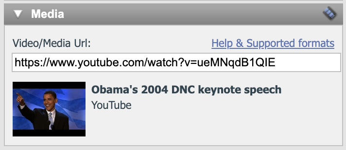

# Embed Video/Media

Use the Video/Media block in the Page Builder to embed video, slides, and other rich content from external services.

The block is available in the Page Builder for emails and webpages. eMarketeer pulls media from services such as YouTube and renders it inside your content.

### How to add video and media

Add a block with Video/Media in it and double-click to edit. The dialog above appears. Paste the URL of your media into the text box (for example, [https://www.youtube.com/watch?v=ueMNqdB1QIE](https://www.youtube.com/watch?v=ueMNqdB1QIE)).

A preview appears below the text box once the URL resolves. Click Save to add the media.

If the block does not update, you clicked Save before the preview finished loading. Try again.

### Will this work in emails?

Most email clients do not support video objects, but they do support images. When you add Video/Media to an email, eMarketeer inserts a screenshot of the video with a play button and links it to the original URL. The recipient sees the illusion of an embedded video and opens the real one in a browser on click.

### Video/Media and the page editor

While you edit a page or email, the block shows only a preview of the media. The actual embedded player appears when you publish, send, or preview the page.

### Supported media formats

The embed feature supports most online rich-content providers, and the list keeps growing. It covers videos, image galleries, presentations, audio, and more.

Supported services include YouTube, Vimeo, SlideRocket, Slideshare, Flickr, and Google Maps. [View the full list of supported formats](https://embed.ly/providers).
