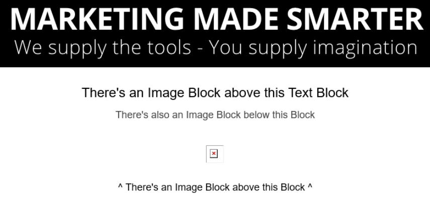
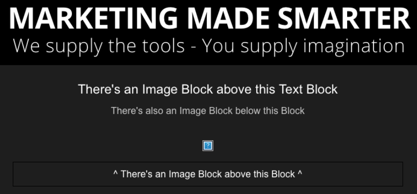
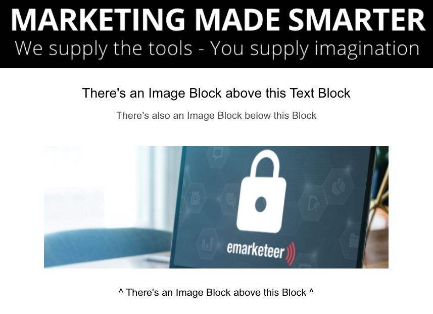
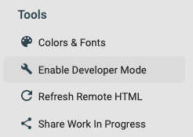
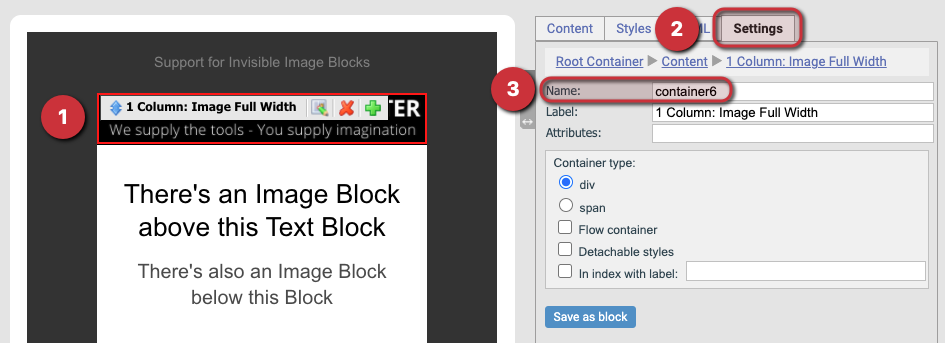
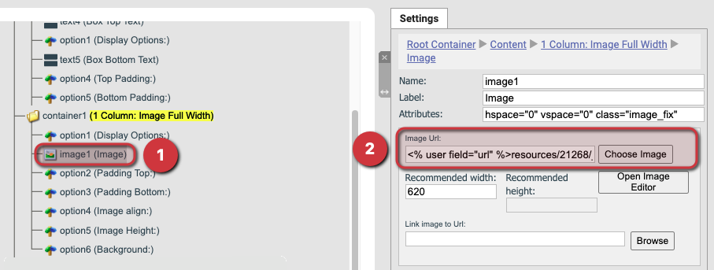
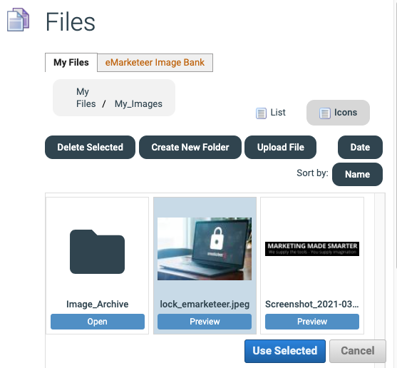
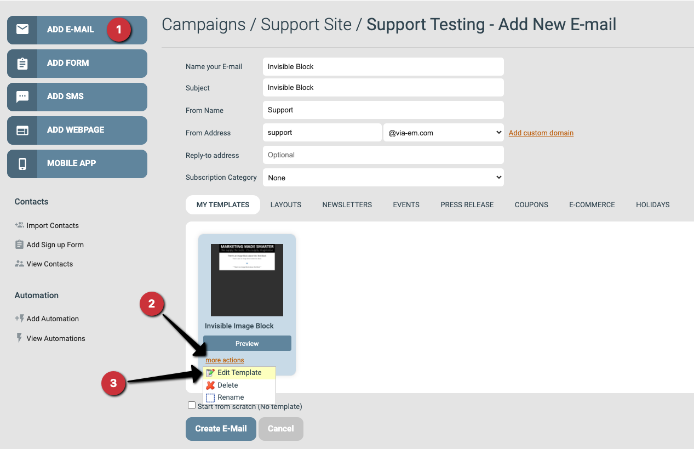

# Missing Image Block in Email Component (Developer)

If a red-x box or a blue question-mark box appears in your sent emails when viewed in Outlook, a missing image block is probably hiding in the email component or template.

Outlook (Windows)

Outlook (Mac)

This happens when the underlying image was removed from your account or moved to a different folder, creating a new file path. Either action invalidates the image link in any email components that use it, and most email clients respond by hiding the block.

Before the image path is broken.

After the image block is broken and hidden.

## How to fix it

An eMarketeer user with developer permission can remove or fix the block from the component by entering developer mode.

Account user with developer permission.

1. Open the editor for the template or component.
2.  Enter developer mode.

    

    The Enable Developer Mode button.
3.  Check the names of all visible image blocks by selecting each and opening the settings tab.

    

    Checking the name of a visible image block.
4.  Enter Tree View.

    

    The Tree View button.
5.  Locate all Image Full Width blocks in the list and match their container names with the visible ones until you find one that doesn't match. In this example, _container1 (1 Column: Image Full Width)_ does not match a visible image block.

    

    Image Full Width blocks in Tree View.
6.  Select the Image part of the block and change the image URL by clicking the Choose Image button, then pick a new image file in the file selection window.

    

    Locating the image URL.

    

    Selecting a new image file.
7.  Save the change, then return to Page View to continue editing the component.

    

    The Save button.

    

    The result after following this guide.

## How to edit a template

1. Click Add E-Mail from a campaign page to show your templates.
2. Click More Actions on the template you want to edit.
3. Click Edit Template in the dropdown menu.
4. The template opens in the component editor. Any change saved here updates the template.

Visual guide to editing a template.
