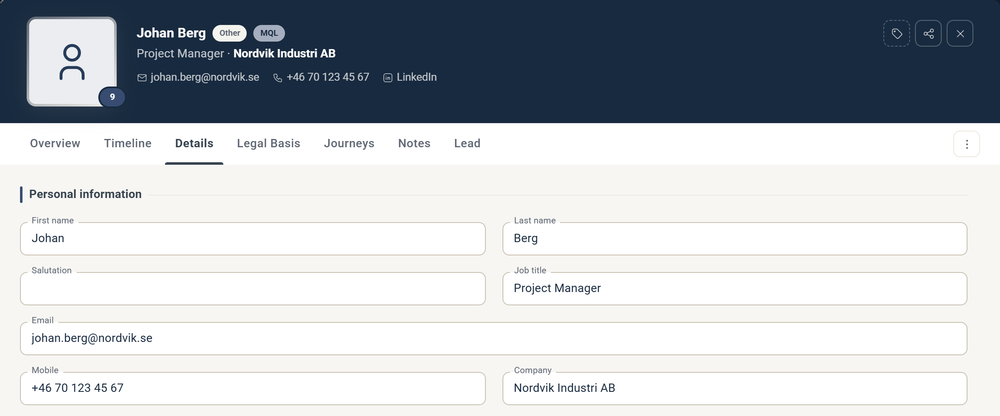
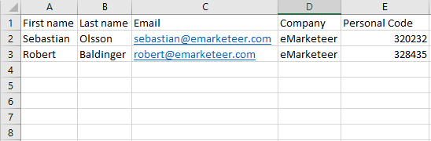
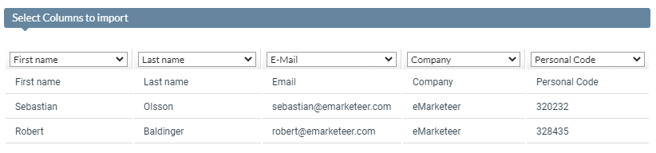
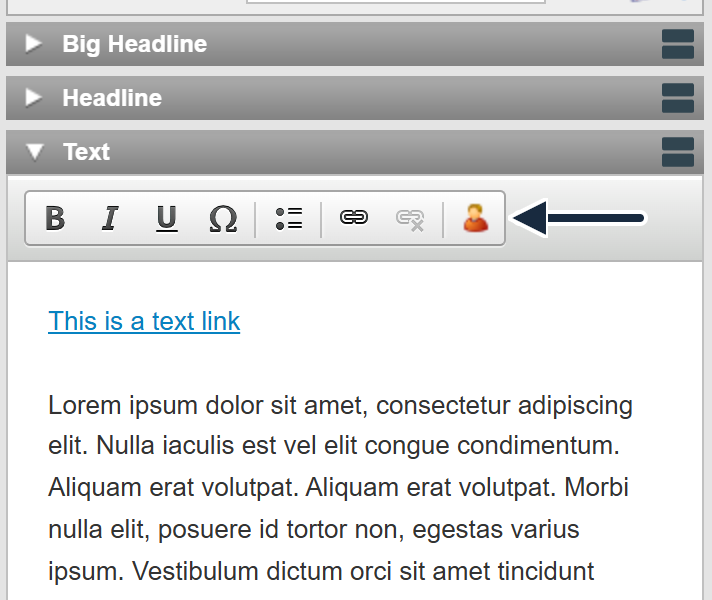
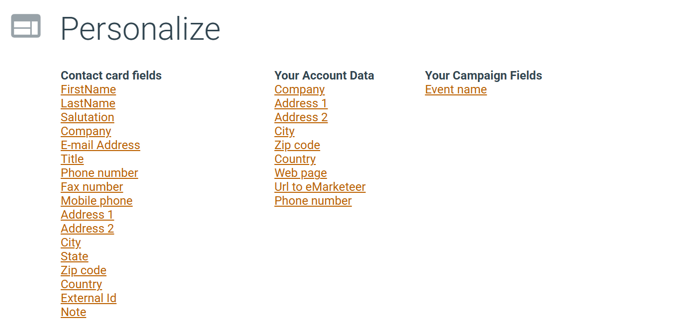
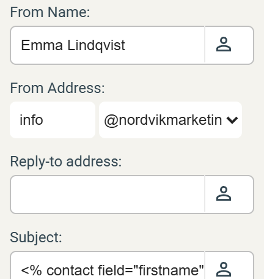
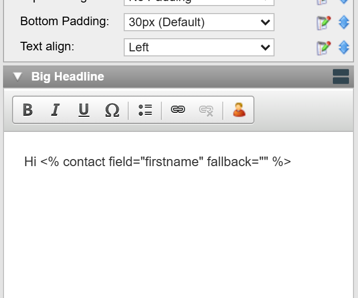
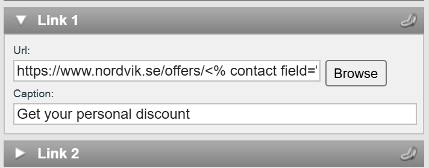
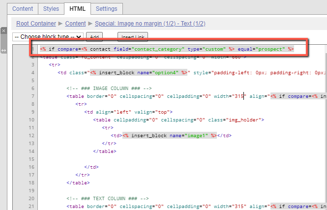

# Personalize content

Personalized content displays differently for each contact based on data stored on the contact card.

The most common example is a personalized email greeting that addresses the contact by name. Personalization works in emails, SMS, forms, and landing pages.

<div align="left" data-with-frame="true"></div>

## How personalized content works

When a contact is identified in an eMarketeer component, that component can pull data from the contact card. Emails and SMS always identify the contact, since they are targeted to specific contacts at send time. Forms and landing pages can also personalize when the contact is identified — for example via a personal link.

<div align="left" data-with-frame="true"></div>

Take the contact Sebastian Olsson as an example. Any data stored on a contact card field can be used in a component's text, URL, or HTML content. With First name available, you can greet the contact informally — "Hi Sebastian." With Last name and Salutation available, you can use a formal greeting — "Dear Mr. Olsson."

An email is rarely sent to a single recipient, so the important part is that every recipient has the same fields populated for a consistent message. When a contact lacks data, a fallback value can be used.

## Storing contact data for personalization

The most common ways to gather contact data are CRM sync, Excel import, and forms.

### Importing via Excel

Importing via Excel lets you set the data on each contact by preparing the sheet before upload. In this example, First name, Last name, Email, Company, and Personal Code are imported for two contacts.

<div align="left" data-with-frame="true"></div>

You can import an Excel file as part of sending an email or SMS, or beforehand into a campaign or contact list. Whichever path you choose, the column-mapping step is crucial — each column must match a contact card field.


In this example, Personal Code is a custom field. Custom fields are non-standard contact card fields. Add custom fields under: Account Settings → Customize → Contact card fields (administrator role required).


<div align="left" data-with-frame="true"></div>

## Using contact data in a component

Add personalized data to any text field using the Personalize option in the toolbar.

<div align="left" data-with-frame="true"></div>

The menu lists all available contact card fields, company account fields, and [campaign fields](../campaigns/how-to-use-campaign-fields-in-emarketeer.md).

<div align="left" data-with-frame="true"></div>

Clicking a field inserts a code snippet at the cursor. The snippet for First name looks like this:

```
<% contact field="firstname" fallback="" %>
```

The fallback value handles contacts that lack the field. Edit the text between the `fallback=""` quotes.

Adding `Hello <% contact field="firstname" fallback="valued customer" %>` to your email renders as:

* Hello Sebastian — if the contact's first name is Sebastian.
* Hello valued customer — if the first name is not available.

### Custom field syntax

Standard fields use the syntax above. Custom fields need an extra `type="custom"` attribute:

```
<% contact field="personal_code" fallback="" type="custom" %>
```


When writing snippets by hand, forgetting the type attribute is a common mistake — it is not required for standard fields.


## Where you can add personalization

### Email sender info

<div align="left" data-with-frame="true"></div>

### Text content

<div align="left" data-with-frame="true"></div>

### Links and URLs

<div align="left" data-with-frame="true"></div>

### HTML

<div align="left" data-with-frame="true"></div>

Personalization in HTML with a conditional statement. The block is visible only to contacts with the value "prospect" for the contact category field.

### Other places

* In forms — fields display only if the contact is identified, such as on the thank-you page, in a confirmation email, or via a personal link.
* In certain automations — for example, the lead description text for SuperOffice automations.
* In SMS.
