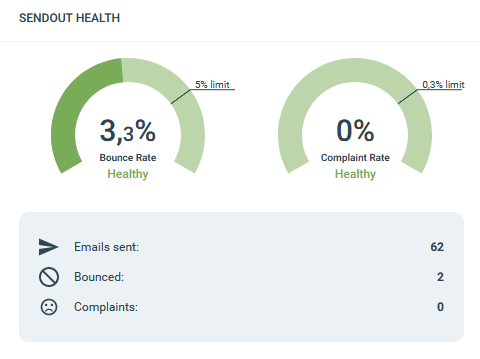

# About email bounces and complaints

This article explains what bounces and complaints are, how eMarketeer handles them, and what you can do to keep your sender reputation healthy.

Bounces and complaints affect whether your emails reach the inbox. Keeping both low protects deliverability for everyone sending from your account.

### What is a bounce?

A bounce means an email could not reach the recipient's mailbox. Bounces fall into two types: soft and hard.

- **Soft bounce:** the email was not delivered due to a temporary issue, such as a full mailbox or an unresponsive mail server.
- **Hard bounce:** the email will never reach this address. The address or its domain does not exist.

The bounce rate is the number of undelivered addresses divided by the total number of addressed emails.

### Why you need a low bounce rate

To block fraudulent senders, Internet Service Providers (ISPs) assign each sender a reputation score. The score is based on several factors, including user engagement, spam complaints, and bounce rate. The higher your bounce rate, the worse your sender reputation. A sender with a poor reputation risks being blocked entirely.

An acceptable bounce rate sits around 1–3%. If yours is higher, review your send-out routines.

### How eMarketeer handles bad addresses

If eMarketeer knows an address is bad, it is filtered out of the send. An address counts as bad when:

- It has faulty syntax — for example, no `@` in the address.
- It hard-bounced in a previous send-out.
- It soft-bounced in three previous send-outs.

Filtering helps, but eMarketeer is not a list-cleaning tool. If you import addresses that previously bounced or are otherwise invalid, they are not blocked on import. The result is a high bounce rate, spam complaints, or unsubscribes.

### How to track your bounce rate

You can see the bounce rate in the email report. Keep your average bounce rate under 5% or your sending will be paused for audit.

### What happens if my bounce rate is too high?

eMarketeer runs the send-out for you and applies email security measures such as your [authenticated domain](https://support.emarketeer.com/knowledgebase/why-authorize-email-domain/). We also rely on you to handle addresses and send-outs with care. If your bounce rate exceeds 5%, your account may be paused to maintain our security standards.

### How do I keep a low bounce rate?

- **Use opt-in forms.** The best way to ensure your contact list contains valid addresses is to collect them through opt-in forms, where contacts give explicit permission to email them. You can use an eMarketeer form on your website. Double opt-in is even better — contacts must confirm their address by clicking a link in a confirmation email before being added.
- **Work with your contact list continuously.** Watch your contacts' engagement. If a contact has bounced or has not opened your last few sends, consider a re-engagement campaign to identify who still wants to hear from you.
- **Be relevant.** Engaged contacts are the foundation of a good sender reputation. Send content that contacts want to read so you get more opens and clicks and fewer bounces and complaints. ISPs notice the difference and reward it.

If you want to learn more, this blog post covers [5 ways to reduce email bounce rate](https://www.emarketeer.com/blog/reduce-email-bounce-rate/).

### What is a complaint?

A complaint is when a contact receives the email in their inbox, then clicks the "This is spam" button. Complaints are only registered from large web-based email providers such as Gmail, Yahoo, and Hotmail.

When a contact marks an email as spam and the event is reported to eMarketeer, that contact is automatically unsubscribed from future sends. Not all complaints are reported back to eMarketeer — some only register at the provider level. You can monitor complaint rates by domain in the [email health dashboard](https://support.emarketeer.com/knowledgebase/email_health_dashboard/).

Your account is allowed an average complaint rate of 0.3% before we have to pause it for audit.
