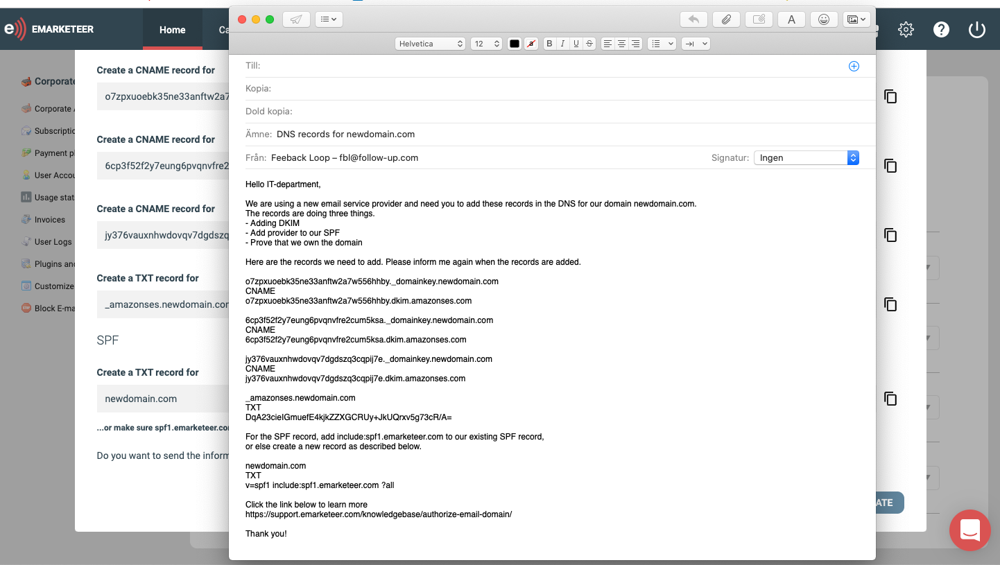
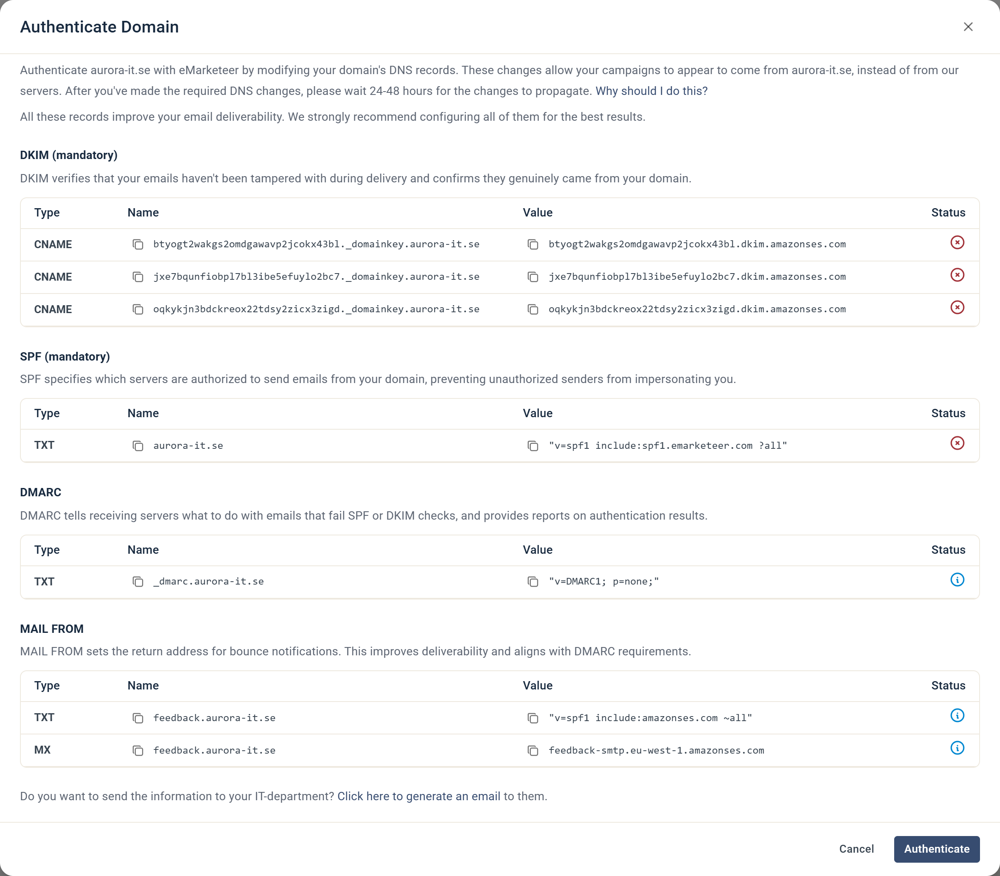

# Add Email domain


An authorized email domain is required to send emails from eMarketeer. Without one, outgoing email is not available on your account.


This guide walks you through authenticating your domain so you can send email from your own address with the best possible deliverability.

Once you finish, let us know and we will activate the new email service for your account.



### Open Email Domains

In eMarketeer, click the gear icon in the top right and choose **Account Settings**. Open **Email Domains** and click **Add A Domain**.



### Enter your domain

Enter the domain you want to authorize (for example, `yourdomain.com`) in the **Domain** field of the Add Domain dialog and click **Add**.




### Add DNS records

The new domain appears in the list with the status Pending. Click **Authenticate** on the domain to open the Authenticate Domain dialog. It lists the DNS records to add: DKIM and SPF (mandatory), DMARC, and MAIL FROM. Add them to your DNS. If you do not have access to your company's DNS — often the IT department owns it — click **Click here to generate an email** at the bottom of the dialog to send the records to the person in charge.




### Click Authenticate

Once the records are in place, open the domain's Authenticate Domain dialog again and click **Authenticate**.



### Confirm authentication

If the records are correct, the domain status changes to Authenticated. If something is wrong, the failing record is marked with a red cross in the Status column. If eMarketeer cannot verify the records within 72 hours, the domain shows Failed: click **Restart Validation** to try again.





DNS changes usually propagate quickly, but allow up to 48 hours.


Once the domain is authenticated, you can send from eMarketeer using your domain as the From address with the best possible deliverability. You can repeat this process for as many domains as you need. If you run into questions, email [support@emarketeer.com](mailto:support@emarketeer.com).
