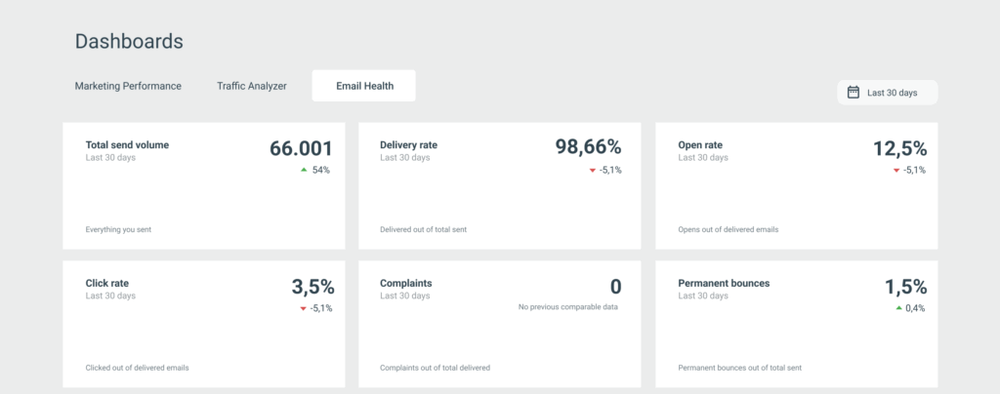
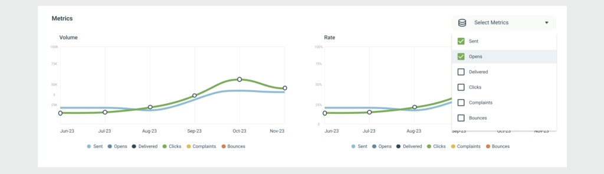
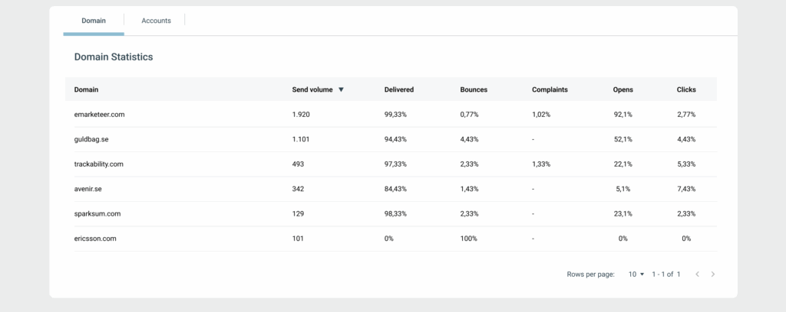
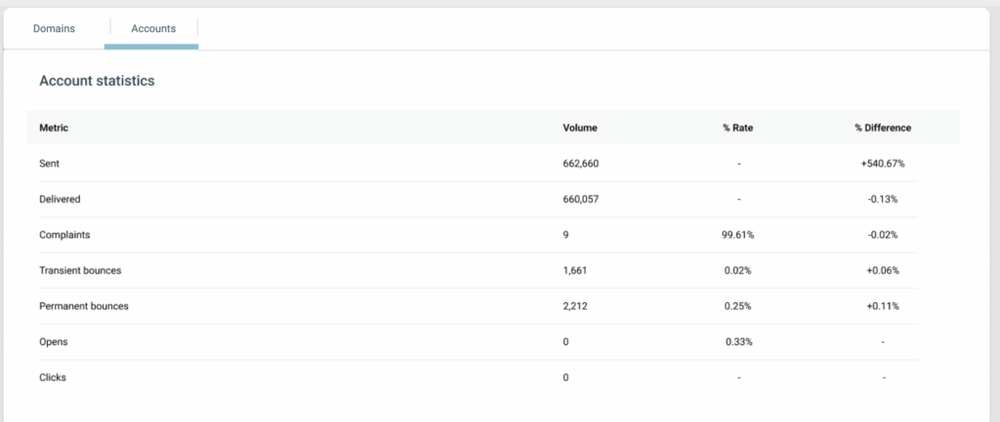

# Email Health Dashboard

The Email Health Dashboard gives you an actionable view of your email deliverability and sender reputation, so you can catch problems before they affect inbox placement.

High-level KPIs, trend charts, and detailed tables let you spot where issues occur and drill down to the exact domains or accounts that need attention.

## What you can do with the Email Health Dashboard

- Protect your sender reputation by monitoring bounces, complaints, and delivery rates.
- Detect deliverability risks early by spotting negative trends before they turn into blocks or deferrals.
- Track performance over time, not just per sendout.
- Drill down by receiving domain or sending account to find the root cause of issues.

## Date range

All data on the dashboard is calculated from the selected date range.

In the Date range selector, choose one of:

- Relative range — a predefined period such as Last 7 days or Last 30 days.
- Custom range — pick a start and end date manually. To view a single day, set the same start and end date.

The selected range applies to the overview cards, the time series charts, and the Domain and Account tables.

## Overview cards

The overview cards give you a quick snapshot of your most important email health metrics:

- Total send volume — total number of emails sent.
- Delivery rate — delivered emails as a percentage of total sent.
- Open rate — opens as a percentage of delivered emails.
- Click rate — clicks as a percentage of delivered emails.
- Complaints — spam complaints as a percentage of delivered emails.
- Permanent bounces — permanent bounces as a percentage of total sent.

Each card also shows the change compared to the previous date range, so you can quickly spot improvements or negative trends.

## Metrics charts

The Metrics section visualizes how your email health develops over time. Two time series charts are shown:

- Volume — sent, delivered, opens, clicks, complaints, and bounces.
- Rate — percentage-based metrics such as delivery, open, click, bounce, and complaint rates.

### Interacting with the charts

- Hover over any date to see exact values for that day.
- Use the Select metrics dropdown to choose which metrics to display.
- Compare multiple metrics to spot correlations — for example, increased volume followed by higher bounce rates.

These charts are useful for catching gradual changes that can signal future deliverability problems.

## Domains table

The Domains table shows how your emails perform for each receiving domain during the selected date range. For each domain, you can see:

- Send volume
- Delivered (%)
- Bounces (%)
- Complaints (%)
- Opens (%)
- Clicks (%)

### How to use the Domains table

- Sort columns to identify domains with high bounce or complaint rates.
- Compare engagement metrics across domains.
- Spot specific receiving domains where reputation issues may be developing.

Only domains with at least 10 sent emails in the selected date range appear in the table.

## Account table

Switch to the Account tab to view email health statistics for the whole account. The table shows volume and rate for:

- Sent
- Delivered
- Complaints
- Transient bounces
- Permanent bounces
- Opens
- Clicks

It also shows the difference (%) compared to the previous date range.

## Understanding bounces and complaints

### Bounces

A bounce occurs when an email cannot be delivered.

- Permanent bounces happen when there is a permanent issue, such as a non-existent address or a receiving server blocking your domain or IP.
- Transient bounces occur because of temporary issues, such as a full inbox or a temporary server problem.

High bounce rates signal poor list quality and can hurt your sender reputation.

### Complaints

A complaint occurs when a recipient marks your email as spam in their email client.

Complaints are a strong negative signal to mailbox providers and can damage your sender reputation quickly if they rise.

## Best practices

To maintain good email health:

- Review bounce and complaint trends regularly.
- Remove inactive or invalid recipients from your lists.
- Watch domains with declining delivery or engagement.
- Act early when you see negative changes — small issues can escalate fast.

The Email Health Dashboard helps you act before deliverability issues affect your results.
