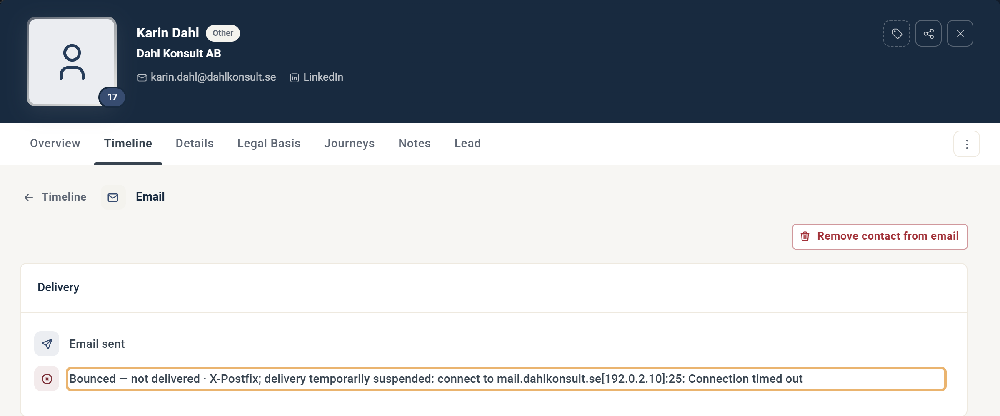

# Identifying why an email was not received

This article explains how to identify the most common reasons a contact did not receive an email and what you can do about each one.

Note that some causes are outside your control as the sender, specifically those tied to the recipient's email service.

## Common causes

1. The email was rejected before being sent.
2. The email bounced after being sent.
3. The final delivery was stopped by the contact's email service.
4. The email was never addressed or sent.

## Identify the reason

### Was the email rejected or bounced?

You can find this in the email component's Report page. Click the Rejected or Bounced count in the Email process diagram to open a side panel listing those contacts, and check whether the contact appears in it.

Rejected and Bounced counts in the Email process diagram

A rejected email means the email service found a problem with the sender address or the recipient address during the final check before sendout. A recipient is usually rejected because of a known issue with that specific recipient address or domain, such as a domain that does not exist. If all recipients are counted as rejected, the problem is most likely the sender address or reply-to address of the email component being invalid.

If a contact has bounced, click their name in the side panel to open their contact card. In the Delivery box of the email, you can read the bounce message returned by the recipient's email service. The example below shows an email bounced by an organisation's strict policy that disallows this type of message.

Bounced error message on a contact's contact card

### The final delivery was stopped by the contact's email service

If the contact appears in the list that opens when you click Delivered in the report, the recipient's email service accepted the message without delivery issues. The same applies if the email's Delivery box on their contact card's Timeline tab shows Delivered (or Opened). Once the email is delivered to the recipient's email service, any reason the message did not reach the inbox is due to an action taken by that service after eMarketeer's successful delivery.

Email information on contact card showing delivery

### The email was never addressed or sent

This usually means the contact was removed from the recipient list during the checklist stage of the sendout process. You can read more about this stage in [this article](../reports/checklist-explained.md).

If the email was never addressed to the contact, you can usually find the reason on their contact card. Start with the Overview tab of the contact card. If a red "Email address is bouncing" banner is shown, or the Reachability panel says "Email - Hard bounced", the contact's email address is marked as undeliverable from a previous bounce message that eMarketeer received from their email service.

Bounced status on a contact card

Another possibility is that the contact's email address is wrong or contains characters that are not supported in email. To verify, check the email address field on the contact card.

It is also possible that the contact unsubscribed from future sendouts and withdrew their marketing sendouts consent, or unsubscribed from the specific subscription list used for the send. Their marketing sendouts consent is visible in the Reachability panel on the Overview tab and on the Legal Basis tab. Their subscription status for each list is visible on the Details tab of the contact card.
