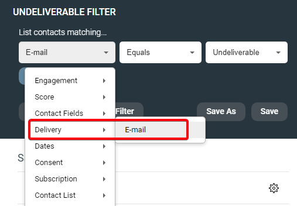

# How to find undeliverable email addresses from the checklist

When you send an email, recipients are verified at the Checklist step, and some are blocked from the sendout. This guide explains the Undeliverable Email Address category and shows how to build a list of those contacts for review.

## What an undeliverable email address is

An undeliverable address is one that cannot receive email due to a delivery issue. eMarketeer blocks sends to these addresses to protect your sender reputation — a metric most email services use to separate spam from legitimate mail.

An address is marked undeliverable when a previous send returned a permanent bounce. You can see this in [the email report](https://support.emarketeer.com/knowledgebase/email-report-explained/) and on the contact card. For more on bounces and sender reputation, see [this article](https://support.emarketeer.com/knowledgebase/about-email-bounces/).

The Checklist also runs a second, live check at send time: it verifies whether each recipient's mail service is currently able to receive email. If a recipient's mail service is temporarily down, that contact is counted as undeliverable for the current send but is not permanently marked on the contact card. The contact will probably receive your next send, but you can't include them in the list this guide builds.

## Build a list of contacts with undeliverable addresses

Start from the Checklist page where you see the undeliverable count. The steps below assume you already have a contact list for the intended recipients.

#### 1. Navigate to the Contacts page

Open the Contacts section for the account.

#### 2. Open Contact Lists

Use the menu on the left to open Contact Lists.

* If you don't have a contact list with the recipients, choose Import instead, create the list, then return to Contact Lists.
* If you want to check every undeliverable contact on the account rather than only the recipients from a specific send, skip to step 4.

#### 3. Open the contact list with the recipients

#### 4. Open the Filter feature

Click the Filter button on the right side of the Contacts page.

#### 5. Apply this filter

Use these parameters to show only contacts with undeliverable email addresses:

`[Delivery: E-mail > Equals > Undeliverable]`

#### 6. Apply the filter

The resulting list contains the recipients with undeliverable addresses you saw on the Checklist page.

## What you can do with the list

* Open an individual contact card and check the engagement log for the last email sent. The specific delivery error that marked the contact undeliverable appears there.
* Export a spreadsheet of the contacts.
  * To request that the undeliverable status be lifted, export their email addresses (comma-separated) and send the file to support@emarketeer.com.
  * If you have a CRM integration such as SuperOffice, you can export the contacts to a list on that CRM.
* Use the [Bulk Actions tool](https://support.emarketeer.com/knowledgebase/bulk-actions-tool/) to manage the contacts. For example, "Add to Contact List" creates a permanent list you can refer back to later.

If you still have questions, contact support through the channels listed on [this page](https://app.emarketeer.com/corporate/gui/help/contact.php) when logged in.
