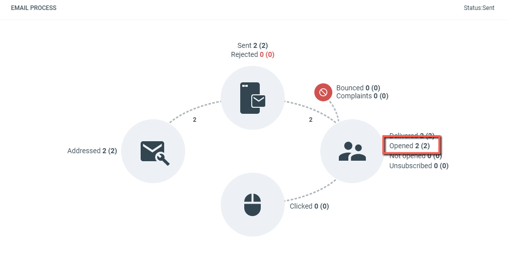

# When is an email registered as opened?

An email is registered as opened when images load in the recipient's email client, or when the recipient clicks a link in the message.

Email report graph, number of opened emails highlighted.

## Why opens are tracked this way

You might assume an "open" is an event the recipient's email client reports back to the sender, but that is not how email works. There is no built-in mechanism that tells the sender when a message has been opened. If you send mail to a colleague directly, you have no way of knowing whether they read it.

eMarketeer, like most email service providers, works around this by including a tracking pixel — a very small transparent image with a unique name — in each email. When that image is requested from the server, eMarketeer knows the contact tied to that unique name has opened the message.

The method works because most email clients load images automatically when the message is opened. Some clients block images by default if the sender is not in the recipient's address book. If a contact opens an email with images blocked, eMarketeer cannot register an open until they choose to show images or click a link in the email.

A click cannot exist without an open, so an email that records a click is automatically also recorded as opened.
