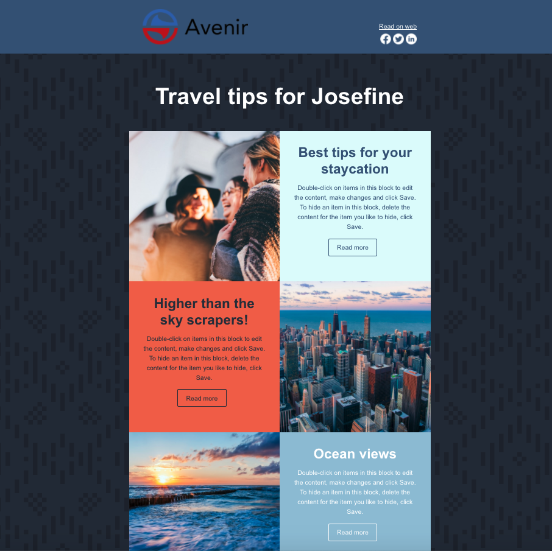
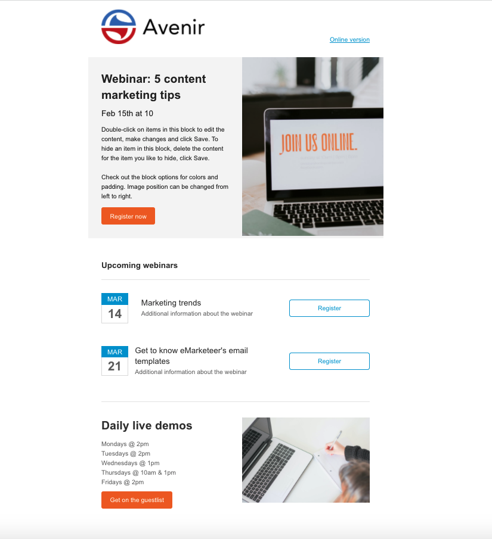
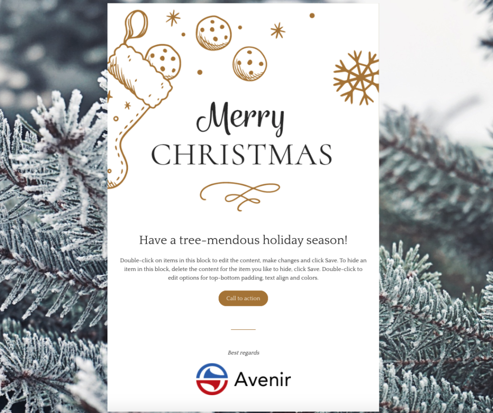
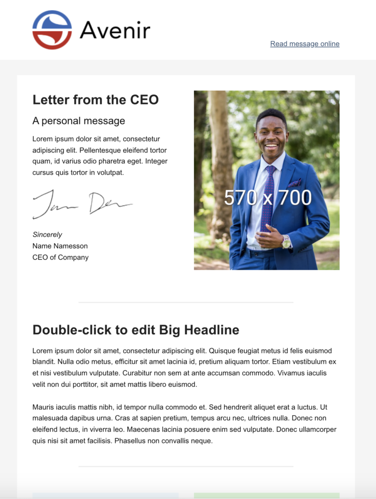
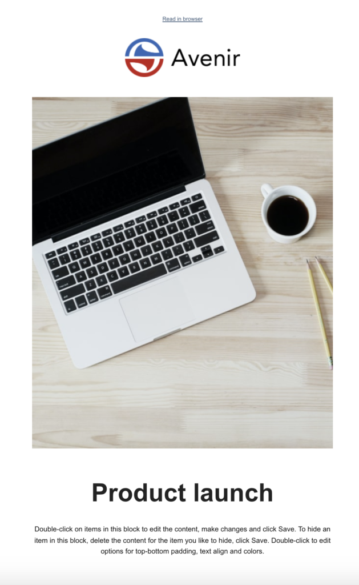
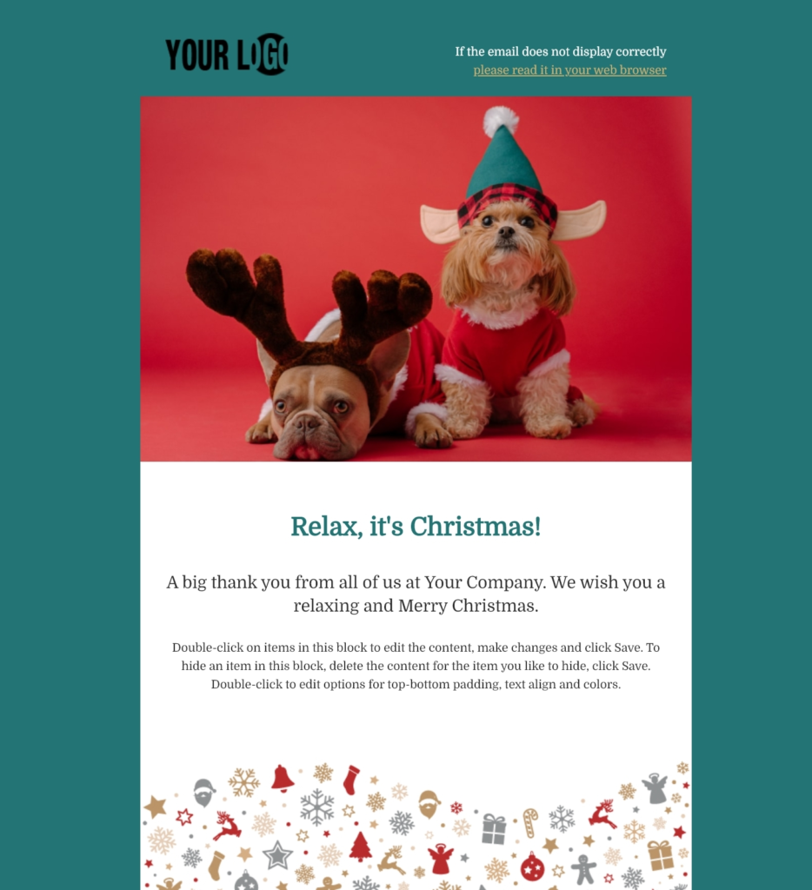
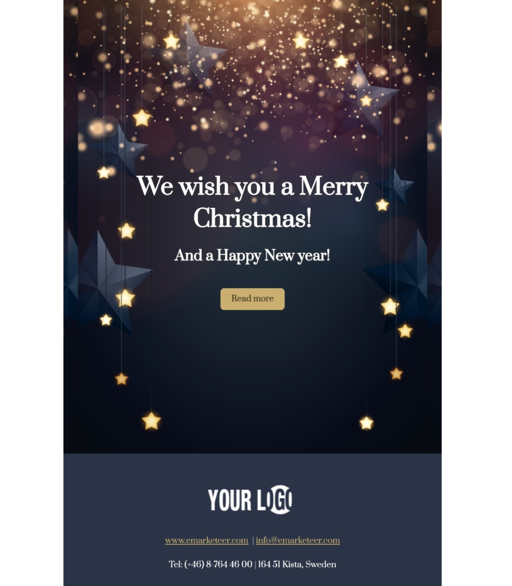
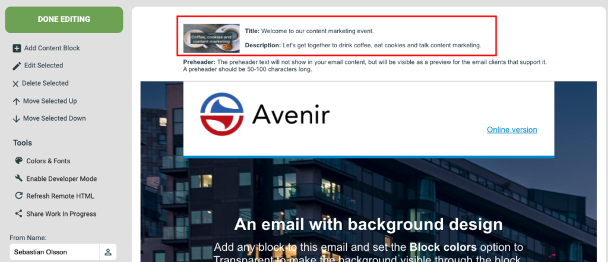

# New email templates — what you need to know

The free email templates in eMarketeer give you a head start when building emails, with dozens of mobile-friendly designs you can customize to fit your brand.

## What is new in the templates

The new templates look more modern and are built on a new root code, which means they render better in more email clients than before. Other benefits include:

- More design options. Over 60 content blocks are available, designed to fit together for simpler editing.
- Higher image resolution.
- Link share settings that let you set the title, description, and image used automatically when the email link is shared on social media.
- Google font support, with no coding needed.

The new templates replace the previous ones. Saved templates still appear in your account, but they are based on the old root code. To get the new benefits, rebuild your saved templates using one of the new ones.

If you need help moving a saved template to the new root, email sales@emarketeer.com.

- 
- 
- 
- 
- 
- 
- 
- 
- 

## Three tips about the email templates

Start by choosing the template that suits your message — event invitation, product promotion, newsletter, and more. In the editor, you customize the template with the drag-and-drop tools and the 60+ content blocks. Three additional tricks, all set up in the email settings box in the editor, are below.

### 1. Link sharing settings

When you share the link to your email on social media, the post can use a custom title, description, and image. At the top of the template in the editor, open the email settings box. Set a title (for example, your subject line), a description, and an image. These values are used automatically in the social media preview.

This is not where you set the subject line for the email itself — the subject line and sender information live in the left-hand side menu.

Where to update link sharing information in the editor.

How the email link looks when posted on social media.

### 2. Set your preheader

The preheader is your second chance — after the subject line — to convince a contact to open the email. It appears next to the subject line in the inbox preview.

In the email settings box, click the preheader field. Use it to extend your subject line or preview the email content. The preheader text is not shown inside the email itself, only in the inbox preview. If you leave it empty, the first text in the email is shown instead, which is often something like "read on web."

The exact length that displays depends on the recipient's email client.

> TODO: verify recommended character counts for subject line and preheader (source said "XXX characters").

Examples of emails with and without a preheader.

### 3. Use a Google font in your email

Double-click the email settings box and open the Google Fonts tab in the panel on the right. In the text box, type the font name exactly as Google has it — the field is case sensitive. You can also choose whether the font applies to headlines only or to all text in the email. Save your changes.

If the recipient's email client does not support web fonts, the font set under Styles is used as the fallback.

## Bonus tip

Create images for your email with the image editor in eMarketeer. You can add filters, text, and graphical elements, and the built-in stock image library includes two million photos, 900 fonts, and 700 icons that are free to use.

For a walkthrough, see [How to use the image editor in eMarketeer](https://support.emarketeer.com/knowledgebase/how-to-use-the-image-editor-in-emarketeer/).
