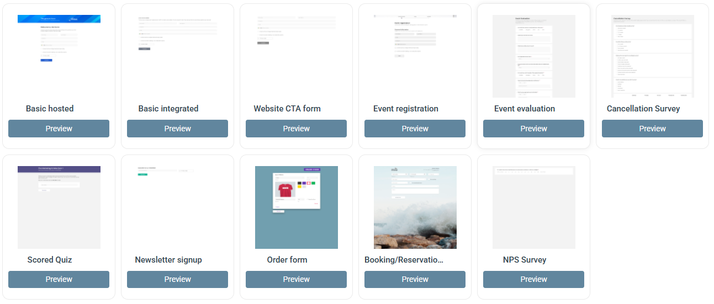

# Forms


This section covers the current **Form** editor. For the previous form editor, see [Forms (Legacy)](legacy.md).


A Form is a campaign component you add to a campaign alongside your emails and other content. To add one, open a campaign and click **Add Form** in the left panel.

When you add a form, you choose from a set of ready-made templates or start from scratch.

Forms are suited for a wide range of use cases:

* Sign-up forms
* Event registrations
* Surveys and post-event evaluations
* Scored quizzes
* NPS surveys

Forms are designed to be easily embedded on your website — any changes you make in eMarketeer update the embedded form automatically. Forms can also be hosted directly by eMarketeer, in which case you get a link you can share or point to from anywhere. See [Embed forms on your website](../../documentation/forms/publish-a-form.md) for setup instructions.

Form submissions are recorded as contact activity. Every form gives you a report of which contacts responded and when. You can also use submissions to trigger [Journeys](../journeys/journeys.md), build [lead scoring](../lead-board-scoring/how-lead-scoring-works-in-emarketeer.md) rules around form engagement, or route contacts into [lead streams](../lead-board-scoring/lead-streams.md). With the [Web Tracker](../../documentation/web-tracker/) installed on your website, form submissions also identify the respondent and connect their site visit history to the contact record, letting you track conversions from your site.

### In this section




[publish-a-form.md](../../documentation/forms/publish-a-form.md)



[the-form-component.md](../../documentation/forms/the-form-component.md)



[form-expression-syntax.md](form-expression-syntax.md)





[ui-overview.md](../../documentation/forms/ui-overview.md)



[how-to-link-to-a-form.md](how-to-link-to-a-form.md)



[form-branching-logic.md](form-branching-logic.md)



