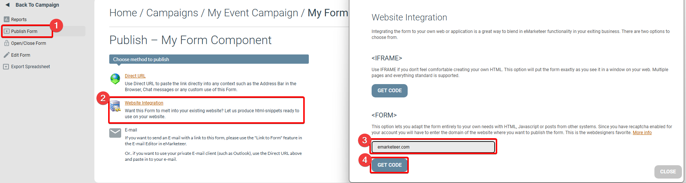
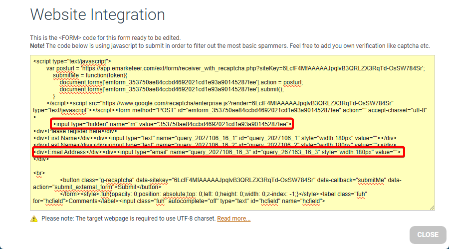

# Form-specific QR code generation for scanning event attendance (advanced)

This guide shows how to build a QR code that, when scanned, submits the contact's email to a specific eMarketeer form to register event attendance.

The standard QR code generator can produce a QR code from any contact field. This advanced variant points the code at a form receiver URL, so scanning the code automatically registers the contact. Some HTML and URL knowledge helps before you start.

***

### What you need to start

You need a form on your account where attending contacts will be registered. You will pull two values out of the form's website integration code to build the QR URL.

The QR code generation URL looks like this:

`https://app.emarketeer.com/library/qrcode/php/qr_img.php?s=6&d=https://app.emarketeer.com/ext/form/receiver.php?m=M_VALUE%26NAME_VALUE=<% contact field="email" %>`

The placeholders `M_VALUE` and `NAME_VALUE` are what you will replace with values from your form.

### Get the M-value and NAME-value from the form

Open the report page for the form where attendance should be registered, then open the form's website integration code.

Guide to form integration code

1. Click **Publish Form** in the left-side menu to open the publishing options.
2. Click **Website Integration** on the publishing page.
3. Under `<FORM>`, type any domain in the domain field and press Enter. For example, `emarketeer.com`.
4. Click the **Get Code** button.

Next, find the two values in the integration code. The M-value identifies the form. The NAME-value identifies the specific question — in this case, the question that stores the contact's email address. Look for:

* `<input type="hidden" name="m" value="M-Value">`
* `<input type="email" name="NAME-Value">`

The M-value and NAME-value

Example values:

* M-value: `353750ae84ccbd4692021cd1e93a90145287fee`
* NAME-value: `query_2027106_16_3`

### Build the QR code URL

Replace the placeholders in the QR code URL with the values from your form. Starting from this template:

`https://app.emarketeer.com/library/qrcode/php/qr_img.php?s=6&d=https://app.emarketeer.com/ext/form/receiver.php?m=M_VALUE%26NAME_VALUE=<% contact field="email" %>`

The finished URL looks like this:

`https://app.emarketeer.com/library/qrcode/php/qr_img.php?s=6&d=https://app.emarketeer.com/ext/form/receiver.php?m=353750ae84ccbd4692021cd1e93a90145287fee%26query_2027106_16_3=<% contact field="email" %>`

### Use the QR code URL

Paste this URL into an image block in an email or app component as if it were a regular image URL. When the email or app is distributed, each contact gets a unique QR code containing their email address. Scanning the code registers them to the form.

To use this URL on an app component's QR code page, you need Developer permissions on your user account. Enable Developer Mode on the app's editing page, open the QR code block, switch to the HTML tab, and replace the standard QR code URL in the HTML with your new one.
