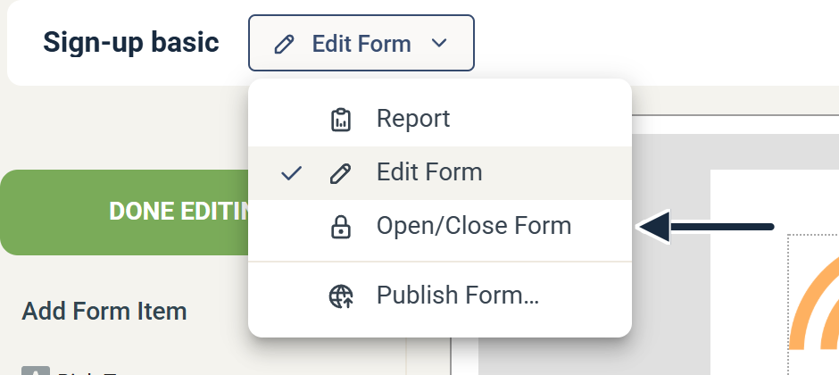

# Forms: Close a form


This article applies to **Form (Legacy)**. For the current form editor, see [Forms](README.md).


Set criteria for when a form should stop accepting answers.

Use this when a form should only run for a limited time or up to a maximum number of submissions.

## Open the form's publish settings

1.  In the campaign view, click the **Publish** icon on the form's card.

    

2.  Open the menu next to the form name at the top of the page and click **Open/Close Form**.

    

3.  Choose the settings you need for your form, then click **Save Changes**.

    

