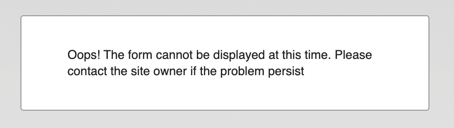
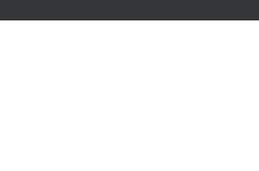
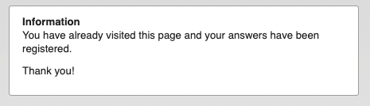
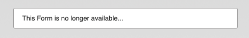
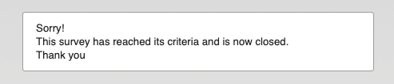
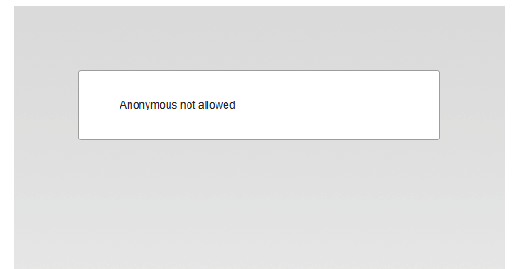

# Identifying why a Form is Unavailable (Legacy)

This guide helps you diagnose unusual behavior or broken links when accessing an eMarketeer form.

Before you start, open a private or incognito window and try the form there. If the form loads in private mode, the cause is most likely stale data in your browser. Clear that data from your browser's settings and the issue should be gone.

This article references different types of eMarketeer URLs. For background, see [Understanding eMarketeer URLs](../account-admin/understanding-em-urls.md).

## The form cannot be displayed at this time

The form cannot be displayed at this time error message

This usually means the eMarketeer account has reached its contact limit and cannot accept new registrations until the limit is raised or the contact count is reduced.

To raise the contact limit, send a request to [customerservice@emarketeer.com](mailto:customerservice@emarketeer.com).

## White webpage

An empty webpage

This usually means the URL is faulty, for example a few characters changed in a dynamic part of the URL. Go back and confirm the link is correct, preferably the [Direct URL](../account-admin/understanding-em-urls.md).

It can also happen when a form has been moved to another campaign. This only occurs with an eMarketeer [Internal URL](../account-admin/understanding-em-urls.md), because internal URLs depend on the target component's location relative to the source. For example, an email that links to a form inside the same campaign breaks if you move the form to a different campaign. Move the components back to their original layout, or redo the linking.

## No such session

A webpage showing the message "No such session"

This usually means the [Session URL](../account-admin/understanding-em-urls.md) has expired. Session URLs live for 24 hours and allow only one answer before they expire. It can also happen when an answer has been deleted from the Form Components Report, since that deletes the session the URL points to.

Use the Direct URL to the form instead.

## Answer already registered

Answer has already been registered

You see this message when a form is set to allow one answer per person and someone has already answered using the Session or [Personalised URL](../account-admin/understanding-em-urls.md) you are trying to use, or when the original respondent revisits the form through a Direct URL. It can surprise people who forwarded or received a forwarded email with a Personalised URL, since only one person can answer.

If you see this in error, confirm you used the correct link and that the form's visitor settings allow more than one answer.

## Form component has been deleted

Direct URL message for a deleted form component

Session URL message for a deleted form component

These messages usually mean the form component has been deleted in eMarketeer. In a few cases, the "Incorrect Form URL" message means someone changed the URL by mistake. If the form still exists in eMarketeer, confirm the URL used to reach it is correct.

## Form component is closed

The default message for a closed form

You see this when the form's Open/Close setting is set to closed, either manually or by a condition. It can appear unexpectedly if the form is a copy of another form component that was closed or had a close condition set at the time of duplication.

Change the form's Open/Close setting to Open so it accepts new answers.

## Anonymous not allowed

Message for a missing form

This message appears when the form component does not exist or cannot be found at the URL used.

Get the correct URL from the form.
