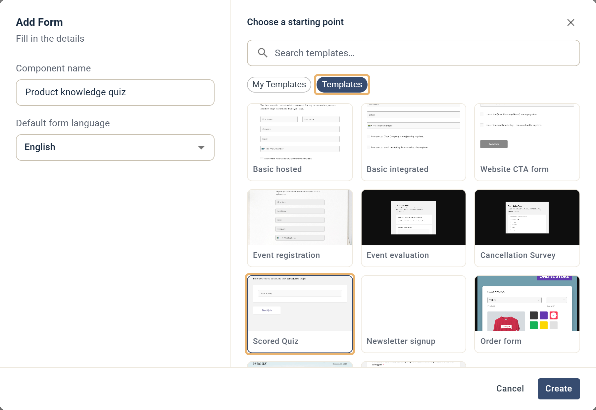
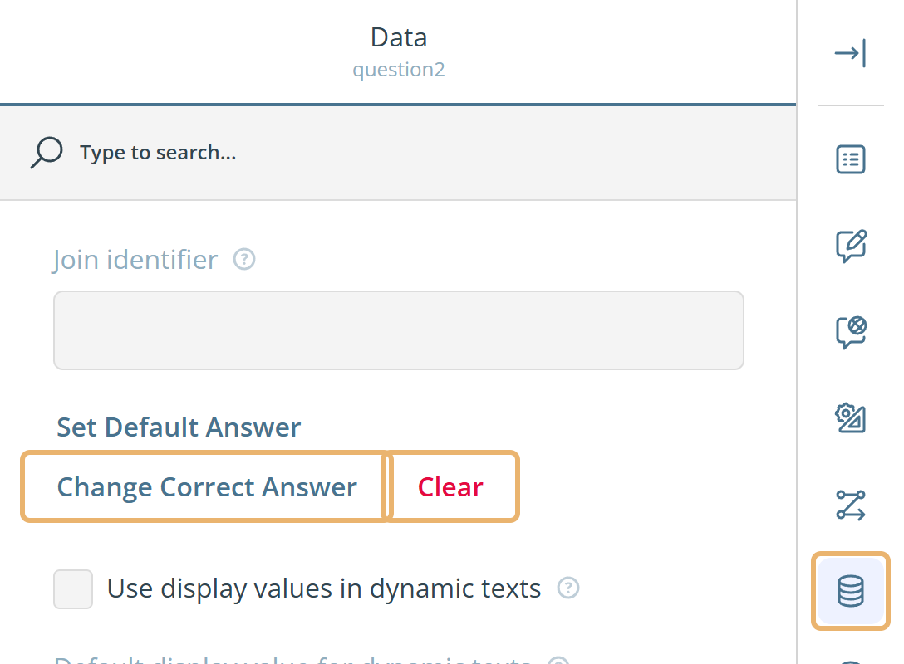
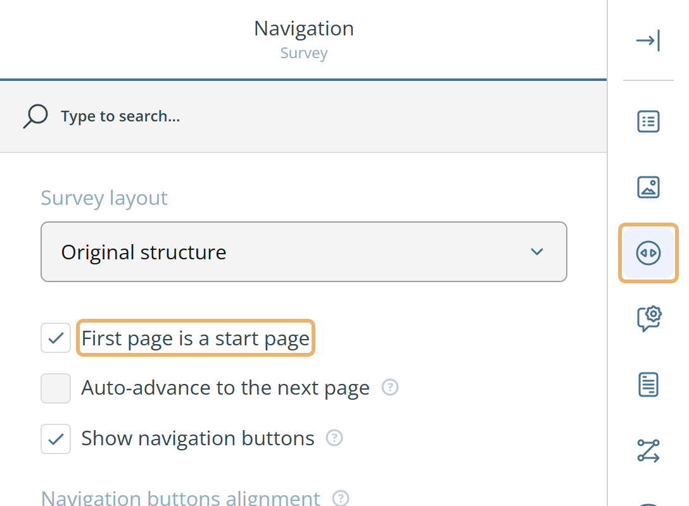
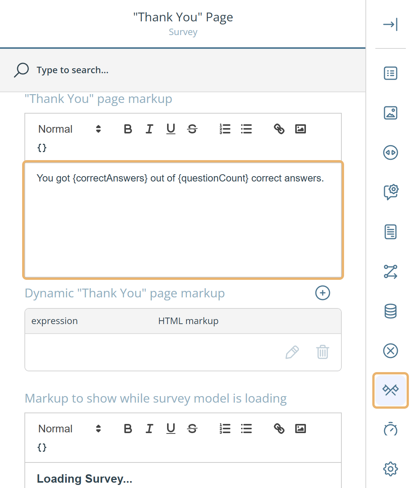
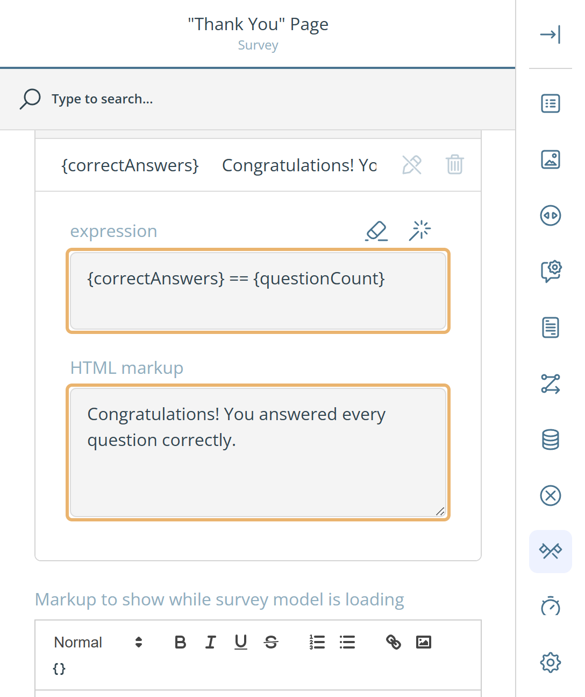
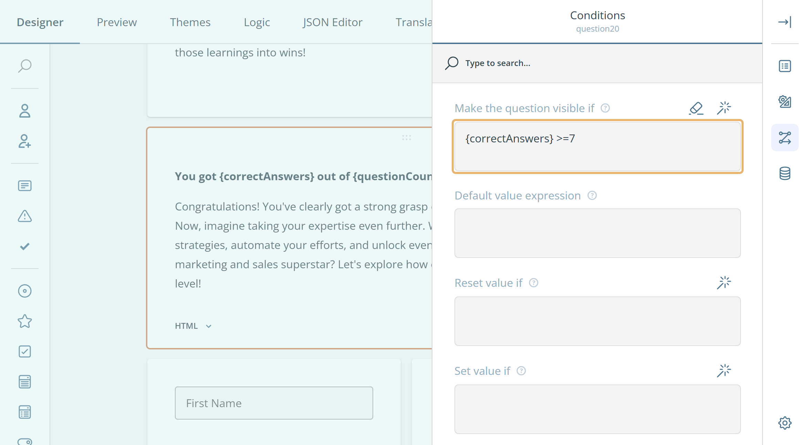

# How to create a quiz

This guide shows how to build a quiz with the eMarketeer form editor, from correct answers to showing each respondent their score.

A quiz is a form where some questions have a correct answer. eMarketeer counts the correct answers, so you can show respondents their result, adapt the message to how well they did, and save the score with their answers.

## Start from the Scored Quiz template

The quickest way to build a quiz is to start from the **Scored Quiz** template. When you add a form to a campaign, click **Templates** in the **Choose a starting point** dialog and select **Scored Quiz**. For the basics of adding a form, see [Creating your first form](../getting-started/basics-creating-form-new.md).

The template contains everything we will cover in this guide:

* A start page that asks for the respondent's name.
* Quiz questions with correct answers set, one question per page.
* A last page that shows the respondent's score and asks for their contact details. The name from the start page is filled in as their first name.
* A hidden **Score** field that saves the score with the answers.

Change the questions and texts to fit your quiz, or build your own quiz from scratch with the steps below.

## Choose question types

You can use any question type in a quiz. Choice questions such as **Radio Button Group**, **Checkboxes** and **Dropdown** are the most common. The Scored Quiz template also uses an **Image Picker** and a ranking question, where the correct answer is the right order.

## Set the correct answer

Set a correct answer on every question that should count towards the score.

1. In the **Designer** tab, click the question and then click **Settings**.
2. In the settings panel, click the **Data** category in the right-hand column.
3. Click **Set Correct Answer**.
4. Select the correct answer and click **Apply**.

Once a correct answer is set, the button reads **Change Correct Answer**. Click it to pick another answer, or click **Clear** to remove the correct answer.

## Add a start page

A start page lets you give instructions or ask for the respondent's name before the quiz begins. It doesn't count as part of the quiz, and the timer doesn't start until the respondent leaves it.

1. Add your instructions and any questions, such as a name field, to the first page of the form.
2. Click **Survey settings** above the design surface, next to the save button.
3. Click the **Navigation** category and select **First page is a start page**.
4. Optionally, change the text of the start button in **"Start Survey" button text**, for example to "Start Quiz".

## Set a time limit

You can give respondents a limited time to complete the quiz, each page, or both. Open **Survey settings** and click the **Quiz Mode** category.

* **Use a timer** — turns the timer on. The time limits only apply when this is selected.
* **Time limit to complete the survey** — the time, in seconds, for the whole quiz. When the time is up, the quiz ends and the respondent goes to the thank-you page.
* **Time limit to complete one page** — the time, in seconds, for each page. When the time is up, the respondent moves on to the next page. With a page limit, respondents can't go back to a previous page.
* **Timer alignment** — show the timer at the top or the bottom of the form.
* **Timer mode** — show the time left on the current page, for the whole quiz, or both.

## Show the score on the thank-you page

You can show each respondent how many questions they answered correctly. Two variables hold the result:

* `{correctAnswers}` — the number of correct answers.
* `{questionCount}` — the number of questions that have a correct answer.

To show the score:

1. Open **Survey settings** and click the **"Thank You" Page** category.
2. In **"Thank You" page markup**, type your message with the variables, for example: `You got {correctAnswers} out of {questionCount} correct answers.`

Type the variables yourself, including the curly brackets. The merge-field button in the editor only lists campaign and contact fields.

## Show different messages depending on the score

With **Dynamic "Thank You" page markup**, the thank-you page can show a different message depending on the result. For example, you can congratulate respondents who got every answer right, and encourage those who didn't.

1. Open **Survey settings** and click the **"Thank You" Page** category.
2. Next to **Dynamic "Thank You" page markup**, click the plus icon to add a row. Then click **Show Details** on the row.
3. In **expression**, enter the condition for this message. For example:
   * `{correctAnswers} == {questionCount}` — every answer is correct.
   * `{correctAnswers} == 0` — no answer is correct.
4. In **HTML markup**, enter the message to show when the condition is met.
5. Repeat for each message you need.

If none of the conditions are met, the respondent sees the regular **"Thank You" page markup**. The Scored Quiz template includes an empty row in this list. Fill it in or remove it.

To build a condition without typing it, click the magic wand icon next to **expression** and use the visual editor. For more about conditions, see [Form branching logic](form-branching-logic.md) and [Form expression syntax](form-expression-syntax.md).

## Show the score before the respondent submits

Instead of the thank-you page, you can show the score on the last page of the quiz. The respondent then sees their result before they submit, and you can ask for their contact details on the same page. The Scored Quiz template works this way.

To set it up, add an **HTML** block for each message to the last page, and make each one visible only for a certain score:

1. Add an **HTML** block with your message, for example `You got {correctAnswers} out of {questionCount} correct answers.`
2. Click **Settings** on the block and open the **Conditions** category.
3. In **Make the question visible if**, enter the condition for this message, for example `{correctAnswers} >= 7`.
4. Add another block for the other result, for example with the condition `{correctAnswers} < 7`.

## Save the score with the answers

To keep each respondent's score, add a hidden field that takes its value from `{correctAnswers}`. The score is then saved with the rest of the respondent's answers.

1. Add a **Single-Line Input** question to the last page and give it a clear name, such as "Score".
2. Click **Settings** on the question. In the **General** category, clear **Visible** so respondents don't see the field.
3. In the **Conditions** category, enter `{correctAnswers}` in **Default value expression**.
4. In the **Data** category, set **Clear hidden question values** to **Never**, so the hidden value is kept when the form is submitted.

