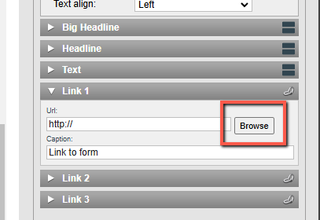
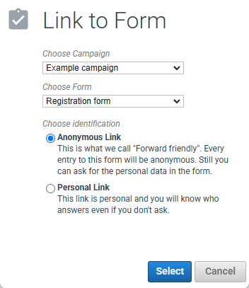

# How to link to a form

This guide shows how to link to a form from an eMarketeer email or web page component.

You can add links to text, images, or link elements such as buttons. The steps below use a button as the example.

## Add the link

Open the button settings and click the browse button next to the URL field.

[

Click "link to eMarketeer form."

## Choose the link options

The final step gives you a few options. Pick the best fit for your use case.

**Choose campaign:** link to a form outside the campaign you are currently working on. Leave this as is to use a form from the current campaign.

**Choose form:** the form the button links to.

**Choose identification:** create either an anonymous link or a personal link. An anonymous link is the same for every contact who receives the email. A personal link is unique to each recipient.

The identification choice matters because a personal link identifies the respondent when the form is opened, which lets the form prefill contact data you already have. Some features — such as "Allow only one answer per visitor" in the form publish settings — work best with a personal link.

Click "Select -> Apply -> Save."

## Why use this method

Linking through this dialog creates a link that is relative to the campaign. If you copy the campaign, the new copy still links to its own internal form — you do not have to manually update the URL.
