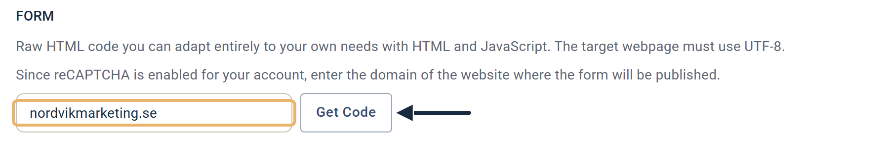
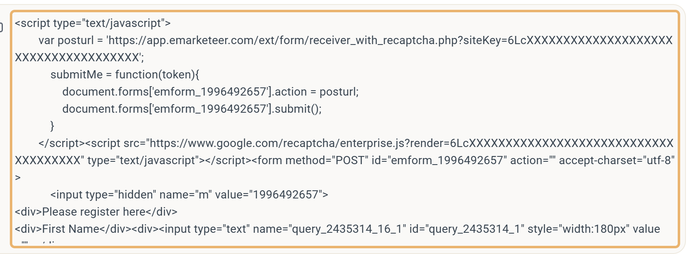

# How to post data to a form


This article applies to **Form (Legacy)**. For the current form editor, see [Forms](README.md).


This guide shows how to post answers to an eMarketeer form from your own website or from another system.

The hosted version of a form covers many cases, but sometimes you need to embed the form on your website or trigger automations from another system. A form is a flexible target for posting data from outside eMarketeer.

## Before you start

You always need to create the form in eMarketeer first. The form defines which questions you want answered. Once it exists, you can post answers to it in several ways:

* Get the direct URL and let visitors answer the hosted form (not covered here).
* Iframe the hosted form onto your site (not covered here).
* Put the HTML of the form on your website.
* Use a script to post data to the form programmatically.

Every form has two important properties:

* A URL to post the data to.
* Input fields with a name and a value.

If you POST (or GET) the answers to that URL with the right name/value pairs, your answers are saved in eMarketeer.

## 1. Create the form

In eMarketeer, create a form with a contact registration and any other questions you need.

## 2. Get the form HTML code

Open the **Edit Form** menu at the top of the form editor and click **Publish Form...**.

The Publish Form page opens. Scroll to **Website Integration**.

Under **FORM**, click **Get Code** to show the form code. If reCAPTCHA is active on your account, enter the domain of your website in the field next to the button first.

The form code appears below the button.

You can paste this code directly on your website. It posts the answers to eMarketeer and then shows the thank-you page.

You can restyle and rearrange the code as much as you want — as long as you keep the action URL and the input names intact. There is also a hidden input named "m" with a value that identifies which form to post to. Keep it.

## cURL and other methods to post

Once you have the URL and the input fields, any method that posts to that URL works. Instead of using a browser, you can use cURL or a similar tool to post programmatically. Keep the input names intact. GET is also valid — pass the parameters in the query string.

## Custom thank-you page

If you embed the form on your site, you may want to send visitors to your own thank-you page instead of the eMarketeer-hosted one. To change the redirect, edit the form in eMarketeer and click **Thank You Page** under **System Pages** in the left-hand menu. Choose **Use Custom URL**, enter the URL to redirect to and click **Update**.

