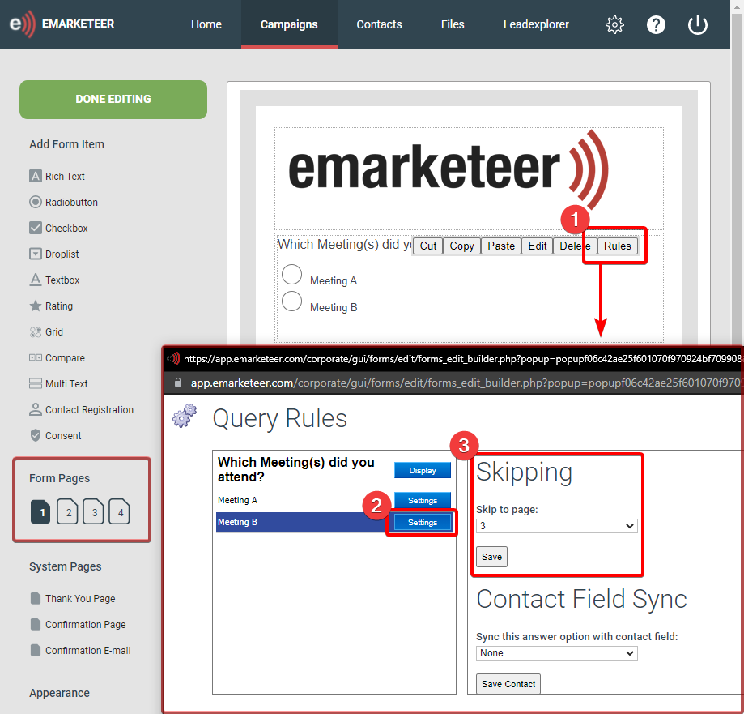

# Creating Branching Question Paths and using Question Display Rules in Forms

Branch form questions or hide them until they are relevant by using rules on form questions.

There are two primary approaches:

1. Branch to different pages of questions based on an answer, by skipping to a specific page.
2. Show or hide questions on the same page based on an answer, by using display options.

## Skip to Page

Skip to Page is easier when each branch has many questions.

The rule changes which page the visitor lands on when they click Next Page. In this hypothetical scenario, a form asks about two meetings. Each visitor attended one, and the questions differ depending on which.

To set this up, use a radio button question where each answer has a Skip to Page rule. Questions about Meeting A live on page 2, questions about Meeting B on page 3.

The selected answer moves the visitor to the matching page. To stop a visitor sent to page 2 from continuing into the Meeting B questions on page 3, double-click the Next Page button on page 2 and set it to skip ahead to page 4.

## Question Display Rules

Display rules suit small branching sets, or single-page forms. They show or hide a question based on the visitor's earlier answer.

In this hypothetical scenario, a form asks about two meetings, and a visitor may have attended one or both. Questions for each meeting should appear only for visitors who attended that meeting, and all questions should appear if both were attended.

Use a checkbox question where the visitor selects Meeting A, Meeting B, or both. Add the meeting-specific questions after it, then open each one's rules and configure its display settings. In this example, the Meeting A question is set to show only when that option is selected on the preceding checkbox question.

Display rules are configured per question and support multiple answers — or combinations of answers — on the preceding question. Checkbox answers are not mutually exclusive, so with more than two options you can show a question only for specific combinations.

A question cannot be both required and hidden. If a question has active display rules, the required setting is ignored.
