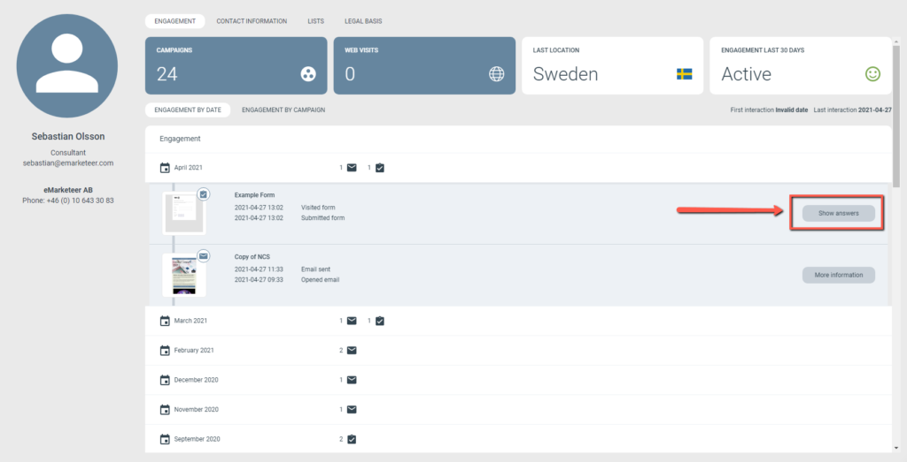
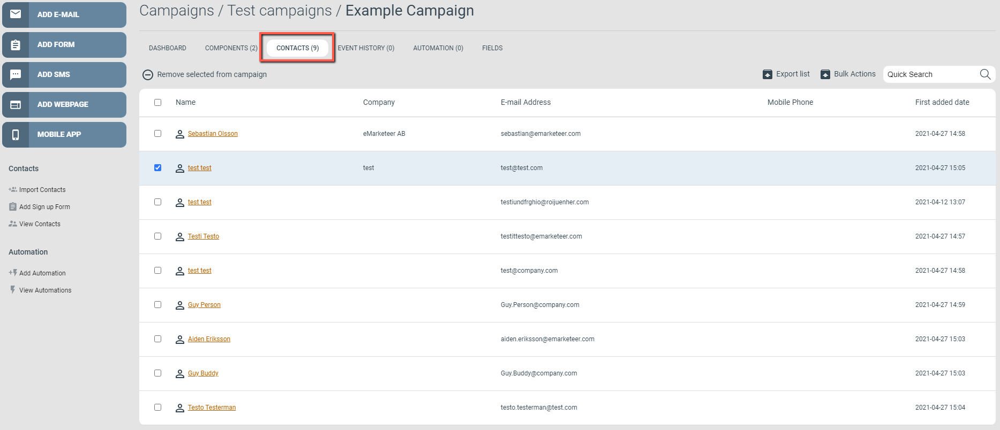

# How do I remove a form answer?

Remove test answers, faulty answers, or the entire set of answers from a form report.

There are three ways to remove undesired form answers, depending on where you start.

## Delete from the Spreadsheet report

Open the form report and go to the Spreadsheet tab. Each row contains contact data and the answers from one contact. Select one or more rows — the Delete Answer button activates, with the selected count shown in parentheses.

Spreadsheet report with two rows selected.

## Delete from the contact card

Find the contact however you prefer — the contacts search box, a filter, or by drilling into a component report. Open the contact card and go to the Engagement tab. Locate the form report you want to remove the contact from, click Show answers, then click Delete answers.

Navigate to the form component and click Show answers.

Delete answers to remove the contact from the report.

## Delete from the Campaign Contacts tab

Use this option when you want to remove a contact from multiple component reports at once. Go to the Contacts tab in the campaign, browse or search for the contact, tick the checkbox next to one or more contacts, and click Remove selected from campaign.

Removing a contact from campaign contacts removes the contact from all campaign reports.
