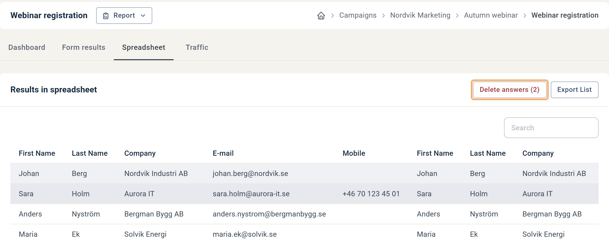
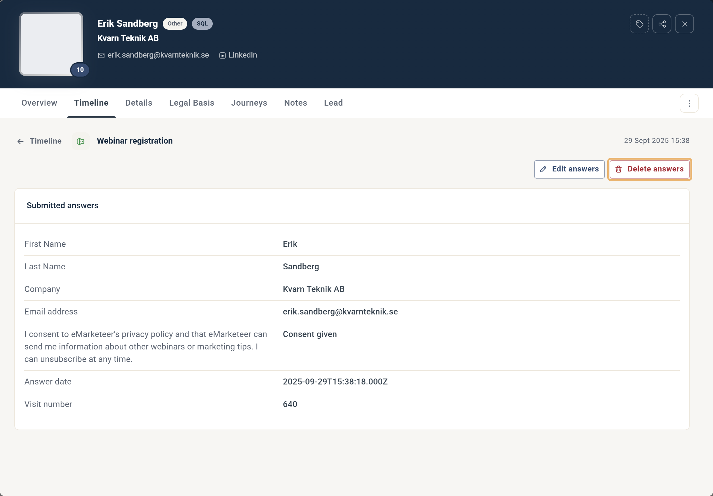
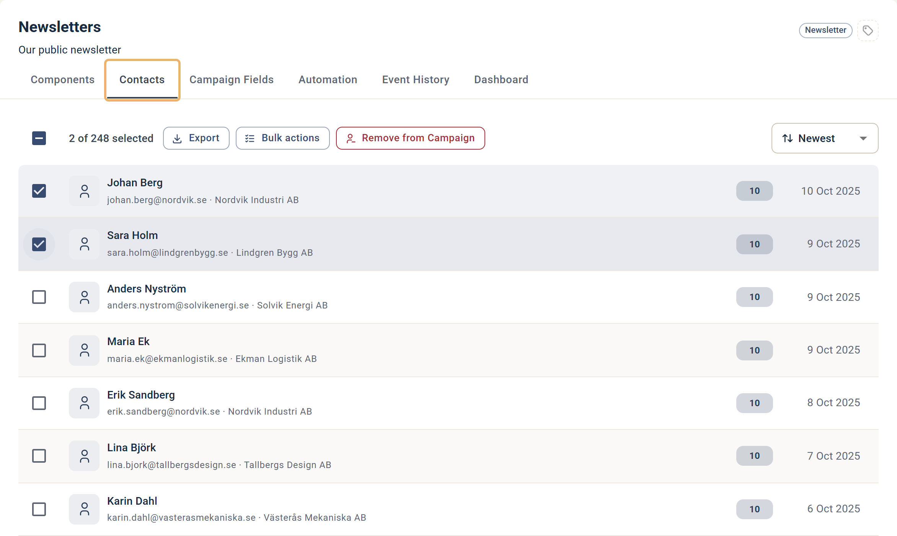

# How do I remove a form answer?


This article applies to **Form (Legacy)**. For the current form editor, see [Forms](README.md).


Remove test answers, faulty answers, or the entire set of answers from a form report.

There are three ways to remove undesired form answers, depending on where you start.

## Delete from the Spreadsheet report

Open the form report and go to the Spreadsheet tab. Each row contains contact data and the answers from one contact. Select one or more rows — the Delete answers button activates, with the selected count shown in parentheses.

Spreadsheet report with two rows selected.

## Delete from the contact card

Find the contact however you prefer — the contacts search box, a filter, or by drilling into a component report. Open the contact card and go to the Timeline tab. Find the form submission you want to remove, click More information, then click Delete answers.

Find the form submission in the timeline and click More information.

Delete answers to remove the contact from the report.

## Delete from the Campaign Contacts tab

Use this option when you want to remove a contact from multiple component reports at once. Go to the Contacts tab in the campaign, browse or search for the contact, tick the checkbox next to one or more contacts, and click Remove from Campaign.

Removing a contact from campaign contacts removes the contact from all campaign reports.
