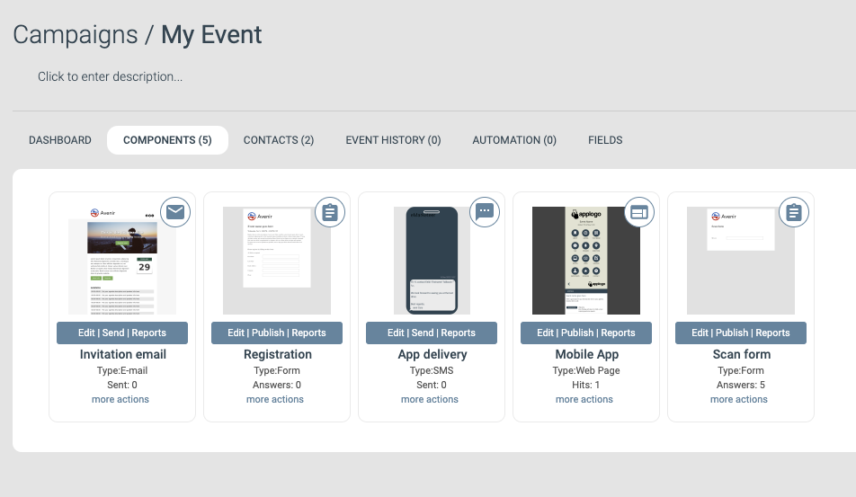
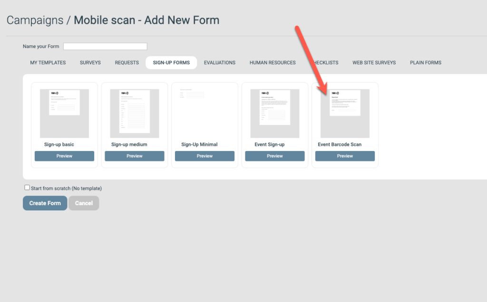
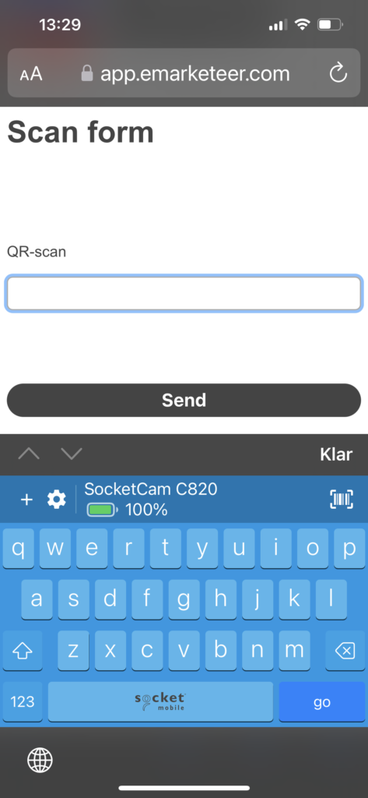

# How to scan event attendance with a mobile phone

Use a mobile phone to register attendance on site at physical events by scanning attendee QR codes.

Attendance is registered by submitting an email address through an eMarketeer form. Instead of typing each visitor's email, you use a phone with a QR-code keyboard app to scan their code from the event app.

The example below uses these event components.

* **Invitation email.** Send your invitation to the audience you want at your event.
* **Registration form.** Where your audience registers for the event. Ask for mobile phone number.
* **App delivery and mobile app.** Create an app for your event to keep all event information in attendees' pockets. Enable the QR code. The "App Delivery" is an SMS with a link to the app; send it to everyone who registered.
* **Scan form.** The form used to register attendees. It is built to accept an email address and return to the register page after submit. Create it by adding a "New Form" and choosing the "Event Barcode Scan" template.

### Register attendance

On the day of the event, your visitors arrive with their mobile event app showing a barcode to be scanned.

#### Preparations

Before you can scan QR codes you need a keyboard app on your phone.

[You find the app here](https://www.socketmobile.com/readers-accessories/product-families/socketcam/get-started)

_Note: this app is not an eMarketeer product. Other "QR code keyboard" apps are available. For example,_ [_this app_](https://play.google.com/store/apps/details?id=com.nikosoft.nikokeyboard) _for Android and_ [_this app_](https://apps.apple.com/us/app/scankey-qr-ocr-nfc-keyboard/id1356206918) _for iPhone._

Installing the app adds a new keyboard to your phone. It works like a normal keyboard but can also scan barcodes.

#### Scanning attendance

Get the web URL for the "Event Barcode Scan" form in your eMarketeer campaign and open it on your phone.

To scan a badge:

1. Tap the text field in the form so the keyboard opens. Switch to the new keyboard with QR scan.
2. Tap the barcode scan icon (top right). Your camera opens — scan the barcode.
3. The form submits automatically and shows the contact details of the scanned person.
4. After a few seconds the screen returns to scan another person. Repeat from step 1.

Each scanned badge becomes a form submission from a known contact in eMarketeer. You know exactly who attended and can follow up based on who was registered.

Once attendees are scanned you can also:

* Send evaluations only to attended registrants.
* Create journeys based on being scanned — for example, an SMS welcome with tips.
* Reach out during the event using SMS with relevant information, such as "Don't forget your goodie bag."

### Alternative scanning setup (advanced)

You can generate form-specific QR codes for registering attendees that can be scanned with any smartphone camera app. This requires more planning and configuration. See [this article](https://support.emarketeer.com/knowledgebase/advanced-event-qr-code/) for the setup guide.
