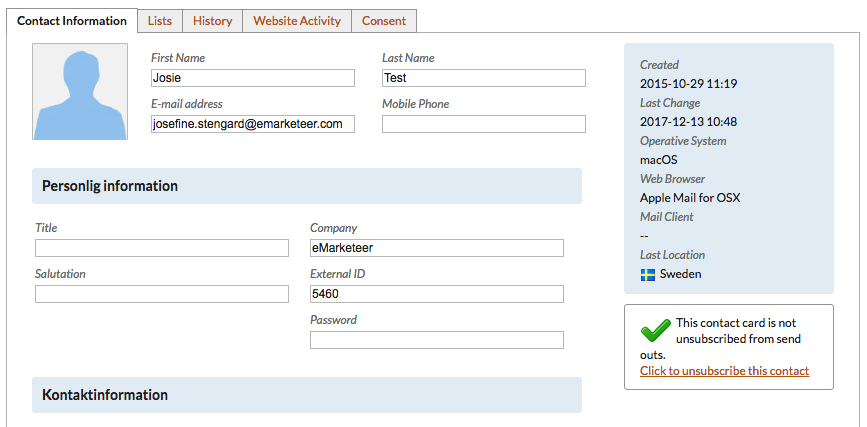
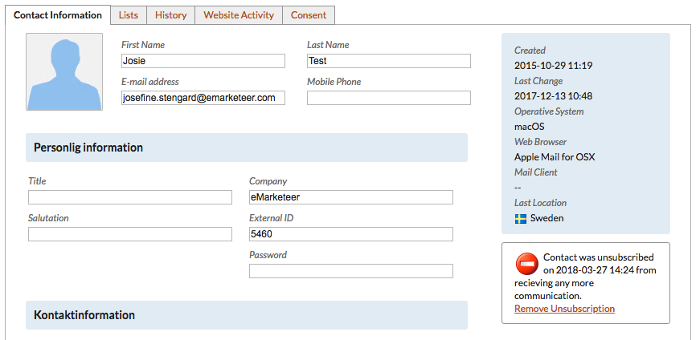
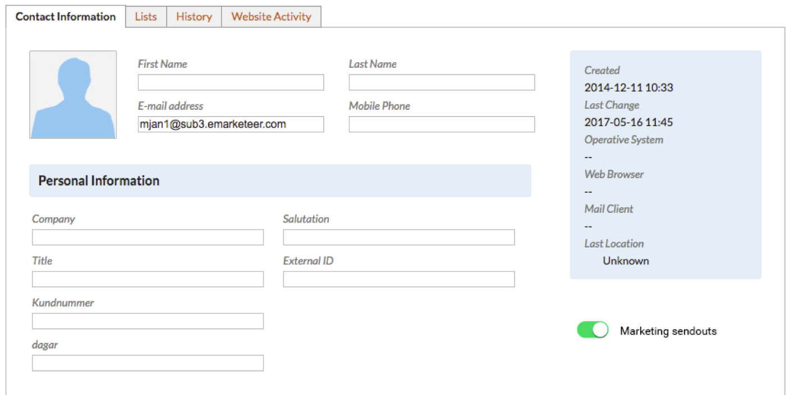
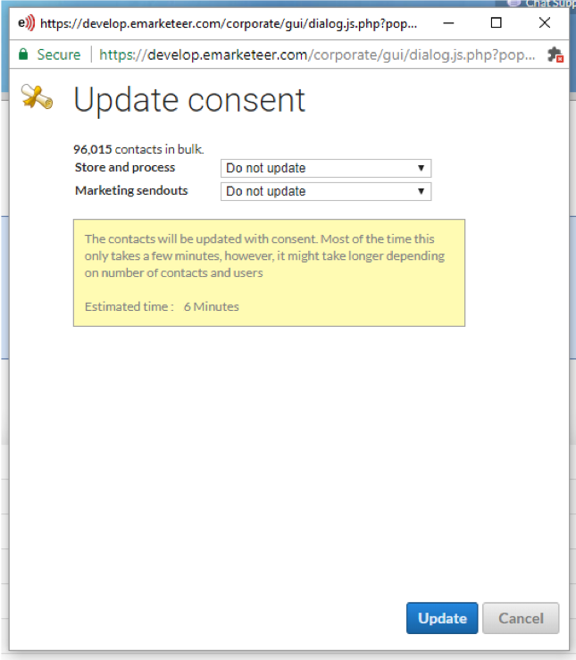
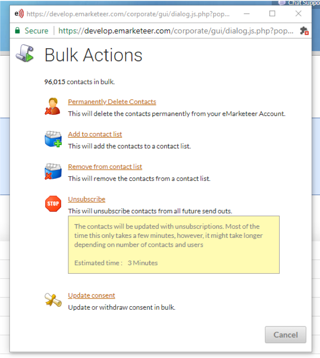
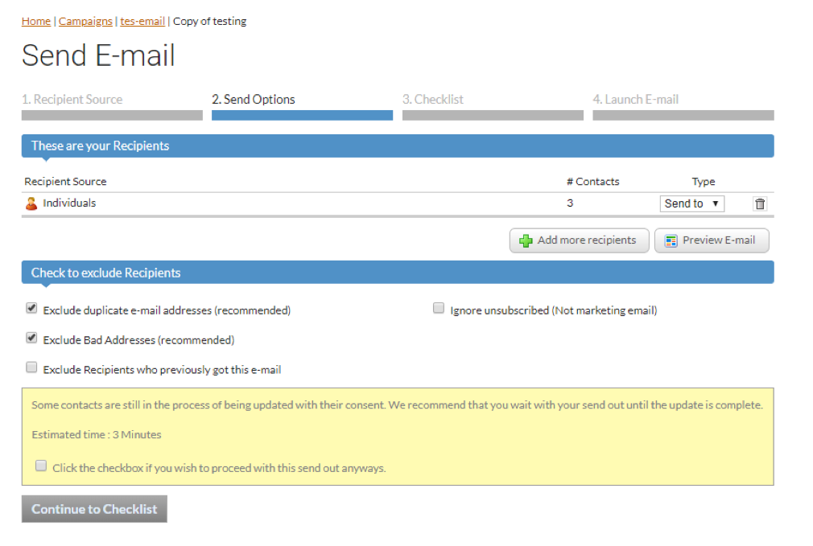

# Second release in GDPR roadmap

With the second and final release of the consent features, eMarketeer is ready to handle your contacts in a GDPR-compliant way.

You use eMarketeer to store contacts and send email to them. Both purposes need a legal base, the right by which you store contacts and send to them. This release gives you the tools to set those legal bases and keep them current.

There are three states of legal base to consider for both storing data and sending email:

1. "none" — nothing is set. The information is missing; update it so there is a valid legal base.
2. "withdrawn" — the contact explicitly withdrew consent. You may not send marketing email to this person. This is the new "unsubscribed."
3. All other legal bases are positive: it is okay to email them.

You can update legal bases for your contacts at your own pace before GDPR takes effect on May 25th, 2018. A bulk update is the fastest way.

The release adds these tools for setting consent and legal bases:

- Filters by date
- Automations to set and remove consent
- New block: consent in forms
- Consent tab on the contact card
- New unsubscriptions
- Send-outs that respect each contact's consent

## New functions and recommended actions

### Recommended actions

- If you have forms published that allow visitors to opt in to send-outs, set those consents automatically from now on. Add the new consent block to your forms.
- Update your current web forms so they all have the consent checkbox. If you already have a checkbox for this, swap it out for the new consent checkbox.
- Update consent for all of your existing contacts with a bulk update. Choose the purpose "Store" and the consent type "Legitimate interest."
- Set marketing consent to "Legitimate interest" for all contacts that have received email in the last 1–2 years.
- Set marketing consent to "Consent" for contacts that opted in through forms or other explicit means. This applies to forms where contacts opted in, not to surveys or evaluations.
- Consider discarding contacts that have not engaged in a long time or where you have no consent on record.

These recommendations are not legal advice and eMarketeer is not responsible for the outcome. Check with your legal advisor.

### Unsubscriptions

Unsubscribing from send-outs now counts as withdrawing consent for marketing email.

What changed? Instead of the previous link on the contact card (images 1 and 2 below), you see a slider that shows consent for marketing send-outs. Green means consent is granted (image 3); off means consent is withdrawn.

Keep in mind:

- Contacts that were globally "unsubscribed" before this release are automatically set to "consent withdrawn" from all marketing send-outs.
- Contacts that were unsubscribed from a specific campaign stay unsubscribed from that campaign. If they unsubscribe again after this release, consent is withdrawn from all marketing send-outs.
- From now on, any unsubscribe action sets the contact's consent to withdrawn from all marketing send-outs, and email will not dispatch to that contact.

### Bulk update of consent and unsubscriptions

Depending on the number of contacts you update, the action can take a few minutes. The bulk actions dialog tells you the estimated time.

### Send-outs and bulk update

Send-outs now check each contact's consent at the time the send-out runs. If you bulk update consent and start a send-out immediately, the bulk process may not be done and the send-out may not reflect your changes. The send-out options warn you about this. Wait until the bulk update completes before sending.

For more about upcoming functions and features, see the [GDPR roadmap](https://support.emarketeer.com/knowledgebase/gdpr-and-what-it-means-for-emarketeer-users/) or visit the [GDPR center](https://support.emarketeer.com/knowledgebase/gdpr-general-data-protection-regulation/). For other questions, email support@emarketeer.com.
