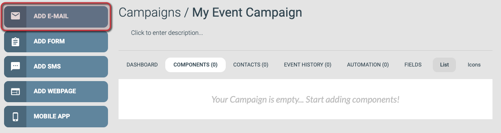
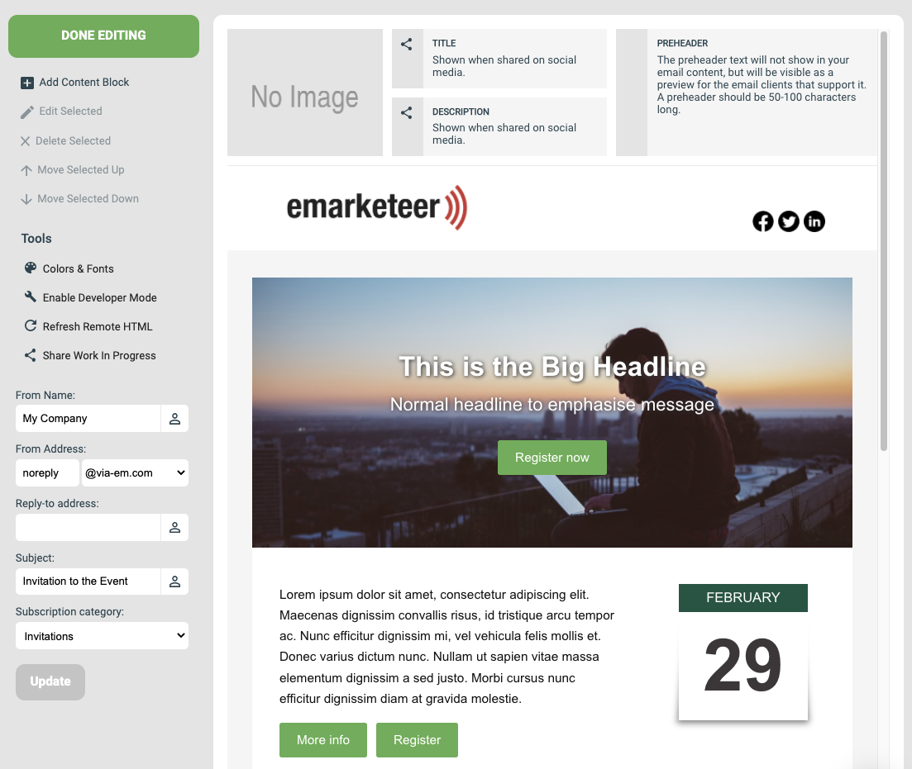
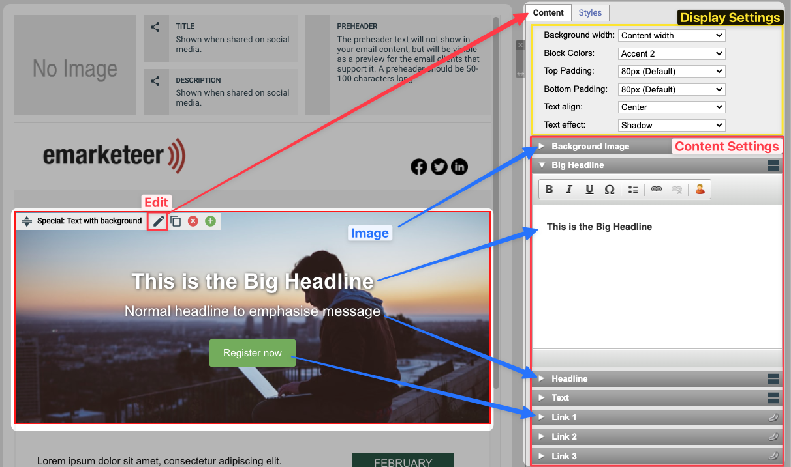
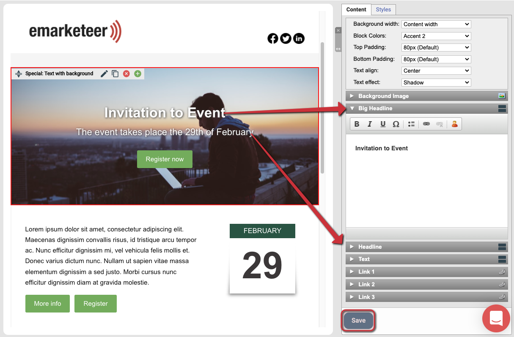
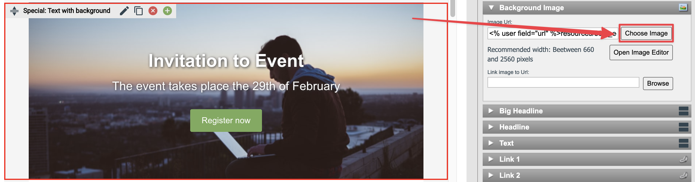
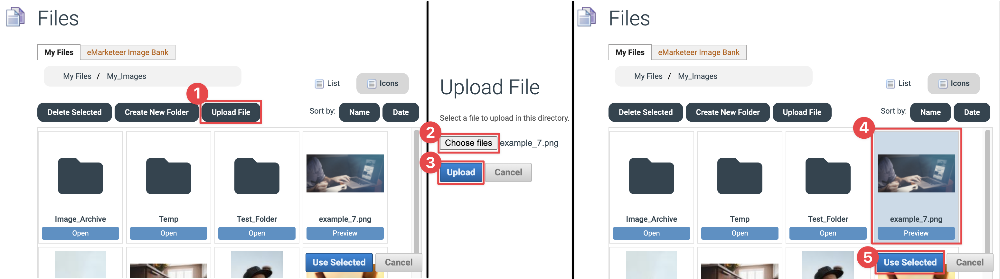
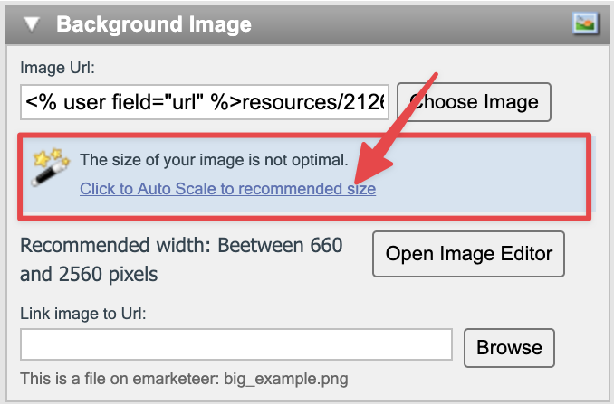
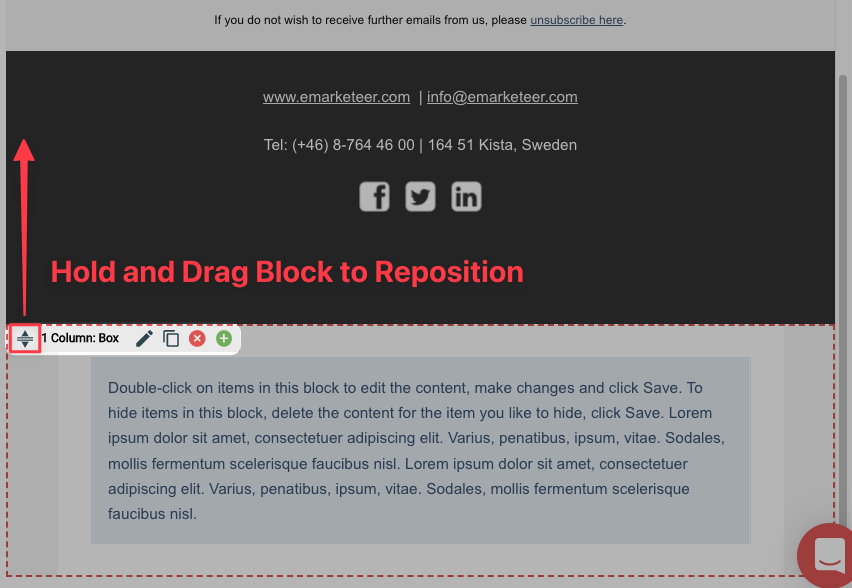
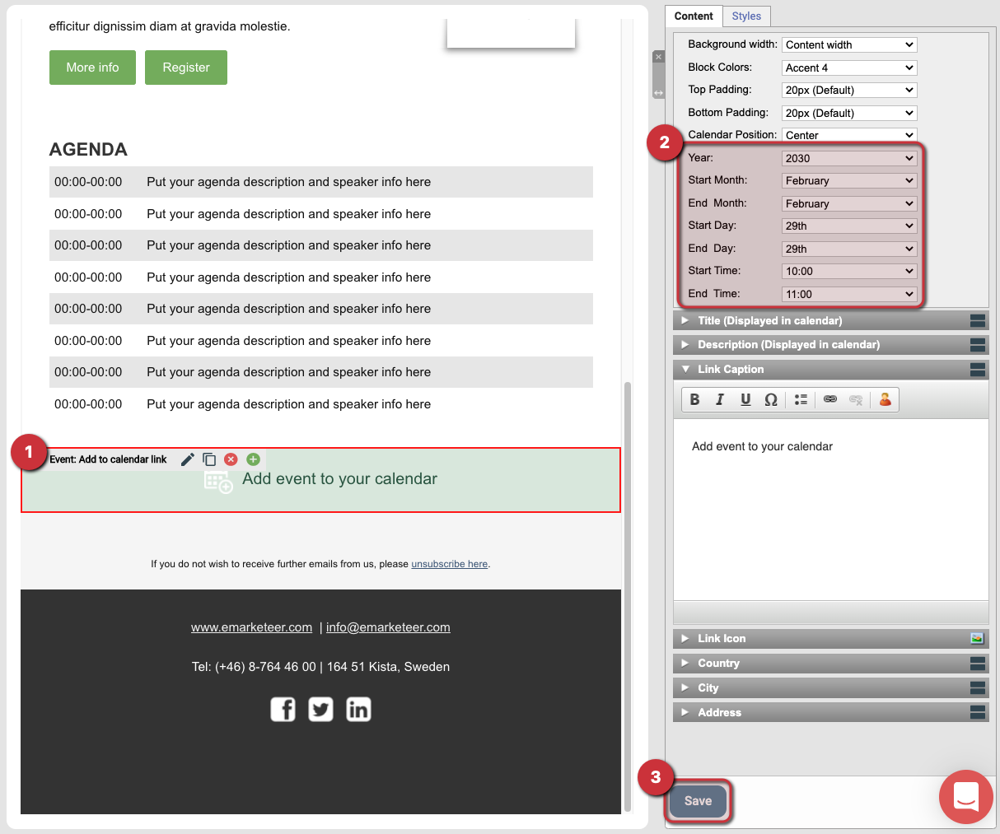
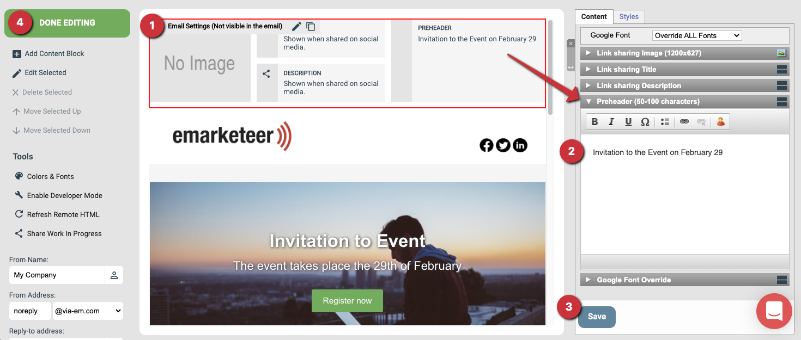

# Creating your first email


To create a new email it is required that you create a campaign first. If you don't have a campaign ready, see [How to create a new campaign](create-new-campaign.md).



The example builds an event invitation email, but the process is the same for any email type. By the end, you will have an email ready to send.




### Add the email from the campaign page

From the campaign page, click **Add Email**.




### Fill in settings, choose a template, create the email

**Settings**

* **Name your email:** Give the email a unique name so you can find it later. Describe the email's purpose in the context of the campaign — for example, "Invitation" for an invitation email. Only you see this name; it is not shown to your contacts.
* **Subject:** The subject line recipients see in their email clients.
* **From Name:** The sender name shown in recipients' email clients.
* **From Address:** This has two parts that make up the sending address.
  1. The part before the `@` can be almost anything. If you are not sure, `noreply` works for most cases, though a real inbox that can receive replies is preferred.
  2. The part after the `@` is your email domain. You must add your own domain before you can send. See [this article](../../documentation/custom-domain/custom-email-domain.md) for how.
* **Reply-to Address (optional):** An address that receives any replies, useful if the From Address cannot receive email. Rarely used; usually safe to skip.
* **Subscription Category (optional):** If your account uses subscription lists, you can categorize this email here. Rarely used; usually safe to skip.

**Template**

Pick a template from one of the tabs as a starting point for the design. This guide uses **Hero Event** from the **Events** tab. Custom templates saved on your account appear under **My Templates**.

**Create email component**

Once settings and template are set, click **Create Email** to create the component.



### The email editor

After you click **Create Email**, the editor opens with the new email. The left-side menu lets you add content blocks, access tools, and update the settings from the previous step. The rest of the page shows the email content, imported from the template you chose.

The content is made up of content blocks, which you edit individually in the following steps.




### Edit a content block

Each content block is made up of several parts you can update. Click the block's edit button to open its settings.

A settings menu opens on the right with two tabs: **Content** and **Styles**. Content is where you change the block's settings and content. Styles is where you change colors and fonts.

On the Content tab, the first section controls how the block displays — leave those defaults for now. The second section is what appears in the block: images, headlines, text paragraphs, and buttons.



### Change a block's headline

To change a headline or text paragraph, click the title bar for that part and edit the text in the text box. If you leave the text box empty, that part of the block is hidden.

In the image below, we are not using the text paragraph and two of the link buttons, so they do not appear in the email.

Click **Save** after each change to save your work.




### Upload an image

To upload your own image, open the content block for editing, go to the Image section in the right-side menu, and click **Choose Image**.

The Choose Image button

To upload and use an image:

1. Click **Upload File**.
2. Click **Choose files** and select the image on your computer.
3. Upload the file to your eMarketeer account.
4. Click the file in the browser window to select it.
5. Click **Use Selected** to add it to the content block.

If the image does not match the recommended dimensions for the block, an option to auto-scale it appears. Click the link in the notice to accept.




### Add a button with a link

Use buttons to link to a webpage, file, or another eMarketeer component. For a web link, type the URL in the Link settings (include the `http://` or `https://` protocol) and write a button caption. To link to another eMarketeer component, follow these steps:

1. Open the "Link 1" content settings and click **Browse**.
2. Click **eMarketeer Form**.
3. Pick the campaign that contains your form in the first dropdown, then the form in the second dropdown.
4. Click **Select**, then **Apply**, then **Save** to add the link and save the block.




### Add a new content block

To add a new content block, click **Add Content Block** in the left-side menu. In the Add Content menu on the right, click **Add Block** next to the type you want.

If the button is grey, first click an existing block to tell the editor where the new one should go.




### Reposition a content block

To move a block, click and hold the reposition icon on the left side of the block's context bar, then drag it to the new position.




### Delete a content block

To remove a block from the template, click the delete button on its context bar.




### Use a block with a calendar link

Some content blocks support a calendar link feature, which is useful for events. When a recipient clicks the link, eMarketeer generates a calendar file that adds the event to their calendar using the settings you chose.

You configure the calendar event in the block's content menu — date, time, title, location, and so on.

Keep the **Description** field to plain text and limit it to two or three short paragraphs.




### Add a preheader and finish the email

The Email Settings block at the top of most emails is optional. Most of its settings are for special use cases involving shared links to the email content, but the **Preheader** is worth using.

The preheader is the short summary that recipient email clients show next to the subject line. Use it to summarize what the email contains.

Once your preheader is saved, click **Done Editing** to exit the editor.




### What to do next

The email is ready to send. See [How to send an email](basics-send-email.md).
